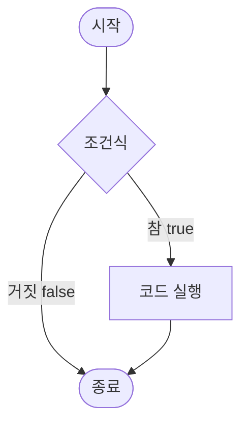
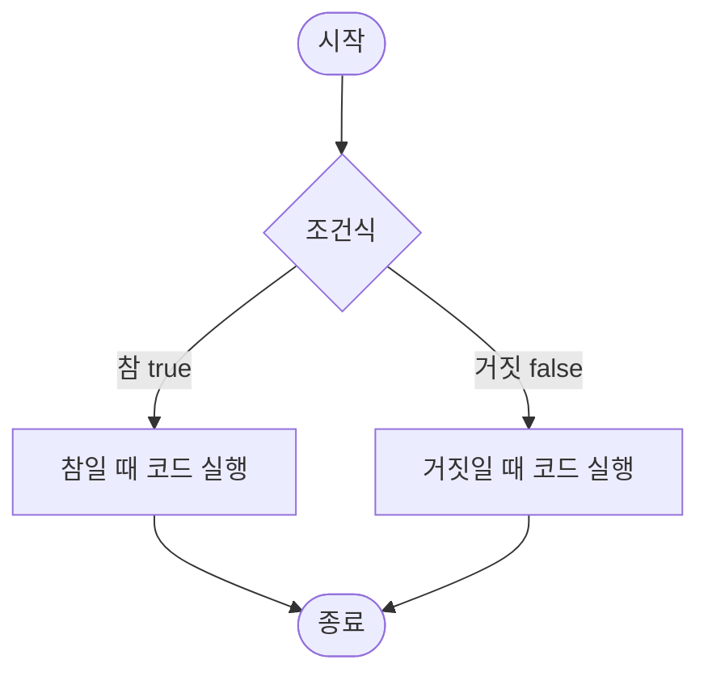
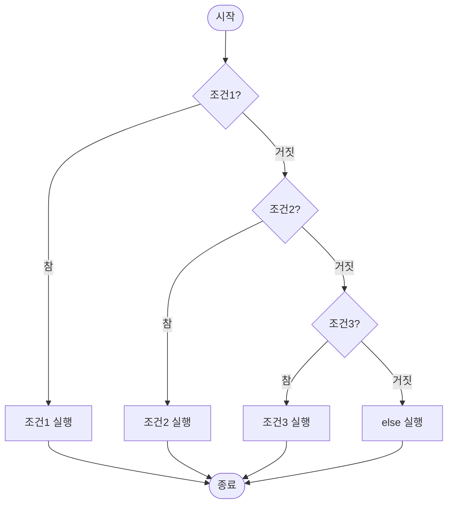

# Day 1-5교시: 조건문 (if, else)

## 학습 목표
- if, else, else if 문 사용하기
- 중첩 조건문 이해하기
- 삼항 연산자 활용하기

## 1. if 문

### 1.0 if 문 흐름도



**ASCII 흐름도:**
```
        ┌─────────┐
        │  시작   │
        └────┬────┘
             │
             ▼
        ┌─────────┐
        │ 조건식? │
        └────┬────┘
             │
        ┌────┴────┐
        │         │
     참 ▼         ▼ 거짓
   ┌──────┐    (건너뜀)
   │ 실행 │        │
   └───┬──┘        │
       │           │
       └─────┬─────┘
             ▼
        ┌─────────┐
        │  종료   │
        └─────────┘
```

### 1.1 기본 if 문

**문법:**
```cpp
if (조건식) {
    // 조건이 참일 때 실행되는 코드
}
```

**예제:**
```cpp
#include <iostream>
using namespace std;

int main() {
    int age;

    cout << "나이를 입력하세요: ";
    cin >> age;

    if (age >= 18) {
        cout << "성인입니다." << endl;
    }

    cout << "프로그램 종료" << endl;

    return 0;
}
```

### 1.2 if-else 문

#### if-else 흐름도



**ASCII 흐름도:**
```
        ┌─────────┐
        │  시작   │
        └────┬────┘
             │
             ▼
        ┌─────────┐
        │ 조건식? │
        └────┬────┘
             │
        ┌────┴────┐
        │         │
     참 ▼         ▼ 거짓
   ┌──────┐   ┌──────┐
   │ 참일 │   │거짓일│
   │때실행│   │때실행│
   └───┬──┘   └───┬──┘
       │          │
       └────┬─────┘
            ▼
       ┌─────────┐
       │  종료   │
       └─────────┘
```

**문법:**
```cpp
if (조건식) {
    // 조건이 참일 때
} else {
    // 조건이 거짓일 때
}
```

**예제:**
```cpp
#include <iostream>
using namespace std;

int main() {
    int number;

    cout << "숫자를 입력하세요: ";
    cin >> number;

    if (number % 2 == 0) {
        cout << number << "은(는) 짝수입니다." << endl;
    } else {
        cout << number << "은(는) 홀수입니다." << endl;
    }

    return 0;
}
```

## 2. if-else if-else 문

### 2.0 if-else if-else 흐름도



**ASCII 흐름도 (학점 계산 예시):**
```
        ┌─────────┐
        │  시작   │
        └────┬────┘
             │
             ▼
        ┌──────────┐
        │score>=90?│
        └────┬─────┘
             │
        ┌────┴────┐
     참 ▼         ▼ 거짓
   ┌──────┐  ┌──────────┐
   │학점 A │  │score>=80?│
   └───┬──┘  └────┬─────┘
       │          │
       │     ┌────┴────┐
       │  참 ▼         ▼ 거짓
       │ ┌──────┐  ┌──────────┐
       │ │학점 B │  │score>=70?│
       │ └───┬──┘  └────┬─────┘
       │     │          │
       │     │     ┌────┴────┐
       │     │  참 ▼         ▼ 거짓
       │     │ ┌──────┐  ┌──────┐
       │     │ │학점 C │  │학점 F│
       │     │ └───┬──┘  └───┬──┘
       │     │     │          │
       └─────┴─────┴────┬─────┘
                        ▼
                   ┌─────────┐
                   │  종료   │
                   └─────────┘
```

### 2.1 기본 문법

```cpp
if (조건식1) {
    // 조건식1이 참일 때
} else if (조건식2) {
    // 조건식2가 참일 때
} else if (조건식3) {
    // 조건식3이 참일 때
} else {
    // 모든 조건이 거짓일 때
}
```

### 2.2 학점 계산 예제

```cpp
#include <iostream>
using namespace std;

int main() {
    int score;

    cout << "점수를 입력하세요 (0-100): ";
    cin >> score;

    if (score >= 90) {
        cout << "학점: A" << endl;
    } else if (score >= 80) {
        cout << "학점: B" << endl;
    } else if (score >= 70) {
        cout << "학점: C" << endl;
    } else if (score >= 60) {
        cout << "학점: D" << endl;
    } else {
        cout << "학점: F" << endl;
    }

    return 0;
}
```

### 2.3 계절 판별 예제

```cpp
#include <iostream>
using namespace std;

int main() {
    int month;

    cout << "월을 입력하세요 (1-12): ";
    cin >> month;

    if (month >= 3 && month <= 5) {
        cout << "봄입니다." << endl;
    } else if (month >= 6 && month <= 8) {
        cout << "여름입니다." << endl;
    } else if (month >= 9 && month <= 11) {
        cout << "가을입니다." << endl;
    } else if (month == 12 || month == 1 || month == 2) {
        cout << "겨울입니다." << endl;
    } else {
        cout << "잘못된 월입니다." << endl;
    }

    return 0;
}
```

## 3. 중첩 조건문

### 3.0 중첩 조건문 구조

```
중첩 조건문 (Nested If):

┌──────────────────────────────────────┐
│           if (조건 A)                │
│           ┌─────────────┐            │
│           │  if (조건 B) │            │
│           │  ┌─────────┐│            │
│           │  │ 코드 실행││            │
│           │  └─────────┘│            │
│           └─────────────┘            │
└──────────────────────────────────────┘

흐름도:
        ┌─────────┐
        │  시작   │
        └────┬────┘
             │
             ▼
        ┌─────────┐
        │ 조건 A? │
        └────┬────┘
             │
        ┌────┴────┐
     참 ▼         ▼ 거짓
   ┌─────────┐    │
   │ 조건 B? │    │
   └────┬────┘    │
        │         │
   ┌────┴────┐    │
참 ▼         ▼거짓 │
┌──────┐ (건너뜀)  │
│ 실행 │     │    │
└───┬──┘     │    │
    │        │    │
    └────┬───┴────┘
         ▼
    ┌─────────┐
    │  종료   │
    └─────────┘
```

### 3.1 기본 중첩

```cpp
#include <iostream>
using namespace std;

int main() {
    int age;
    bool hasTicket;

    cout << "나이를 입력하세요: ";
    cin >> age;

    cout << "티켓이 있나요? (1: 예, 0: 아니오): ";
    cin >> hasTicket;

    if (age >= 18) {
        if (hasTicket) {
            cout << "입장 가능합니다." << endl;
        } else {
            cout << "티켓을 구매하세요." << endl;
        }
    } else {
        cout << "미성년자는 입장할 수 없습니다." << endl;
    }

    return 0;
}
```

### 3.2 복잡한 중첩 예제

```cpp
#include <iostream>
using namespace std;

int main() {
    int score;
    bool attendance;

    cout << "점수를 입력하세요: ";
    cin >> score;

    cout << "출석률이 70% 이상인가요? (1: 예, 0: 아니오): ";
    cin >> attendance;

    if (score >= 60) {
        if (attendance) {
            cout << "합격입니다!" << endl;
        } else {
            cout << "출석률 부족으로 불합격입니다." << endl;
        }
    } else {
        cout << "점수 부족으로 불합격입니다." << endl;
    }

    return 0;
}
```

## 4. 삼항 연산자

### 4.1 기본 문법

```cpp
조건식 ? 참일_때_값 : 거짓일_때_값
```

### 4.2 간단한 예제

```cpp
#include <iostream>
using namespace std;

int main() {
    int age = 20;

    // if-else 사용
    string status1;
    if (age >= 18) {
        status1 = "성인";
    } else {
        status1 = "미성년자";
    }

    // 삼항 연산자 사용 (더 간결함)
    string status2 = (age >= 18) ? "성인" : "미성년자";

    cout << "상태 (if-else): " << status1 << endl;
    cout << "상태 (삼항): " << status2 << endl;

    return 0;
}
```

### 4.3 삼항 연산자 활용

```cpp
#include <iostream>
using namespace std;

int main() {
    int a = 10, b = 20;

    // 최댓값 찾기
    int max = (a > b) ? a : b;
    cout << "최댓값: " << max << endl;

    // 최솟값 찾기
    int min = (a < b) ? a : b;
    cout << "최솟값: " << min << endl;

    // 절댓값 구하기
    int num = -5;
    int abs = (num >= 0) ? num : -num;
    cout << "절댓값: " << abs << endl;

    // 짝수/홀수 판별
    int number = 7;
    cout << number << "은(는) "
         << ((number % 2 == 0) ? "짝수" : "홀수")
         << "입니다." << endl;

    return 0;
}
```

### 4.4 중첩 삼항 연산자 (주의!)

```cpp
#include <iostream>
using namespace std;

int main() {
    int score = 85;

    // 중첩 삼항 연산자 (가독성 떨어짐)
    string grade = (score >= 90) ? "A" :
                   (score >= 80) ? "B" :
                   (score >= 70) ? "C" : "F";

    cout << "학점: " << grade << endl;

    // 위 코드보다 if-else가 더 읽기 쉬움!

    return 0;
}
```

## 5. 실습 예제

### 예제 1: BMI 계산 및 판정

```cpp
#include <iostream>
#include <iomanip>
using namespace std;

int main() {
    double height, weight;

    cout << "키를 입력하세요 (cm): ";
    cin >> height;

    cout << "몸무게를 입력하세요 (kg): ";
    cin >> weight;

    // 키를 미터로 변환
    height /= 100.0;

    // BMI 계산
    double bmi = weight / (height * height);

    cout << fixed << setprecision(2);
    cout << "BMI: " << bmi << endl;

    // BMI 판정
    if (bmi < 18.5) {
        cout << "저체중" << endl;
    } else if (bmi < 23.0) {
        cout << "정상" << endl;
    } else if (bmi < 25.0) {
        cout << "과체중" << endl;
    } else {
        cout << "비만" << endl;
    }

    return 0;
}
```

### 예제 2: 자판기 프로그램

```cpp
#include <iostream>
using namespace std;

int main() {
    int choice, money;

    cout << "=== 자판기 ===" << endl;
    cout << "1. 콜라 (1000원)" << endl;
    cout << "2. 사이다 (1200원)" << endl;
    cout << "3. 커피 (1500원)" << endl;
    cout << "선택: ";
    cin >> choice;

    cout << "투입 금액: ";
    cin >> money;

    int price;
    string item;

    if (choice == 1) {
        item = "콜라";
        price = 1000;
    } else if (choice == 2) {
        item = "사이다";
        price = 1200;
    } else if (choice == 3) {
        item = "커피";
        price = 1500;
    } else {
        cout << "잘못된 선택입니다." << endl;
        return 1;
    }

    if (money >= price) {
        int change = money - price;
        cout << item << "가 나왔습니다." << endl;
        cout << "거스름돈: " << change << "원" << endl;
    } else {
        int needed = price - money;
        cout << needed << "원이 부족합니다." << endl;
    }

    return 0;
}
```

### 예제 3: 놀이공원 입장료

```cpp
#include <iostream>
using namespace std;

int main() {
    int age;

    cout << "나이를 입력하세요: ";
    cin >> age;

    int price;

    if (age <= 3) {
        price = 0;  // 무료
    } else if (age <= 13) {
        price = 10000;  // 어린이
    } else if (age <= 64) {
        price = 20000;  // 성인
    } else {
        price = 0;  // 경로 우대 무료
    }

    cout << "입장료: " << price << "원" << endl;

    return 0;
}
```

## 6. 실습 과제

### 과제 1: 계산기
두 숫자와 연산자(+, -, *, /)를 입력받아 계산 결과를 출력하세요.

### 과제 2: 주차 요금 계산
주차 시간을 입력받아 요금을 계산하세요.
- 1시간 이하: 무료
- 1시간 초과 2시간 이하: 2000원
- 2시간 초과 4시간 이하: 4000원
- 4시간 초과: 6000원 + 초과 시간당 1000원

### 과제 3: 성적 우수상
평균 점수와 출석률을 입력받아 다음 기준으로 상을 결정하세요.
- 평균 90 이상, 출석률 90% 이상: 최우수상
- 평균 80 이상, 출석률 80% 이상: 우수상
- 그 외: 참가상

### 과제 4: 환전 수수료 계산
환전 금액을 입력받아 수수료를 계산하세요.
- 100만원 이상: 수수료 없음
- 50만원 이상: 1% 수수료
- 10만원 이상: 2% 수수료
- 10만원 미만: 3% 수수료

## 핵심 정리

### ✅ 오늘 배운 내용
- if: 조건이 참일 때 실행
- if-else: 참/거짓 두 가지 경우 처리
- if-else if-else: 여러 조건 순차 확인
- 중첩 조건문: 조건문 안에 조건문
- 삼항 연산자: 간단한 조건 처리

### ✅ 중요 포인트
- 조건식은 반드시 bool 타입 결과
- else if는 순서대로 확인
- 중괄호 생략 시 한 문장만 포함
- 삼항 연산자는 간단한 경우에만 사용
- 복잡한 조건은 if-else가 더 읽기 쉬움

### ✅ 다음 시간 예고
- switch 문
- 반복문 (for, while)
- break와 continue

---

## Day 1 총정리

### 오늘 배운 모든 내용
1. **C++ 기초**
   - 개발 환경 설정
   - Hello World 프로그램
   - 컴파일과 실행

2. **변수와 데이터 타입**
   - 정수형, 실수형, 문자형, 불리언, 문자열
   - 변수 선언과 초기화
   - 상수

3. **입력과 연산자**
   - cin으로 입력 받기
   - 산술 연산자
   - 타입 변환

4. **비교와 논리**
   - 비교 연산자
   - 논리 연산자
   - 연산자 우선순위

5. **조건문**
   - if, else, else if
   - 중첩 조건문
   - 삼항 연산자

### 내일 배울 내용
- switch 문
- for, while, do-while 반복문
- 배열 기초
