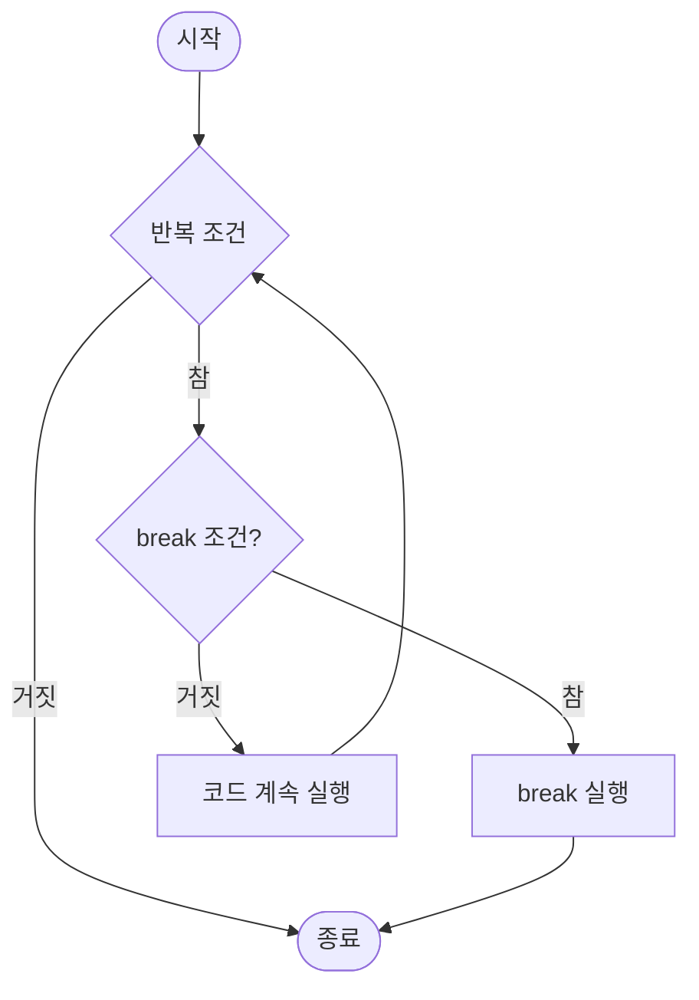
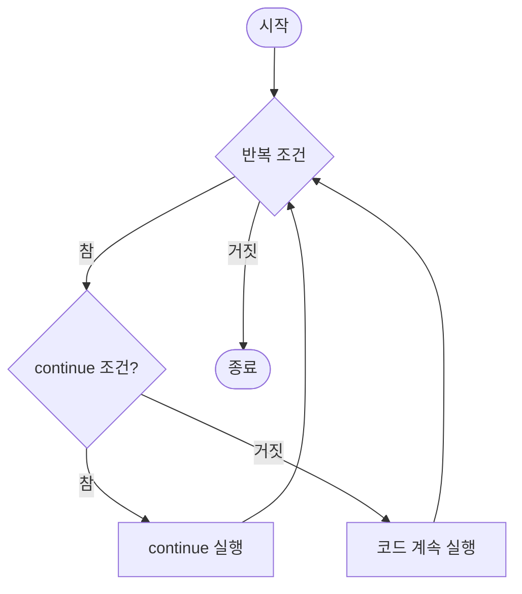

# Day 2-4교시: break와 continue (50분)

## 🎯 학습 목표
- break 문의 역할과 사용법을 완벽히 이해한다
- continue 문의 동작 원리를 파악한다
- break와 continue의 차이점을 명확히 구분한다
- 중첩 반복문에서 break/continue의 영향 범위를 이해한다
- 실전 문제 해결에 break/continue를 효과적으로 활용한다

## 📚 목차
1. [break 문 기초](#1-break-문-기초)
2. [break 실전 활용](#2-break-실전-활용)
3. [continue 문 기초](#3-continue-문-기초)
4. [continue 실전 활용](#4-continue-실전-활용)
5. [break vs continue](#5-break-vs-continue)
6. [중첩 반복문에서의 사용](#6-중첩-반복문에서의-사용)
7. [종합 실습](#7-종합-실습)

---

## 1. break 문 기초

### 1.1 break란?

**break 문**은 반복문(for, while, do-while)이나 switch 문을 즉시 종료하고 빠져나가는 제어문입니다.

**특징:**
- 반복문 즉시 종료
- 가장 가까운 반복문에만 영향
- 조건 없이 즉시 실행
- switch 문에서도 사용

### 1.2 기본 문법

```cpp
while (조건) {
    if (특정조건) {
        break;  // 반복문 종료
    }
}
// break 후 이곳으로 이동
```

**break 동작 시각화:**



**ASCII 흐름도:**
```
for (i=1; i<=10; i++) {
    if (i == 5) break;
    cout << i;
}

┌─────────────────────────────┐
│      break 동작 과정        │
├─────────────────────────────┤
│ i=1: 1<5? 아니오, 출력: 1   │
│ i=2: 2<5? 아니오, 출력: 2   │
│ i=3: 3<5? 아니오, 출력: 3   │
│ i=4: 4<5? 아니오, 출력: 4   │
│ i=5: 5==5? 예! → break!     │
│      ↓                      │
│ 반복문 즉시 종료            │
│ (6, 7, 8, 9, 10 실행 안 됨) │
└─────────────────────────────┘

출력 결과: 1234
```

### 1.3 첫 번째 예제 - for 문에서 break

```cpp
#include <iostream>
using namespace std;

int main() {
    cout << "=== break 기본 예제 ===" << endl;

    for (int i = 1; i <= 10; i++) {
        if (i == 5) {
            cout << "5에 도달! break 실행" << endl;
            break;  // i가 5일 때 반복 종료
        }
        cout << "i = " << i << endl;
    }

    cout << "반복문 종료" << endl;

    return 0;
}
```

**출력:**
```
=== break 기본 예제 ===
i = 1
i = 2
i = 3
i = 4
5에 도달! break 실행
반복문 종료
```

**분석:**
- i = 1, 2, 3, 4까지만 출력
- i = 5일 때 break 실행
- 6, 7, 8, 9, 10은 실행되지 않음

### 1.4 while 문에서 break

```cpp
#include <iostream>
using namespace std;

int main() {
    int count = 0;

    cout << "=== while + break ===" << endl;

    while (true) {  // 무한 루프
        count++;
        cout << "카운트: " << count << endl;

        if (count == 5) {
            cout << "5회 반복 완료! 종료" << endl;
            break;
        }
    }

    cout << "최종 카운트: " << count << endl;

    return 0;
}
```

**출력:**
```
=== while + break ===
카운트: 1
카운트: 2
카운트: 3
카운트: 4
카운트: 5
5회 반복 완료! 종료
최종 카운트: 5
```

### 1.5 break 실행 흐름 상세 분석

```cpp
#include <iostream>
using namespace std;

int main() {
    cout << "=== break 실행 흐름 분석 ===" << endl;

    for (int i = 1; i <= 10; i++) {
        cout << "반복 시작: i = " << i << endl;

        if (i == 5) {
            cout << "  → break 조건 만족!" << endl;
            break;
        }

        cout << "반복 끝: i = " << i << endl;
        cout << "---" << endl;
    }

    cout << "\nfor 문 밖으로 나왔습니다." << endl;

    return 0;
}
```

**출력:**
```
=== break 실행 흐름 분석 ===
반복 시작: i = 1
반복 끝: i = 1
---
반복 시작: i = 2
반복 끝: i = 2
---
반복 시작: i = 3
반복 끝: i = 3
---
반복 시작: i = 4
반복 끝: i = 4
---
반복 시작: i = 5
  → break 조건 만족!

for 문 밖으로 나왔습니다.
```

---

## 2. break 실전 활용

### 2.1 사용자 입력 종료

```cpp
#include <iostream>
using namespace std;

int main() {
    cout << "=== 숫자 입력 프로그램 ===" << endl;
    cout << "0을 입력하면 종료됩니다.\n" << endl;

    int sum = 0;
    int count = 0;

    while (true) {
        int number;
        cout << "숫자 입력: ";
        cin >> number;

        if (number == 0) {
            cout << "\n0 입력으로 프로그램을 종료합니다." << endl;
            break;
        }

        sum += number;
        count++;

        cout << "  입력된 숫자: " << count << "개" << endl;
        cout << "  현재 합계: " << sum << endl;
        cout << endl;
    }

    if (count > 0) {
        double average = (double)sum / count;
        cout << "\n=== 최종 결과 ===" << endl;
        cout << "총 개수: " << count << endl;
        cout << "합계: " << sum << endl;
        cout << "평균: " << average << endl;
    } else {
        cout << "\n입력된 숫자가 없습니다." << endl;
    }

    return 0;
}
```

### 2.2 로그인 시스템

```cpp
#include <iostream>
#include <string>
using namespace std;

int main() {
    const string CORRECT_PASSWORD = "1234";
    const int MAX_ATTEMPTS = 3;

    cout << "╔════════════════════╗" << endl;
    cout << "║  로그인 시스템     ║" << endl;
    cout << "╚════════════════════╝" << endl;

    int attempts = 0;
    bool success = false;

    while (attempts < MAX_ATTEMPTS) {
        string password;
        attempts++;

        cout << "\n[시도 " << attempts << "/" << MAX_ATTEMPTS << "]" << endl;
        cout << "비밀번호를 입력하세요: ";
        cin >> password;

        if (password == CORRECT_PASSWORD) {
            cout << "\n✅ 로그인 성공!" << endl;
            cout << "환영합니다!" << endl;
            success = true;
            break;  // 성공 시 즉시 종료
        }

        int remaining = MAX_ATTEMPTS - attempts;
        if (remaining > 0) {
            cout << "❌ 비밀번호가 틀렸습니다." << endl;
            cout << "남은 기회: " << remaining << "번" << endl;
        }
    }

    if (!success) {
        cout << "\n🔒 로그인 실패!" << endl;
        cout << "계정이 잠겼습니다." << endl;
    }

    return 0;
}
```

### 2.3 특정 값 검색

```cpp
#include <iostream>
using namespace std;

int main() {
    int numbers[] = {10, 25, 30, 42, 55, 67, 80, 95};
    int size = 8;
    int target;

    cout << "배열: ";
    for (int i = 0; i < size; i++) {
        cout << numbers[i] << " ";
    }
    cout << endl;

    cout << "\n찾을 숫자를 입력하세요: ";
    cin >> target;

    bool found = false;
    int position = -1;

    for (int i = 0; i < size; i++) {
        cout << "검색 중... [" << i << "] = " << numbers[i] << endl;

        if (numbers[i] == target) {
            found = true;
            position = i;
            cout << "→ 찾았습니다!" << endl;
            break;  // 찾으면 즉시 종료
        }
    }

    cout << "\n=== 결과 ===" << endl;
    if (found) {
        cout << target << "은(는) 인덱스 " << position << "에 있습니다." << endl;
    } else {
        cout << target << "을(를) 찾을 수 없습니다." << endl;
    }

    return 0;
}
```

### 2.4 소수 판별

```cpp
#include <iostream>
using namespace std;

int main() {
    int number;

    cout << "=== 소수 판별기 ===" << endl;
    cout << "숫자를 입력하세요 (2 이상): ";
    cin >> number;

    if (number < 2) {
        cout << number << "은(는) 소수가 아닙니다." << endl;
        return 0;
    }

    bool isPrime = true;

    cout << "\n소수 판별 과정:" << endl;

    for (int i = 2; i * i <= number; i++) {
        cout << number << " ÷ " << i << " = ";

        if (number % i == 0) {
            cout << (number / i) << " (나누어떨어짐)" << endl;
            cout << "→ " << number << " = " << i << " × " << (number / i) << endl;
            isPrime = false;
            break;  // 약수를 발견하면 즉시 종료
        } else {
            cout << (number / i) << " 나머지 " << (number % i) << endl;
        }
    }

    cout << "\n=== 결과 ===" << endl;
    if (isPrime) {
        cout << number << "은(는) 소수입니다! ✨" << endl;
    } else {
        cout << number << "은(는) 소수가 아닙니다." << endl;
    }

    return 0;
}
```

### 2.5 첫 번째 조건 찾기

```cpp
#include <iostream>
using namespace std;

int main() {
    cout << "=== 100 이하 첫 번째 완전수 찾기 ===" << endl;
    cout << "(완전수: 자신을 제외한 약수의 합이 자기 자신인 수)\n" << endl;

    for (int num = 2; num <= 100; num++) {
        int sum = 0;

        // 약수의 합 계산 (자신 제외)
        for (int i = 1; i < num; i++) {
            if (num % i == 0) {
                sum += i;
            }
        }

        // 완전수 판별
        if (sum == num) {
            cout << "첫 번째 완전수를 찾았습니다: " << num << endl;
            cout << "약수: ";

            // 약수 출력
            for (int i = 1; i < num; i++) {
                if (num % i == 0) {
                    cout << i << " ";
                }
            }
            cout << endl;
            cout << "합: " << sum << endl;

            break;  // 첫 번째만 찾으면 종료
        }
    }

    return 0;
}
```

**출력:**
```
=== 100 이하 첫 번째 완전수 찾기 ===
(완전수: 자신을 제외한 약수의 합이 자기 자신인 수)

첫 번째 완전수를 찾았습니다: 6
약수: 1 2 3
합: 6
```

---

## 3. continue 문 기초

### 3.1 continue란?

**continue 문**은 현재 반복을 건너뛰고 다음 반복으로 즉시 이동하는 제어문입니다.

**특징:**
- 반복문을 종료하지 않음
- 현재 반복만 건너뜀
- 다음 반복 계속 진행
- 반복문의 조건 검사로 이동

### 3.2 기본 문법

```cpp
for (int i = 0; i < 10; i++) {
    if (조건) {
        continue;  // 이 반복 건너뛰고 다음 반복으로
    }
    // continue 실행 시 이 부분은 건너뜀
}
```

**continue 동작 시각화:**



**ASCII 흐름도:**
```
for (i=1; i<=5; i++) {
    if (i == 3) continue;
    cout << i;
}

┌──────────────────────────────────┐
│      continue 동작 과정          │
├──────────────────────────────────┤
│ i=1: 1==3? 아니오, 출력: 1       │
│      ↓ (다음 반복)               │
│ i=2: 2==3? 아니오, 출력: 2       │
│      ↓ (다음 반복)               │
│ i=3: 3==3? 예! → continue!       │
│      ↓ (출력 건너뜀)             │
│      ↓ (증감식 i++ 실행)         │
│      ↓ (다음 반복으로)           │
│ i=4: 4==3? 아니오, 출력: 4       │
│      ↓ (다음 반복)               │
│ i=5: 5==3? 아니오, 출력: 5       │
│      ↓                           │
│ 반복문 정상 종료                 │
└──────────────────────────────────┘

출력 결과: 1245 (3만 건너뜀)
```

**break vs continue 비교:**
```
┌─────────────────┬─────────────────┐
│     break       │    continue     │
├─────────────────┼─────────────────┤
│ 반복문 즉시 종료│ 현재 반복 건너뜀│
│ 반복문 탈출     │ 다음 반복 진행  │
│ 남은 반복 무시  │ 반복 계속       │
└─────────────────┴─────────────────┘

예제:
for (i=1; i<=5; i++) {
    if (i==3) break;
    cout << i;
}
결과: 12 (3에서 완전히 종료)

for (i=1; i<=5; i++) {
    if (i==3) continue;
    cout << i;
}
결과: 1245 (3만 건너뛰고 계속)
```

### 3.3 첫 번째 예제 - 홀수 건너뛰기

```cpp
#include <iostream>
using namespace std;

int main() {
    cout << "=== continue 기본 예제 ===" << endl;
    cout << "1부터 10까지 짝수만 출력:\n" << endl;

    for (int i = 1; i <= 10; i++) {
        if (i % 2 != 0) {  // 홀수인 경우
            cout << i << "은(는) 홀수 → continue" << endl;
            continue;  // 홀수는 건너뛰기
        }
        cout << i << " ← 짝수 출력" << endl;
    }

    cout << "\n반복문 종료" << endl;

    return 0;
}
```

**출력:**
```
=== continue 기본 예제 ===
1부터 10까지 짝수만 출력:

1은(는) 홀수 → continue
2 ← 짝수 출력
3은(는) 홀수 → continue
4 ← 짝수 출력
5은(는) 홀수 → continue
6 ← 짝수 출력
7은(는) 홀수 → continue
8 ← 짝수 출력
9은(는) 홀수 → continue
10 ← 짝수 출력

반복문 종료
```

### 3.4 continue 실행 흐름 분석

```cpp
#include <iostream>
using namespace std;

int main() {
    cout << "=== continue 흐름 분석 ===" << endl;

    for (int i = 1; i <= 5; i++) {
        cout << "\n[반복 시작: i = " << i << "]" << endl;

        if (i == 3) {
            cout << "  → i가 3이므로 continue!" << endl;
            continue;
        }

        cout << "  작업 1 실행" << endl;
        cout << "  작업 2 실행" << endl;
        cout << "[반복 끝: i = " << i << "]" << endl;
    }

    cout << "\nfor 문 종료" << endl;

    return 0;
}
```

**출력:**
```
=== continue 흐름 분석 ===

[반복 시작: i = 1]
  작업 1 실행
  작업 2 실행
[반복 끝: i = 1]

[반복 시작: i = 2]
  작업 1 실행
  작업 2 실행
[반복 끝: i = 2]

[반복 시작: i = 3]
  → i가 3이므로 continue!

[반복 시작: i = 4]
  작업 1 실행
  작업 2 실행
[반복 끝: i = 4]

[반복 시작: i = 5]
  작업 1 실행
  작업 2 실행
[반복 끝: i = 5]

for 문 종료
```

**분석:**
- i = 3일 때만 작업 1, 2가 실행되지 않음
- 반복문은 계속 진행 (i = 4, 5도 실행됨)
- break와 달리 반복문을 빠져나가지 않음

### 3.5 while 문에서 continue

```cpp
#include <iostream>
using namespace std;

int main() {
    int count = 0;

    cout << "=== while + continue ===" << endl;

    while (count < 5) {
        count++;

        if (count == 3) {
            cout << "count = " << count << " → continue (출력 건너뜀)" << endl;
            continue;
        }

        cout << "count = " << count << " → 출력" << endl;
    }

    cout << "\nwhile 문 종료" << endl;

    return 0;
}
```

**출력:**
```
=== while + continue ===
count = 1 → 출력
count = 2 → 출력
count = 3 → continue (출력 건너뜀)
count = 4 → 출력
count = 5 → 출력

while 문 종료
```

---

## 4. continue 실전 활용

### 4.1 특정 값 제외하고 처리

```cpp
#include <iostream>
using namespace std;

int main() {
    int numbers[] = {10, 0, 25, 0, 30, 42, 0, 55};
    int size = 8;

    cout << "=== 0이 아닌 값만 처리 ===" << endl;
    cout << "원본 배열: ";

    for (int i = 0; i < size; i++) {
        cout << numbers[i] << " ";
    }
    cout << endl;

    cout << "\n처리 과정:" << endl;

    int sum = 0;
    int count = 0;

    for (int i = 0; i < size; i++) {
        if (numbers[i] == 0) {
            cout << "[" << i << "] = 0 → 건너뜀" << endl;
            continue;  // 0은 처리하지 않음
        }

        sum += numbers[i];
        count++;
        cout << "[" << i << "] = " << numbers[i] << " → 처리 (sum=" << sum << ")" << endl;
    }

    cout << "\n=== 결과 ===" << endl;
    cout << "처리된 숫자 개수: " << count << endl;
    cout << "합계: " << sum << endl;
    cout << "평균: " << (double)sum / count << endl;

    return 0;
}
```

### 4.2 유효한 데이터만 출력

```cpp
#include <iostream>
using namespace std;

int main() {
    int scores[] = {85, -1, 92, 78, -1, 95, 88, -1, 76};
    int size = 9;

    cout << "=== 학생 성적 출력 (-1은 결석) ===" << endl;

    int validCount = 0;
    int sum = 0;

    for (int i = 0; i < size; i++) {
        if (scores[i] == -1) {
            cout << "학생 " << (i + 1) << ": 결석" << endl;
            continue;  // 결석자는 통계에서 제외
        }

        validCount++;
        sum += scores[i];
        cout << "학생 " << (i + 1) << ": " << scores[i] << "점";

        // 등급 표시
        if (scores[i] >= 90) {
            cout << " (A)";
        } else if (scores[i] >= 80) {
            cout << " (B)";
        } else if (scores[i] >= 70) {
            cout << " (C)";
        }
        cout << endl;
    }

    cout << "\n=== 통계 ===" << endl;
    cout << "출석 인원: " << validCount << "명" << endl;
    cout << "결석 인원: " << (size - validCount) << "명" << endl;
    cout << "평균 점수: " << (double)sum / validCount << "점" << endl;

    return 0;
}
```

### 4.3 조건에 맞는 값만 카운트

```cpp
#include <iostream>
using namespace std;

int main() {
    cout << "=== 1부터 100까지 숫자 중 ===" << endl;

    // 3의 배수이면서 5의 배수가 아닌 수
    int count = 0;

    cout << "3의 배수이면서 5의 배수가 아닌 수:" << endl;

    for (int i = 1; i <= 100; i++) {
        // 3의 배수가 아니면 건너뛰기
        if (i % 3 != 0) {
            continue;
        }

        // 5의 배수면 건너뛰기
        if (i % 5 == 0) {
            continue;
        }

        cout << i << " ";
        count++;

        if (count % 10 == 0) {
            cout << endl;  // 10개마다 줄바꿈
        }
    }

    cout << "\n\n총 개수: " << count << "개" << endl;

    return 0;
}
```

### 4.4 입력 필터링

```cpp
#include <iostream>
using namespace std;

int main() {
    cout << "=== 양수만 입력받기 ===" << endl;
    cout << "10개의 양수를 입력하세요 (0이나 음수는 무시됨)\n" << endl;

    int numbers[10];
    int index = 0;

    while (index < 10) {
        int input;
        cout << "[" << (index + 1) << "/10] 숫자: ";
        cin >> input;

        if (input <= 0) {
            cout << "  → 양수가 아니므로 무시합니다.\n" << endl;
            continue;  // 양수가 아니면 다시 입력
        }

        numbers[index] = input;
        cout << "  → 저장되었습니다." << endl;
        index++;
    }

    cout << "\n=== 입력된 숫자 ===" << endl;
    int sum = 0;

    for (int i = 0; i < 10; i++) {
        cout << numbers[i] << " ";
        sum += numbers[i];
    }

    cout << "\n\n합계: " << sum << endl;
    cout << "평균: " << (double)sum / 10 << endl;

    return 0;
}
```

---

## 5. break vs continue

### 5.1 핵심 차이점

```cpp
#include <iostream>
using namespace std;

int main() {
    cout << "╔═══════════════════════════╗" << endl;
    cout << "║  break vs continue 비교   ║" << endl;
    cout << "╚═══════════════════════════╝" << endl;

    // break 예제
    cout << "\n=== break 예제 ===" << endl;
    cout << "1부터 10까지 출력하되, 5에서 멈춤:" << endl;

    for (int i = 1; i <= 10; i++) {
        if (i == 5) {
            cout << "break 실행 → 반복문 종료" << endl;
            break;
        }
        cout << i << " ";
    }
    cout << "\n출력된 숫자: 1 2 3 4" << endl;

    // continue 예제
    cout << "\n=== continue 예제 ===" << endl;
    cout << "1부터 10까지 출력하되, 5는 건너뜀:" << endl;

    for (int i = 1; i <= 10; i++) {
        if (i == 5) {
            cout << "(5 건너뜀) ";
            continue;
        }
        cout << i << " ";
    }
    cout << "\n출력된 숫자: 1 2 3 4 6 7 8 9 10" << endl;

    return 0;
}
```

**출력:**
```
╔═══════════════════════════╗
║  break vs continue 비교   ║
╚═══════════════════════════╝

=== break 예제 ===
1부터 10까지 출력하되, 5에서 멈춤:
1 2 3 4 break 실행 → 반복문 종료
출력된 숫자: 1 2 3 4

=== continue 예제 ===
1부터 10까지 출력하되, 5는 건너뜀:
1 2 3 4 (5 건너뜀) 6 7 8 9 10
출력된 숫자: 1 2 3 4 6 7 8 9 10
```

### 5.2 비교표

| 특성 | break | continue |
|------|-------|----------|
| 기능 | 반복문 종료 | 현재 반복 건너뛰기 |
| 반복문 상태 | 완전 종료 | 계속 진행 |
| 다음 반복 | 실행 안 됨 | 실행됨 |
| 사용 목적 | 조기 종료 | 특정 조건 제외 |
| 주요 용도 | 검색 성공, 오류 발생 | 필터링, 조건 제외 |

### 5.3 실전 비교 예제

```cpp
#include <iostream>
using namespace std;

int main() {
    int numbers[] = {5, 12, 8, 15, 20, 3, 18, 25, 30, 7};
    int size = 10;

    cout << "배열: ";
    for (int i = 0; i < size; i++) {
        cout << numbers[i] << " ";
    }
    cout << endl;

    // break 사용: 첫 번째 20 이상 찾기
    cout << "\n=== break: 첫 번째 20 이상 숫자 찾기 ===" << endl;

    for (int i = 0; i < size; i++) {
        cout << "검사: " << numbers[i];

        if (numbers[i] >= 20) {
            cout << " → 20 이상 발견! 종료" << endl;
            cout << "결과: " << numbers[i] << endl;
            break;
        }

        cout << " → 계속" << endl;
    }

    // continue 사용: 20 이상 숫자 모두 찾기
    cout << "\n=== continue: 20 이상 숫자 모두 찾기 ===" << endl;

    int count = 0;
    for (int i = 0; i < size; i++) {
        if (numbers[i] < 20) {
            continue;  // 20 미만은 건너뛰기
        }

        cout << numbers[i] << " ";
        count++;
    }

    cout << "\n총 " << count << "개 발견" << endl;

    return 0;
}
```

### 5.4 선택 가이드

**break를 사용할 때:**
- 원하는 값을 찾았을 때
- 오류가 발생했을 때
- 더 이상 반복이 필요 없을 때
- 조기 종료가 필요할 때

**continue를 사용할 때:**
- 특정 조건을 제외하고 싶을 때
- 유효하지 않은 데이터를 건너뛸 때
- 필터링이 필요할 때
- 예외 케이스를 무시할 때

---

## 6. 중첩 반복문에서의 사용

### 6.1 중첩 반복문에서 break

```cpp
#include <iostream>
using namespace std;

int main() {
    cout << "=== 중첩 반복문에서 break ===" << endl;
    cout << "break는 가장 가까운 반복문만 종료합니다.\n" << endl;

    for (int i = 1; i <= 3; i++) {
        cout << "외부 반복: i = " << i << endl;

        for (int j = 1; j <= 5; j++) {
            if (j == 3) {
                cout << "  → j가 3이므로 내부 반복 종료" << endl;
                break;  // 안쪽 for 문만 종료
            }
            cout << "  내부 반복: j = " << j << endl;
        }

        cout << "  (내부 반복 종료, 외부 반복 계속)\n" << endl;
    }

    cout << "모든 반복 종료" << endl;

    return 0;
}
```

**출력:**
```
=== 중첩 반복문에서 break ===
break는 가장 가까운 반복문만 종료합니다.

외부 반복: i = 1
  내부 반복: j = 1
  내부 반복: j = 2
  → j가 3이므로 내부 반복 종료
  (내부 반복 종료, 외부 반복 계속)

외부 반복: i = 2
  내부 반복: j = 1
  내부 반복: j = 2
  → j가 3이므로 내부 반복 종료
  (내부 반복 종료, 외부 반복 계속)

외부 반복: i = 3
  내부 반복: j = 1
  내부 반복: j = 2
  → j가 3이므로 내부 반복 종료
  (내부 반복 종료, 외부 반복 계속)

모든 반복 종료
```

### 6.2 플래그를 사용한 전체 종료

```cpp
#include <iostream>
using namespace std;

int main() {
    cout << "=== 플래그로 중첩 반복문 전체 종료 ===" << endl;

    bool found = false;

    for (int i = 1; i <= 5 && !found; i++) {
        for (int j = 1; j <= 5; j++) {
            cout << "(" << i << ", " << j << ") ";

            if (i * j == 12) {
                cout << "\n→ " << i << " × " << j << " = 12 발견!" << endl;
                found = true;
                break;  // 안쪽 반복 종료
            }
        }

        cout << endl;

        if (found) {
            break;  // 바깥쪽 반복도 종료
        }
    }

    cout << "\n검색 종료" << endl;

    return 0;
}
```

### 6.3 중첩 반복문에서 continue

```cpp
#include <iostream>
using namespace std;

int main() {
    cout << "=== 중첩 반복문에서 continue ===" << endl;
    cout << "5×5 구구단에서 곱이 짝수인 것만 출력\n" << endl;

    for (int i = 1; i <= 5; i++) {
        cout << "[" << i << "단]" << endl;

        for (int j = 1; j <= 5; j++) {
            int result = i * j;

            if (result % 2 != 0) {
                continue;  // 홀수는 건너뛰기
            }

            cout << "  " << i << " × " << j << " = " << result << endl;
        }

        cout << endl;
    }

    return 0;
}
```

### 6.4 2차원 배열 탐색

```cpp
#include <iostream>
using namespace std;

int main() {
    int matrix[4][4] = {
        {1, 2, 3, 4},
        {5, 0, 7, 8},
        {9, 10, 0, 12},
        {13, 14, 15, 16}
    };

    cout << "=== 2차원 배열에서 0 제외하고 합계 계산 ===" << endl;
    cout << "배열:" << endl;

    for (int i = 0; i < 4; i++) {
        for (int j = 0; j < 4; j++) {
            cout << matrix[i][j] << "\t";
        }
        cout << endl;
    }

    cout << "\n계산 과정:" << endl;

    int sum = 0;
    int count = 0;

    for (int i = 0; i < 4; i++) {
        for (int j = 0; j < 4; j++) {
            if (matrix[i][j] == 0) {
                cout << "[" << i << "][" << j << "] = 0 → 건너뜀" << endl;
                continue;
            }

            sum += matrix[i][j];
            count++;
        }
    }

    cout << "\n=== 결과 ===" << endl;
    cout << "처리된 요소: " << count << "개" << endl;
    cout << "합계: " << sum << endl;
    cout << "평균: " << (double)sum / count << endl;

    return 0;
}
```

---

## 7. 종합 실습

### 7.1 실습 1: 소수 찾기

```cpp
#include <iostream>
using namespace std;

int main() {
    int start, end;

    cout << "=== 소수 찾기 프로그램 ===" << endl;
    cout << "시작 숫자: ";
    cin >> start;
    cout << "끝 숫자: ";
    cin >> end;

    if (start < 2) start = 2;

    cout << "\n" << start << "부터 " << end << "까지의 소수:" << endl;

    int count = 0;

    for (int num = start; num <= end; num++) {
        bool isPrime = true;

        // 소수 판별
        for (int i = 2; i * i <= num; i++) {
            if (num % i == 0) {
                isPrime = false;
                break;  // 약수 발견 시 즉시 종료
            }
        }

        if (isPrime) {
            cout << num << " ";
            count++;

            if (count % 10 == 0) {
                cout << endl;  // 10개마다 줄바꿈
            }
        }
    }

    cout << "\n\n총 " << count << "개의 소수 발견" << endl;

    return 0;
}
```

### 7.2 실습 2: 배수 필터링

```cpp
#include <iostream>
using namespace std;

int main() {
    int n, exclude;

    cout << "=== 배수 제외 출력 ===" << endl;
    cout << "1부터 몇까지? ";
    cin >> n;
    cout << "제외할 배수: ";
    cin >> exclude;

    cout << "\n1부터 " << n << "까지 (" << exclude << "의 배수 제외):" << endl;

    int count = 0;
    int sum = 0;

    for (int i = 1; i <= n; i++) {
        if (i % exclude == 0) {
            continue;  // 배수는 건너뛰기
        }

        cout << i << " ";
        count++;
        sum += i;

        if (count % 10 == 0) {
            cout << endl;
        }
    }

    cout << "\n\n=== 통계 ===" << endl;
    cout << "출력된 숫자: " << count << "개" << endl;
    cout << "합계: " << sum << endl;
    cout << "평균: " << (double)sum / count << endl;

    return 0;
}
```

### 7.3 실습 3: 숫자 게임

```cpp
#include <iostream>
#include <cstdlib>
#include <ctime>
using namespace std;

int main() {
    srand(time(0));

    int secret = rand() % 100 + 1;
    int maxAttempts = 7;
    int attempts = 0;
    bool won = false;

    cout << "╔════════════════════════════╗" << endl;
    cout << "║   숫자 맞히기 게임         ║" << endl;
    cout << "╚════════════════════════════╝" << endl;
    cout << "1-100 사이의 숫자를 맞혀보세요!" << endl;
    cout << "기회는 " << maxAttempts << "번입니다.\n" << endl;

    while (attempts < maxAttempts) {
        int guess;
        attempts++;

        cout << "[시도 " << attempts << "/" << maxAttempts << "] 숫자: ";
        cin >> guess;

        // 범위 검증
        if (guess < 1 || guess > 100) {
            cout << "❌ 1-100 사이의 숫자를 입력하세요." << endl;
            attempts--;  // 카운트 복원
            continue;  // 다시 입력
        }

        // 정답 확인
        if (guess == secret) {
            cout << "\n🎉 정답입니다!" << endl;
            cout << attempts << "번 만에 맞혔습니다!" << endl;

            if (attempts <= 3) {
                cout << "평가: 천재! 🌟" << endl;
            } else if (attempts <= 5) {
                cout << "평가: 훌륭합니다! 👍" << endl;
            } else {
                cout << "평가: 성공! 😊" << endl;
            }

            won = true;
            break;  // 게임 종료
        }

        // 힌트 제공
        if (guess < secret) {
            cout << "⬆️  UP! 더 큰 수입니다." << endl;
        } else {
            cout << "⬇️  DOWN! 더 작은 수입니다." << endl;
        }

        int remaining = maxAttempts - attempts;
        if (remaining > 0) {
            cout << "남은 기회: " << remaining << "번\n" << endl;
        }
    }

    if (!won) {
        cout << "\n😢 기회를 모두 사용했습니다." << endl;
        cout << "정답은 " << secret << "이었습니다." << endl;
    }

    return 0;
}
```

### 7.4 실습 4: 패턴 출력 with continue

```cpp
#include <iostream>
using namespace std;

int main() {
    int size;

    cout << "=== 특수 패턴 출력 ===" << endl;
    cout << "크기 입력 (홀수): ";
    cin >> size;

    // 홀수 검증
    if (size % 2 == 0) {
        cout << "홀수를 입력하세요!" << endl;
        return 1;
    }

    cout << "\n다이아몬드 패턴 (가운데 줄 제외):\n" << endl;

    int mid = size / 2;

    // 위쪽 삼각형
    for (int i = 0; i < size; i++) {
        if (i == mid) {
            continue;  // 가운데 줄은 건너뛰기
        }

        // 공백 출력
        for (int j = 0; j < abs(mid - i); j++) {
            cout << " ";
        }

        // 별 출력
        int stars = size - 2 * abs(mid - i);
        for (int k = 0; k < stars; k++) {
            cout << "*";
        }

        cout << endl;
    }

    return 0;
}
```

---

## 📝 4교시 실습 과제

### 과제 1: 소수 출력 ⭐
**난이도:** 쉬움

2부터 100까지의 소수를 모두 찾아 출력하세요.

**요구사항:**
- 소수 판별에 break 사용
- 10개씩 줄바꿈
- 총 개수 출력

**출력 예시:**
```
2 3 5 7 11 13 17 19 23 29
31 37 41 43 47 53 59 61 67 71
73 79 83 89 97

총 25개의 소수
```

### 과제 2: 3의 배수 제외 ⭐
**난이도:** 쉬움

1부터 30까지 중 3의 배수가 아닌 수만 출력하세요.

**요구사항:**
- continue 사용
- 한 줄에 출력
- 합계 계산

**출력 예시:**
```
1 2 4 5 7 8 10 11 13 14 16 17 19 20 22 23 25 26 28 29

총 20개, 합계: 300
```

### 과제 3: 완전수 찾기 ⭐⭐
**난이도:** 중간

1부터 1000 사이의 첫 번째 완전수를 찾으세요.

**요구사항:**
- 완전수: 자신을 제외한 약수의 합 = 자기 자신
- 예: 6 = 1 + 2 + 3
- 약수 출력
- break 사용하여 첫 번째만 찾기

**출력 예시:**
```
첫 번째 완전수: 6
약수: 1 2 3
합: 6
```

### 과제 4: 유효한 점수만 통계 ⭐⭐⭐
**난이도:** 어려움

학생들의 점수를 입력받아 통계를 출력하세요.

**요구사항:**
- 10명의 점수 입력
- 0-100 범위 검증 (continue로 재입력)
- 평균, 최고점, 최저점 출력
- 입력 과정 표시

**출력 예시:**
```
[1/10] 점수: 150
  → 0-100 사이만 입력 가능
[1/10] 점수: 85
  → 저장

...

=== 통계 ===
평균: 82.5점
최고점: 95점
최저점: 70점
```

---

## 💡 핵심 정리

### ✅ break 문
```cpp
while (조건) {
    if (특정조건) {
        break;  // 반복문 즉시 종료
    }
}
```
- **기능:** 반복문 완전 종료
- **효과:** 반복문 밖으로 빠져나감
- **용도:** 검색 성공, 조기 종료

### ✅ continue 문
```cpp
for (int i = 0; i < n; i++) {
    if (조건) {
        continue;  // 이번 반복 건너뛰기
    }
    // 처리
}
```
- **기능:** 현재 반복만 건너뜀
- **효과:** 다음 반복 계속 진행
- **용도:** 필터링, 조건 제외

### ✅ 중첩 반복문에서의 영향

```cpp
for (외부) {
    for (내부) {
        if (조건) break;     // 내부 반복만 종료
        if (조건) continue;  // 내부 반복만 건너뜀
    }
}
```

**주의:**
- break/continue는 가장 가까운 반복문에만 영향
- 전체 종료가 필요하면 플래그 사용

### ✅ 사용 패턴

| 상황 | 적합한 제어문 |
|------|--------------|
| 원하는 값 찾음 | break |
| 오류 발생 | break |
| 특정 값 제외 | continue |
| 유효하지 않은 데이터 | continue |

---

## 🎓 학습 체크리스트

- [ ] break의 역할을 정확히 이해했다
- [ ] continue의 동작 원리를 이해했다
- [ ] break와 continue의 차이를 설명할 수 있다
- [ ] 중첩 반복문에서의 영향 범위를 이해했다
- [ ] 적절한 상황에 break/continue를 선택할 수 있다
- [ ] 플래그를 사용한 전체 종료를 구현할 수 있다

---

## 📚 다음 시간 예고

**Day 2-5교시: 종합 실습**
- switch와 반복문 통합
- 실전 프로그램 작성
- Day 2 총정리
- 미니 프로젝트

**준비사항:**
- Day 2 전체 내용 복습
- 실습 문제 풀이 준비

---

## ❓ 자주 묻는 질문 (FAQ)

### Q1: break와 return의 차이는?
**A:**
- **break:** 반복문만 종료, 함수는 계속
- **return:** 함수 자체를 종료

```cpp
void function() {
    for (int i = 0; i < 10; i++) {
        if (i == 5) break;     // for 문만 종료
        if (i == 8) return;    // function 종료
    }
    cout << "break는 여기 도달" << endl;
    // return은 여기 도달 안 함
}
```

### Q2: continue 후에도 i++는 실행되나요?
**A:** 네, for 문에서는 continue 후에도 증감식(i++)이 실행됩니다.

```cpp
for (int i = 0; i < 5; i++) {  // i++는 항상 실행
    if (i == 2) continue;
    cout << i << endl;
}
// 출력: 0 1 3 4
```

### Q3: 중첩 반복문 전체를 한 번에 종료하려면?
**A:** goto나 플래그를 사용하거나, 함수로 분리해서 return을 사용합니다.

```cpp
// 방법 1: 플래그
bool done = false;
for (int i = 0; i < 10 && !done; i++) {
    for (int j = 0; j < 10; j++) {
        if (조건) {
            done = true;
            break;
        }
    }
}

// 방법 2: 함수 사용 (권장)
void search() {
    for (int i = 0; i < 10; i++) {
        for (int j = 0; j < 10; j++) {
            if (조건) {
                return;  // 함수 전체 종료
            }
        }
    }
}
```

### Q4: break 없이 switch 문을 쓰면?
**A:** Fall-through가 발생하여 다음 case도 실행됩니다.

```cpp
switch (value) {
    case 1:
        cout << "1" << endl;
        // break 없음!
    case 2:
        cout << "2" << endl;  // value=1일 때도 실행됨
        break;
}
```

### Q5: continue를 while에서 사용할 때 주의사항은?
**A:** while 문에서는 증감을 잊지 말아야 합니다!

```cpp
// 위험한 코드 (무한 루프!)
int i = 0;
while (i < 10) {
    if (i % 2 == 0) continue;  // i++가 실행 안 됨!
    cout << i << endl;
    i++;
}

// 올바른 코드
int i = 0;
while (i < 10) {
    i++;  // 먼저 증가
    if (i % 2 == 0) continue;
    cout << i << endl;
}
```

---

## 🔍 디버깅 팁

### 1. break가 실행되는지 확인

```cpp
for (int i = 0; i < 10; i++) {
    if (i == 5) {
        cout << "DEBUG: break 실행!" << endl;
        break;
    }
}
cout << "DEBUG: for 문 종료" << endl;
```

### 2. continue 카운트

```cpp
int continueCount = 0;
for (int i = 0; i < 10; i++) {
    if (조건) {
        continueCount++;
        continue;
    }
}
cout << "continue 실행 횟수: " << continueCount << endl;
```

### 3. 중첩 반복문 추적

```cpp
for (int i = 0; i < 3; i++) {
    cout << "외부: i=" << i << endl;
    for (int j = 0; j < 3; j++) {
        cout << "  내부: j=" << j << endl;
        if (조건) {
            cout << "  → break!" << endl;
            break;
        }
    }
    cout << "외부 계속" << endl;
}
```

---

## 🎯 실력 향상 문제

### 도전 1: 쌍둥이 소수
차이가 2인 소수 쌍을 찾으세요. (예: 3과 5, 11과 13)

### 도전 2: 자릿수 합이 10인 수
1부터 100까지 중 자릿수의 합이 10인 수를 모두 찾으세요.

### 도전 3: 패스칼 삼각형
크기 n의 패스칼 삼각형을 출력하되, 짝수는 *로, 홀수는 공백으로 표시하세요.

---

**수고하셨습니다! 다음 시간에는 종합 실습을 진행하겠습니다.** 🚀
