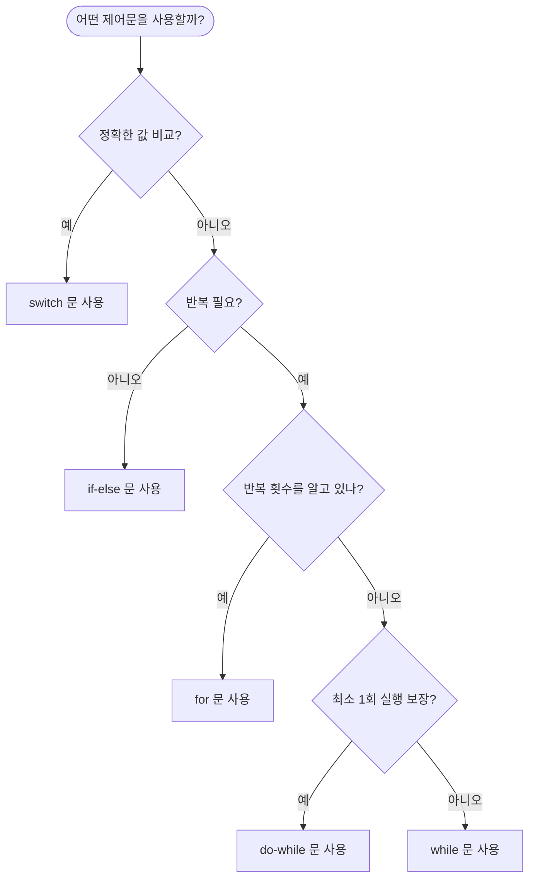

# Day 2-5교시: 종합 실습 및 프로젝트

## 🎯 학습 목표
- switch와 반복문을 활용한 실전 프로그램 작성
- 메뉴 기반 프로그램 설계 및 구현
- 게임 프로그래밍 기초
- 문제 해결 능력 향상
- 실전 디버깅 및 최적화

## 📋 목차
1. [메뉴 기반 프로그램](#1-메뉴-기반-프로그램)
2. [게임 프로그래밍](#2-게임-프로그래밍)
3. [패턴 출력 마스터](#3-패턴-출력-마스터)
4. [실전 문제 해결](#4-실전-문제-해결)
5. [프로젝트: 종합 관리 시스템](#5-프로젝트-종합-관리-시스템)
6. [디버깅 및 최적화](#6-디버깅-및-최적화)

---

## 1. 메뉴 기반 프로그램

### 1.1 기본 계산기 프로그램

```cpp
#include <iostream>
#include <iomanip>
using namespace std;

int main() {
    int choice;

    while (true) {
        cout << "\n╔════════════════════════════════╗" << endl;
        cout << "║      계산기 메뉴 v1.0          ║" << endl;
        cout << "╠════════════════════════════════╣" << endl;
        cout << "║ 1. 덧셈 (+)                    ║" << endl;
        cout << "║ 2. 뺄셈 (-)                    ║" << endl;
        cout << "║ 3. 곱셈 (×)                    ║" << endl;
        cout << "║ 4. 나눗셈 (÷)                  ║" << endl;
        cout << "║ 5. 나머지 (%)                  ║" << endl;
        cout << "║ 6. 거듭제곱 (^)                ║" << endl;
        cout << "║ 7. 종료                        ║" << endl;
        cout << "╚════════════════════════════════╝" << endl;
        cout << "선택 (1-7): ";
        cin >> choice;

        if (choice == 7) {
            cout << "\n프로그램을 종료합니다. 감사합니다!" << endl;
            break;
        }

        if (choice < 1 || choice > 7) {
            cout << "❌ 잘못된 선택입니다. 다시 선택해주세요." << endl;
            continue;
        }

        double num1, num2, result;
        cout << "\n첫 번째 숫자를 입력하세요: ";
        cin >> num1;
        cout << "두 번째 숫자를 입력하세요: ";
        cin >> num2;

        cout << fixed << setprecision(2);

        switch (choice) {
            case 1:
                result = num1 + num2;
                cout << "✅ 결과: " << num1 << " + " << num2 << " = " << result << endl;
                break;

            case 2:
                result = num1 - num2;
                cout << "✅ 결과: " << num1 << " - " << num2 << " = " << result << endl;
                break;

            case 3:
                result = num1 * num2;
                cout << "✅ 결과: " << num1 << " × " << num2 << " = " << result << endl;
                break;

            case 4:
                if (num2 == 0) {
                    cout << "❌ 오류: 0으로 나눌 수 없습니다!" << endl;
                } else {
                    result = num1 / num2;
                    cout << "✅ 결과: " << num1 << " ÷ " << num2 << " = " << result << endl;
                }
                break;

            case 5:
                if (num2 == 0) {
                    cout << "❌ 오류: 0으로 나눌 수 없습니다!" << endl;
                } else {
                    result = (int)num1 % (int)num2;
                    cout << "✅ 결과: " << (int)num1 << " % " << (int)num2 << " = " << (int)result << endl;
                }
                break;

            case 6: {
                result = 1;
                for (int i = 0; i < num2; i++) {
                    result *= num1;
                }
                cout << "✅ 결과: " << num1 << " ^ " << num2 << " = " << result << endl;
                break;
            }
        }

        // 계속 진행 여부
        cout << "\n계속 계산하시겠습니까? (y/n): ";
        char continueCalc;
        cin >> continueCalc;
        if (continueCalc == 'n' || continueCalc == 'N') {
            cout << "프로그램을 종료합니다." << endl;
            break;
        }
    }

    return 0;
}
```

**실행 결과:**
```
╔════════════════════════════════╗
║      계산기 메뉴 v1.0          ║
╠════════════════════════════════╣
║ 1. 덧셈 (+)                    ║
║ 2. 뺄셈 (-)                    ║
║ 3. 곱셈 (×)                    ║
║ 4. 나눗셈 (÷)                  ║
║ 5. 나머지 (%)                  ║
║ 6. 거듭제곱 (^)                ║
║ 7. 종료                        ║
╚════════════════════════════════╝
선택 (1-7): 3

첫 번째 숫자를 입력하세요: 12.5
두 번째 숫자를 입력하세요: 4
✅ 결과: 12.50 × 4.00 = 50.00

계속 계산하시겠습니까? (y/n): y
```

### 1.2 학생 성적 관리 시스템

```cpp
#include <iostream>
#include <iomanip>
#include <string>
using namespace std;

int main() {
    const int MAX_STUDENTS = 50;
    string names[MAX_STUDENTS];
    int scores[MAX_STUDENTS];
    int studentCount = 0;

    while (true) {
        cout << "\n╔════════════════════════════════╗" << endl;
        cout << "║    학생 성적 관리 시스템       ║" << endl;
        cout << "╠════════════════════════════════╣" << endl;
        cout << "║ 1. 학생 추가                   ║" << endl;
        cout << "║ 2. 성적 조회                   ║" << endl;
        cout << "║ 3. 전체 학생 목록              ║" << endl;
        cout << "║ 4. 통계 보기                   ║" << endl;
        cout << "║ 5. 학생 삭제                   ║" << endl;
        cout << "║ 6. 등급별 분류                 ║" << endl;
        cout << "║ 7. 종료                        ║" << endl;
        cout << "╚════════════════════════════════╝" << endl;
        cout << "현재 등록된 학생 수: " << studentCount << "/" << MAX_STUDENTS << endl;
        cout << "선택: ";

        int choice;
        cin >> choice;

        switch (choice) {
            case 1: {  // 학생 추가
                if (studentCount >= MAX_STUDENTS) {
                    cout << "❌ 더 이상 학생을 추가할 수 없습니다." << endl;
                    break;
                }

                cout << "\n=== 학생 추가 ===" << endl;
                cout << "이름: ";
                cin >> names[studentCount];
                cout << "점수 (0-100): ";
                cin >> scores[studentCount];

                if (scores[studentCount] < 0 || scores[studentCount] > 100) {
                    cout << "❌ 잘못된 점수입니다. (0-100 사이로 입력)" << endl;
                    break;
                }

                studentCount++;
                cout << "✅ 학생이 추가되었습니다!" << endl;
                break;
            }

            case 2: {  // 성적 조회
                if (studentCount == 0) {
                    cout << "❌ 등록된 학생이 없습니다." << endl;
                    break;
                }

                cout << "\n조회할 학생 이름: ";
                string searchName;
                cin >> searchName;

                bool found = false;
                for (int i = 0; i < studentCount; i++) {
                    if (names[i] == searchName) {
                        cout << "\n=== 학생 정보 ===" << endl;
                        cout << "이름: " << names[i] << endl;
                        cout << "점수: " << scores[i] << "점" << endl;

                        // 등급 계산
                        char grade;
                        if (scores[i] >= 90) grade = 'A';
                        else if (scores[i] >= 80) grade = 'B';
                        else if (scores[i] >= 70) grade = 'C';
                        else if (scores[i] >= 60) grade = 'D';
                        else grade = 'F';

                        cout << "등급: " << grade << endl;
                        found = true;
                        break;
                    }
                }

                if (!found) {
                    cout << "❌ 해당 학생을 찾을 수 없습니다." << endl;
                }
                break;
            }

            case 3: {  // 전체 학생 목록
                if (studentCount == 0) {
                    cout << "❌ 등록된 학생이 없습니다." << endl;
                    break;
                }

                cout << "\n╔════════════════════════════════════════╗" << endl;
                cout << "║         전체 학생 목록                 ║" << endl;
                cout << "╠════╦═══════════╦════════╦══════════╣" << endl;
                cout << "║ No ║   이름    ║  점수  ║   등급   ║" << endl;
                cout << "╠════╬═══════════╬════════╬══════════╣" << endl;

                for (int i = 0; i < studentCount; i++) {
                    char grade;
                    if (scores[i] >= 90) grade = 'A';
                    else if (scores[i] >= 80) grade = 'B';
                    else if (scores[i] >= 70) grade = 'C';
                    else if (scores[i] >= 60) grade = 'D';
                    else grade = 'F';

                    cout << "║ " << setw(2) << (i + 1) << " ║ "
                         << setw(9) << left << names[i] << right
                         << " ║ " << setw(6) << scores[i]
                         << " ║    " << grade << "     ║" << endl;
                }
                cout << "╚════╩═══════════╩════════╩══════════╝" << endl;
                break;
            }

            case 4: {  // 통계 보기
                if (studentCount == 0) {
                    cout << "❌ 등록된 학생이 없습니다." << endl;
                    break;
                }

                int sum = 0;
                int maxScore = scores[0];
                int minScore = scores[0];
                string topStudent = names[0];
                string bottomStudent = names[0];

                for (int i = 0; i < studentCount; i++) {
                    sum += scores[i];
                    if (scores[i] > maxScore) {
                        maxScore = scores[i];
                        topStudent = names[i];
                    }
                    if (scores[i] < minScore) {
                        minScore = scores[i];
                        bottomStudent = names[i];
                    }
                }

                double average = (double)sum / studentCount;

                cout << "\n╔════════════════════════════════════╗" << endl;
                cout << "║          통계 정보                 ║" << endl;
                cout << "╠════════════════════════════════════╣" << endl;
                cout << "║ 총 학생 수: " << setw(20) << studentCount << " 명 ║" << endl;
                cout << "║ 평균 점수: " << fixed << setprecision(2) << setw(21) << average << " 점 ║" << endl;
                cout << "║ 최고 점수: " << setw(20) << maxScore << " 점 ║" << endl;
                cout << "║   (학생명: " << setw(20) << topStudent << ")   ║" << endl;
                cout << "║ 최저 점수: " << setw(20) << minScore << " 점 ║" << endl;
                cout << "║   (학생명: " << setw(20) << bottomStudent << ")   ║" << endl;
                cout << "╚════════════════════════════════════╝" << endl;
                break;
            }

            case 5: {  // 학생 삭제
                if (studentCount == 0) {
                    cout << "❌ 등록된 학생이 없습니다." << endl;
                    break;
                }

                cout << "\n삭제할 학생 이름: ";
                string deleteName;
                cin >> deleteName;

                bool found = false;
                for (int i = 0; i < studentCount; i++) {
                    if (names[i] == deleteName) {
                        // 삭제: 뒤의 요소들을 앞으로 이동
                        for (int j = i; j < studentCount - 1; j++) {
                            names[j] = names[j + 1];
                            scores[j] = scores[j + 1];
                        }
                        studentCount--;
                        cout << "✅ 학생이 삭제되었습니다!" << endl;
                        found = true;
                        break;
                    }
                }

                if (!found) {
                    cout << "❌ 해당 학생을 찾을 수 없습니다." << endl;
                }
                break;
            }

            case 6: {  // 등급별 분류
                if (studentCount == 0) {
                    cout << "❌ 등록된 학생이 없습니다." << endl;
                    break;
                }

                int gradeCount[5] = {0};  // A, B, C, D, F

                for (int i = 0; i < studentCount; i++) {
                    if (scores[i] >= 90) gradeCount[0]++;
                    else if (scores[i] >= 80) gradeCount[1]++;
                    else if (scores[i] >= 70) gradeCount[2]++;
                    else if (scores[i] >= 60) gradeCount[3]++;
                    else gradeCount[4]++;
                }

                cout << "\n╔════════════════════════════════════╗" << endl;
                cout << "║       등급별 학생 분포             ║" << endl;
                cout << "╠════════════════════════════════════╣" << endl;

                char grades[] = {'A', 'B', 'C', 'D', 'F'};
                for (int i = 0; i < 5; i++) {
                    cout << "║ " << grades[i] << " 등급: " << setw(3) << gradeCount[i] << "명 ";

                    // 막대 그래프
                    int barLength = (gradeCount[i] * 20) / (studentCount > 0 ? studentCount : 1);
                    for (int j = 0; j < barLength; j++) {
                        cout << "█";
                    }
                    cout << endl;
                }
                cout << "╚════════════════════════════════════╝" << endl;
                break;
            }

            case 7:
                cout << "\n프로그램을 종료합니다." << endl;
                return 0;

            default:
                cout << "❌ 잘못된 선택입니다." << endl;
        }
    }

    return 0;
}
```

### 1.3 ATM 시스템 시뮬레이션

```cpp
#include <iostream>
#include <string>
using namespace std;

int main() {
    const string CORRECT_PIN = "1234";
    double balance = 100000.0;  // 초기 잔액 10만원
    int loginAttempts = 0;
    const int MAX_ATTEMPTS = 3;
    bool isLoggedIn = false;

    // 로그인
    cout << "╔════════════════════════════════╗" << endl;
    cout << "║      ATM 시스템 v1.0           ║" << endl;
    cout << "╚════════════════════════════════╝" << endl;

    while (loginAttempts < MAX_ATTEMPTS && !isLoggedIn) {
        cout << "\nPIN 번호를 입력하세요: ";
        string inputPin;
        cin >> inputPin;

        if (inputPin == CORRECT_PIN) {
            cout << "✅ 로그인 성공!" << endl;
            isLoggedIn = true;
        } else {
            loginAttempts++;
            if (loginAttempts < MAX_ATTEMPTS) {
                cout << "❌ 잘못된 PIN입니다. 남은 기회: "
                     << (MAX_ATTEMPTS - loginAttempts) << "회" << endl;
            } else {
                cout << "❌ 로그인 실패. 카드가 잠겼습니다." << endl;
                return 1;
            }
        }
    }

    // 메인 메뉴
    while (true) {
        cout << "\n╔════════════════════════════════╗" << endl;
        cout << "║         ATM 메뉴               ║" << endl;
        cout << "╠════════════════════════════════╣" << endl;
        cout << "║ 1. 잔액 조회                   ║" << endl;
        cout << "║ 2. 입금                        ║" << endl;
        cout << "║ 3. 출금                        ║" << endl;
        cout << "║ 4. 송금                        ║" << endl;
        cout << "║ 5. 거래 내역                   ║" << endl;
        cout << "║ 6. 종료                        ║" << endl;
        cout << "╚════════════════════════════════╝" << endl;
        cout << "선택: ";

        int choice;
        cin >> choice;

        switch (choice) {
            case 1: {  // 잔액 조회
                cout << "\n╔════════════════════════════════╗" << endl;
                cout << "║         잔액 조회              ║" << endl;
                cout << "╠════════════════════════════════╣" << endl;
                cout << "║ 현재 잔액: " << balance << " 원" << endl;
                cout << "╚════════════════════════════════╝" << endl;
                break;
            }

            case 2: {  // 입금
                cout << "\n입금할 금액을 입력하세요: ";
                double amount;
                cin >> amount;

                if (amount <= 0) {
                    cout << "❌ 잘못된 금액입니다." << endl;
                } else if (amount > 1000000) {
                    cout << "❌ 1회 입금 한도는 100만원입니다." << endl;
                } else {
                    balance += amount;
                    cout << "✅ 입금이 완료되었습니다." << endl;
                    cout << "입금액: " << amount << " 원" << endl;
                    cout << "현재 잔액: " << balance << " 원" << endl;
                }
                break;
            }

            case 3: {  // 출금
                cout << "\n출금할 금액을 입력하세요: ";
                double amount;
                cin >> amount;

                if (amount <= 0) {
                    cout << "❌ 잘못된 금액입니다." << endl;
                } else if (amount > balance) {
                    cout << "❌ 잔액이 부족합니다." << endl;
                    cout << "현재 잔액: " << balance << " 원" << endl;
                } else if (amount > 500000) {
                    cout << "❌ 1회 출금 한도는 50만원입니다." << endl;
                } else {
                    balance -= amount;
                    cout << "✅ 출금이 완료되었습니다." << endl;
                    cout << "출금액: " << amount << " 원" << endl;
                    cout << "현재 잔액: " << balance << " 원" << endl;
                }
                break;
            }

            case 4: {  // 송금
                cout << "\n받는 사람 계좌번호: ";
                string accountNumber;
                cin >> accountNumber;

                cout << "송금할 금액을 입력하세요: ";
                double amount;
                cin >> amount;

                if (amount <= 0) {
                    cout << "❌ 잘못된 금액입니다." << endl;
                } else if (amount > balance) {
                    cout << "❌ 잔액이 부족합니다." << endl;
                } else {
                    cout << "\n=== 송금 확인 ===" << endl;
                    cout << "받는 계좌: " << accountNumber << endl;
                    cout << "송금액: " << amount << " 원" << endl;
                    cout << "수수료: 500 원" << endl;
                    cout << "총 차감액: " << (amount + 500) << " 원" << endl;
                    cout << "\n송금하시겠습니까? (y/n): ";

                    char confirm;
                    cin >> confirm;

                    if (confirm == 'y' || confirm == 'Y') {
                        if (amount + 500 > balance) {
                            cout << "❌ 수수료를 포함한 금액이 잔액을 초과합니다." << endl;
                        } else {
                            balance -= (amount + 500);
                            cout << "✅ 송금이 완료되었습니다." << endl;
                            cout << "현재 잔액: " << balance << " 원" << endl;
                        }
                    } else {
                        cout << "송금이 취소되었습니다." << endl;
                    }
                }
                break;
            }

            case 5: {  // 거래 내역 (단순 예시)
                cout << "\n╔════════════════════════════════════════════╗" << endl;
                cout << "║            최근 거래 내역                  ║" << endl;
                cout << "╠════════════════════════════════════════════╣" << endl;
                cout << "║ 2024-01-15  입금      50,000원            ║" << endl;
                cout << "║ 2024-01-14  출금      20,000원            ║" << endl;
                cout << "║ 2024-01-13  송금      30,000원            ║" << endl;
                cout << "╚════════════════════════════════════════════╝" << endl;
                break;
            }

            case 6:
                cout << "\n이용해 주셔서 감사합니다." << endl;
                return 0;

            default:
                cout << "❌ 잘못된 선택입니다." << endl;
        }
    }

    return 0;
}
```

---

## 2. 게임 프로그래밍

### 2.1 숫자 맞추기 게임 (고급)

```cpp
#include <iostream>
#include <cstdlib>
#include <ctime>
using namespace std;

int main() {
    srand(time(0));  // 난수 초기화

    cout << "╔════════════════════════════════════╗" << endl;
    cout << "║     숫자 맞추기 게임 v2.0          ║" << endl;
    cout << "╚════════════════════════════════════╝" << endl;

    // 난이도 선택
    cout << "\n난이도를 선택하세요:" << endl;
    cout << "1. 쉬움 (1-50, 10번 기회)" << endl;
    cout << "2. 보통 (1-100, 7번 기회)" << endl;
    cout << "3. 어려움 (1-200, 5번 기회)" << endl;
    cout << "선택: ";

    int difficulty;
    cin >> difficulty;

    int maxNumber, maxAttempts;
    switch (difficulty) {
        case 1:
            maxNumber = 50;
            maxAttempts = 10;
            break;
        case 2:
            maxNumber = 100;
            maxAttempts = 7;
            break;
        case 3:
            maxNumber = 200;
            maxAttempts = 5;
            break;
        default:
            cout << "잘못된 선택입니다. 보통 난이도로 시작합니다." << endl;
            maxNumber = 100;
            maxAttempts = 7;
    }

    int secretNumber = rand() % maxNumber + 1;
    int attempts = 0;
    int guess;
    int minRange = 1, maxRange = maxNumber;

    cout << "\n1부터 " << maxNumber << " 사이의 숫자를 맞춰보세요!" << endl;
    cout << "기회는 " << maxAttempts << "번입니다." << endl;

    while (attempts < maxAttempts) {
        cout << "\n┌─────────────────────────────────┐" << endl;
        cout << "│ 남은 기회: " << (maxAttempts - attempts) << "번" << endl;
        cout << "│ 범위: " << minRange << " ~ " << maxRange << endl;
        cout << "└─────────────────────────────────┘" << endl;
        cout << "추측: ";
        cin >> guess;

        attempts++;

        if (guess < minRange || guess > maxRange) {
            cout << "⚠️  범위를 벗어났습니다! (" << minRange << " ~ " << maxRange << ")" << endl;
            attempts--;  // 기회 차감하지 않음
            continue;
        }

        if (guess == secretNumber) {
            cout << "\n╔════════════════════════════════════╗" << endl;
            cout << "║          축하합니다! 🎉            ║" << endl;
            cout << "╠════════════════════════════════════╣" << endl;
            cout << "║ 정답: " << secretNumber << endl;
            cout << "║ 시도 횟수: " << attempts << "번" << endl;

            // 점수 계산
            int score = (maxAttempts - attempts + 1) * 100;
            cout << "║ 점수: " << score << "점" << endl;

            // 평가
            if (attempts <= 2) {
                cout << "║ 평가: 천재! 🌟" << endl;
            } else if (attempts <= 4) {
                cout << "║ 평가: 훌륭해요! ⭐" << endl;
            } else if (attempts <= 6) {
                cout << "║ 평가: 잘했어요! ✨" << endl;
            } else {
                cout << "║ 평가: 성공! 👍" << endl;
            }
            cout << "╚════════════════════════════════════╝" << endl;
            break;
        } else if (guess < secretNumber) {
            cout << "📈 UP! 더 큰 숫자입니다." << endl;
            if (guess > minRange) {
                minRange = guess + 1;
            }

            // 힌트
            int diff = secretNumber - guess;
            if (diff <= 5) {
                cout << "🔥 아주 가까워요!" << endl;
            } else if (diff <= 10) {
                cout << "🌡️  가까워요!" << endl;
            }
        } else {
            cout << "📉 DOWN! 더 작은 숫자입니다." << endl;
            if (guess < maxRange) {
                maxRange = guess - 1;
            }

            // 힌트
            int diff = guess - secretNumber;
            if (diff <= 5) {
                cout << "🔥 아주 가까워요!" << endl;
            } else if (diff <= 10) {
                cout << "🌡️  가까워요!" << endl;
            }
        }
    }

    if (attempts >= maxAttempts && guess != secretNumber) {
        cout << "\n╔════════════════════════════════════╗" << endl;
        cout << "║          게임 오버 😢              ║" << endl;
        cout << "╠════════════════════════════════════╣" << endl;
        cout << "║ 정답은 " << secretNumber << "이었습니다." << endl;
        cout << "║ 다음에 다시 도전해보세요!" << endl;
        cout << "╚════════════════════════════════════╝" << endl;
    }

    // 재시작
    cout << "\n다시 하시겠습니까? (y/n): ";
    char playAgain;
    cin >> playAgain;

    if (playAgain == 'y' || playAgain == 'Y') {
        return main();  // 재귀 호출 (실습용)
    }

    return 0;
}
```

### 2.2 가위바위보 게임

```cpp
#include <iostream>
#include <cstdlib>
#include <ctime>
using namespace std;

int main() {
    srand(time(0));

    int playerWins = 0;
    int computerWins = 0;
    int draws = 0;
    int round = 1;

    cout << "╔════════════════════════════════════╗" << endl;
    cout << "║       가위바위보 게임 v2.0         ║" << endl;
    cout << "╚════════════════════════════════════╝" << endl;
    cout << "\n3판 2선승제입니다!" << endl;

    while (playerWins < 2 && computerWins < 2) {
        cout << "\n┌─────────────────────────────────┐" << endl;
        cout << "│ Round " << round << endl;
        cout << "│ 플레이어: " << playerWins << "승 | 컴퓨터: " << computerWins << "승 | 무승부: " << draws << endl;
        cout << "└─────────────────────────────────┘" << endl;

        cout << "\n1. 가위 ✌️" << endl;
        cout << "2. 바위 ✊" << endl;
        cout << "3. 보 ✋" << endl;
        cout << "4. 게임 종료" << endl;
        cout << "선택: ";

        int playerChoice;
        cin >> playerChoice;

        if (playerChoice == 4) {
            cout << "게임을 종료합니다." << endl;
            break;
        }

        if (playerChoice < 1 || playerChoice > 3) {
            cout << "❌ 잘못된 선택입니다." << endl;
            continue;
        }

        int computerChoice = rand() % 3 + 1;

        // 선택 출력
        cout << "\n당신의 선택: ";
        switch (playerChoice) {
            case 1: cout << "가위 ✌️"; break;
            case 2: cout << "바위 ✊"; break;
            case 3: cout << "보 ✋"; break;
        }
        cout << endl;

        cout << "컴퓨터의 선택: ";
        switch (computerChoice) {
            case 1: cout << "가위 ✌️"; break;
            case 2: cout << "바위 ✊"; break;
            case 3: cout << "보 ✋"; break;
        }
        cout << endl;

        // 승부 판정
        if (playerChoice == computerChoice) {
            cout << "🤝 무승부!" << endl;
            draws++;
        } else if ((playerChoice == 1 && computerChoice == 3) ||
                   (playerChoice == 2 && computerChoice == 1) ||
                   (playerChoice == 3 && computerChoice == 2)) {
            cout << "🎉 당신이 이겼습니다!" << endl;
            playerWins++;
            round++;
        } else {
            cout << "😢 컴퓨터가 이겼습니다!" << endl;
            computerWins++;
            round++;
        }
    }

    // 최종 결과
    if (playerWins >= 2 || computerWins >= 2) {
        cout << "\n╔════════════════════════════════════╗" << endl;
        cout << "║          게임 종료                 ║" << endl;
        cout << "╠════════════════════════════════════╣" << endl;
        cout << "║ 최종 결과" << endl;
        cout << "║ 플레이어: " << playerWins << "승" << endl;
        cout << "║ 컴퓨터: " << computerWins << "승" << endl;
        cout << "║ 무승부: " << draws << "회" << endl;
        cout << "╠════════════════════════════════════╣" << endl;

        if (playerWins > computerWins) {
            cout << "║ 🏆 당신이 승리했습니다!" << endl;
        } else {
            cout << "║ 😢 컴퓨터가 승리했습니다!" << endl;
        }
        cout << "╚════════════════════════════════════╝" << endl;
    }

    return 0;
}
```

### 2.3 간단한 RPG 전투 시스템

```cpp
#include <iostream>
#include <cstdlib>
#include <ctime>
#include <string>
using namespace std;

int main() {
    srand(time(0));

    // 플레이어 정보
    string playerName;
    int playerHP = 100;
    int playerMP = 50;
    int playerAttack = 15;
    int playerDefense = 10;
    int potions = 3;

    // 몬스터 정보
    string monsterName = "오크";
    int monsterHP = 80;
    int monsterAttack = 12;

    cout << "╔════════════════════════════════════╗" << endl;
    cout << "║      RPG 전투 시스템 v1.0          ║" << endl;
    cout << "╚════════════════════════════════════╝" << endl;

    cout << "\n용사의 이름을 입력하세요: ";
    getline(cin, playerName);

    cout << "\n" << playerName << "님, 모험을 시작합니다!" << endl;
    cout << "야생의 " << monsterName << "이(가) 나타났다!" << endl;

    int turn = 1;

    while (playerHP > 0 && monsterHP > 0) {
        cout << "\n╔════════════════════════════════════╗" << endl;
        cout << "║ Turn " << turn << endl;
        cout << "╠════════════════════════════════════╣" << endl;
        cout << "║ " << playerName << endl;
        cout << "║ HP: " << playerHP << "/100 | MP: " << playerMP << "/50" << endl;
        cout << "║ 포션: " << potions << "개" << endl;
        cout << "╠════════════════════════════════════╣" << endl;
        cout << "║ " << monsterName << endl;
        cout << "║ HP: " << monsterHP << "/80" << endl;
        cout << "╚════════════════════════════════════╝" << endl;

        cout << "\n행동을 선택하세요:" << endl;
        cout << "1. 공격 (일반 공격)" << endl;
        cout << "2. 스킬 (MP 15 소모, 데미지 2배)" << endl;
        cout << "3. 방어 (데미지 50% 감소)" << endl;
        cout << "4. 포션 사용 (HP 50 회복)" << endl;
        cout << "5. 도망치기" << endl;
        cout << "선택: ";

        int action;
        cin >> action;

        bool playerDefending = false;

        switch (action) {
            case 1: {  // 일반 공격
                int damage = playerAttack + rand() % 10;
                monsterHP -= damage;
                cout << "\n⚔️  " << playerName << "의 공격!" << endl;
                cout << monsterName << "에게 " << damage << "의 데미지를 입혔다!" << endl;
                break;
            }

            case 2: {  // 스킬
                if (playerMP < 15) {
                    cout << "\n❌ MP가 부족합니다!" << endl;
                    continue;
                }
                int damage = (playerAttack * 2) + rand() % 15;
                monsterHP -= damage;
                playerMP -= 15;
                cout << "\n✨ " << playerName << "의 스킬 발동!" << endl;
                cout << monsterName << "에게 " << damage << "의 강력한 데미지를 입혔다!" << endl;
                break;
            }

            case 3: {  // 방어
                playerDefending = true;
                cout << "\n🛡️  " << playerName << "은(는) 방어 자세를 취했다!" << endl;
                break;
            }

            case 4: {  // 포션
                if (potions <= 0) {
                    cout << "\n❌ 포션이 없습니다!" << endl;
                    continue;
                }
                potions--;
                int healAmount = 50;
                playerHP += healAmount;
                if (playerHP > 100) playerHP = 100;
                cout << "\n💊 포션을 사용했다!" << endl;
                cout << "HP가 " << healAmount << " 회복되었다! (현재 HP: " << playerHP << ")" << endl;
                break;
            }

            case 5: {  // 도망
                int escapeChance = rand() % 100;
                if (escapeChance < 50) {
                    cout << "\n🏃 도망쳤다!" << endl;
                    return 0;
                } else {
                    cout << "\n❌ 도망치지 못했다!" << endl;
                }
                break;
            }

            default:
                cout << "\n❌ 잘못된 선택입니다!" << endl;
                continue;
        }

        // 몬스터 체크
        if (monsterHP <= 0) {
            break;
        }

        // 몬스터 턴
        int monsterDamage = monsterAttack + rand() % 8;
        if (playerDefending) {
            monsterDamage /= 2;
            cout << "\n🛡️  방어로 데미지를 " << monsterDamage << "로 줄였다!" << endl;
        }

        playerHP -= monsterDamage;
        cout << "\n👹 " << monsterName << "의 공격!" << endl;
        cout << playerName << "은(는) " << monsterDamage << "의 데미지를 받았다!" << endl;

        // MP 자동 회복
        playerMP += 5;
        if (playerMP > 50) playerMP = 50;

        turn++;
    }

    // 전투 결과
    cout << "\n╔════════════════════════════════════╗" << endl;
    cout << "║          전투 종료                 ║" << endl;
    cout << "╠════════════════════════════════════╣" << endl;

    if (playerHP > 0) {
        cout << "║ 🏆 승리!" << endl;
        cout << "║ " << monsterName << "을(를) 물리쳤다!" << endl;
        cout << "║ 경험치 100을 획득했다!" << endl;
        cout << "║ 골드 50을 획득했다!" << endl;
        cout << "║ 남은 HP: " << playerHP << endl;
    } else {
        cout << "║ 💀 패배..." << endl;
        cout << "║ " << playerName << "은(는) 쓰러졌다..." << endl;
    }

    cout << "╚════════════════════════════════════╝" << endl;

    return 0;
}
```

---

## 3. 패턴 출력 마스터

### 3.1 다양한 패턴 출력 프로그램

```cpp
#include <iostream>
using namespace std;

void printPattern1(int n) {
    // 직각삼각형
    cout << "\n=== 패턴 1: 직각삼각형 ===" << endl;
    for (int i = 1; i <= n; i++) {
        for (int j = 1; j <= i; j++) {
            cout << "* ";
        }
        cout << endl;
    }
}

void printPattern2(int n) {
    // 역직각삼각형
    cout << "\n=== 패턴 2: 역직각삼각형 ===" << endl;
    for (int i = n; i >= 1; i--) {
        for (int j = 1; j <= i; j++) {
            cout << "* ";
        }
        cout << endl;
    }
}

void printPattern3(int n) {
    // 피라미드
    cout << "\n=== 패턴 3: 피라미드 ===" << endl;
    for (int i = 1; i <= n; i++) {
        // 공백
        for (int j = 1; j <= n - i; j++) {
            cout << " ";
        }
        // 별
        for (int k = 1; k <= 2 * i - 1; k++) {
            cout << "*";
        }
        cout << endl;
    }
}

void printPattern4(int n) {
    // 역피라미드
    cout << "\n=== 패턴 4: 역피라미드 ===" << endl;
    for (int i = n; i >= 1; i--) {
        // 공백
        for (int j = 1; j <= n - i; j++) {
            cout << " ";
        }
        // 별
        for (int k = 1; k <= 2 * i - 1; k++) {
            cout << "*";
        }
        cout << endl;
    }
}

void printPattern5(int n) {
    // 다이아몬드
    cout << "\n=== 패턴 5: 다이아몬드 ===" << endl;
    // 위쪽
    for (int i = 1; i <= n; i++) {
        for (int j = 1; j <= n - i; j++) {
            cout << " ";
        }
        for (int k = 1; k <= 2 * i - 1; k++) {
            cout << "*";
        }
        cout << endl;
    }
    // 아래쪽
    for (int i = n - 1; i >= 1; i--) {
        for (int j = 1; j <= n - i; j++) {
            cout << " ";
        }
        for (int k = 1; k <= 2 * i - 1; k++) {
            cout << "*";
        }
        cout << endl;
    }
}

void printPattern6(int n) {
    // 속이 빈 사각형
    cout << "\n=== 패턴 6: 속이 빈 사각형 ===" << endl;
    for (int i = 1; i <= n; i++) {
        for (int j = 1; j <= n; j++) {
            if (i == 1 || i == n || j == 1 || j == n) {
                cout << "* ";
            } else {
                cout << "  ";
            }
        }
        cout << endl;
    }
}

void printPattern7(int n) {
    // 속이 빈 피라미드
    cout << "\n=== 패턴 7: 속이 빈 피라미드 ===" << endl;
    for (int i = 1; i <= n; i++) {
        // 공백
        for (int j = 1; j <= n - i; j++) {
            cout << " ";
        }
        // 별
        for (int k = 1; k <= 2 * i - 1; k++) {
            if (k == 1 || k == 2 * i - 1 || i == n) {
                cout << "*";
            } else {
                cout << " ";
            }
        }
        cout << endl;
    }
}

void printPattern8(int n) {
    // 지그재그
    cout << "\n=== 패턴 8: 지그재그 ===" << endl;
    for (int i = 1; i <= n; i++) {
        for (int j = 1; j <= i; j++) {
            cout << "* ";
        }
        cout << endl;
    }
    for (int i = n - 1; i >= 1; i--) {
        for (int j = 1; j <= i; j++) {
            cout << "* ";
        }
        cout << endl;
    }
}

void printPattern9(int n) {
    // 나비 모양
    cout << "\n=== 패턴 9: 나비 모양 ===" << endl;
    // 위쪽
    for (int i = 1; i <= n; i++) {
        // 왼쪽
        for (int j = 1; j <= i; j++) {
            cout << "*";
        }
        // 중간 공백
        for (int j = 1; j <= 2 * (n - i); j++) {
            cout << " ";
        }
        // 오른쪽
        for (int j = 1; j <= i; j++) {
            cout << "*";
        }
        cout << endl;
    }
    // 아래쪽
    for (int i = n - 1; i >= 1; i--) {
        // 왼쪽
        for (int j = 1; j <= i; j++) {
            cout << "*";
        }
        // 중간 공백
        for (int j = 1; j <= 2 * (n - i); j++) {
            cout << " ";
        }
        // 오른쪽
        for (int j = 1; j <= i; j++) {
            cout << "*";
        }
        cout << endl;
    }
}

void printPattern10(int n) {
    // 숫자 피라미드
    cout << "\n=== 패턴 10: 숫자 피라미드 ===" << endl;
    for (int i = 1; i <= n; i++) {
        // 공백
        for (int j = 1; j <= n - i; j++) {
            cout << " ";
        }
        // 숫자 증가
        for (int k = 1; k <= i; k++) {
            cout << k;
        }
        // 숫자 감소
        for (int k = i - 1; k >= 1; k--) {
            cout << k;
        }
        cout << endl;
    }
}

void printPattern11(int n) {
    // 체스판
    cout << "\n=== 패턴 11: 체스판 ===" << endl;
    for (int i = 1; i <= n; i++) {
        for (int j = 1; j <= n; j++) {
            if ((i + j) % 2 == 0) {
                cout << "■ ";
            } else {
                cout << "□ ";
            }
        }
        cout << endl;
    }
}

void printPattern12(int n) {
    // 모래시계
    cout << "\n=== 패턴 12: 모래시계 ===" << endl;
    // 위쪽
    for (int i = n; i >= 1; i--) {
        for (int j = 1; j <= n - i; j++) {
            cout << " ";
        }
        for (int k = 1; k <= 2 * i - 1; k++) {
            cout << "*";
        }
        cout << endl;
    }
    // 아래쪽
    for (int i = 2; i <= n; i++) {
        for (int j = 1; j <= n - i; j++) {
            cout << " ";
        }
        for (int k = 1; k <= 2 * i - 1; k++) {
            cout << "*";
        }
        cout << endl;
    }
}

int main() {
    int choice, size;

    while (true) {
        cout << "\n╔════════════════════════════════════╗" << endl;
        cout << "║      패턴 출력 프로그램            ║" << endl;
        cout << "╠════════════════════════════════════╣" << endl;
        cout << "║  1. 직각삼각형                     ║" << endl;
        cout << "║  2. 역직각삼각형                   ║" << endl;
        cout << "║  3. 피라미드                       ║" << endl;
        cout << "║  4. 역피라미드                     ║" << endl;
        cout << "║  5. 다이아몬드                     ║" << endl;
        cout << "║  6. 속이 빈 사각형                 ║" << endl;
        cout << "║  7. 속이 빈 피라미드               ║" << endl;
        cout << "║  8. 지그재그                       ║" << endl;
        cout << "║  9. 나비 모양                      ║" << endl;
        cout << "║ 10. 숫자 피라미드                  ║" << endl;
        cout << "║ 11. 체스판                         ║" << endl;
        cout << "║ 12. 모래시계                       ║" << endl;
        cout << "║ 13. 모든 패턴 보기                 ║" << endl;
        cout << "║ 14. 종료                           ║" << endl;
        cout << "╚════════════════════════════════════╝" << endl;
        cout << "선택: ";
        cin >> choice;

        if (choice == 14) {
            cout << "프로그램을 종료합니다." << endl;
            break;
        }

        cout << "크기를 입력하세요 (3-20): ";
        cin >> size;

        if (size < 3 || size > 20) {
            cout << "❌ 크기는 3에서 20 사이여야 합니다." << endl;
            continue;
        }

        switch (choice) {
            case 1: printPattern1(size); break;
            case 2: printPattern2(size); break;
            case 3: printPattern3(size); break;
            case 4: printPattern4(size); break;
            case 5: printPattern5(size); break;
            case 6: printPattern6(size); break;
            case 7: printPattern7(size); break;
            case 8: printPattern8(size); break;
            case 9: printPattern9(size); break;
            case 10: printPattern10(size); break;
            case 11: printPattern11(size); break;
            case 12: printPattern12(size); break;
            case 13:
                // 모든 패턴 출력
                for (int i = 1; i <= 12; i++) {
                    switch (i) {
                        case 1: printPattern1(size); break;
                        case 2: printPattern2(size); break;
                        case 3: printPattern3(size); break;
                        case 4: printPattern4(size); break;
                        case 5: printPattern5(size); break;
                        case 6: printPattern6(size); break;
                        case 7: printPattern7(size); break;
                        case 8: printPattern8(size); break;
                        case 9: printPattern9(size); break;
                        case 10: printPattern10(size); break;
                        case 11: printPattern11(size); break;
                        case 12: printPattern12(size); break;
                    }
                }
                break;
            default:
                cout << "❌ 잘못된 선택입니다." << endl;
        }
    }

    return 0;
}
```

---

## 4. 실전 문제 해결

### 4.1 소수 관련 문제

```cpp
#include <iostream>
#include <cmath>
using namespace std;

// 소수 판별
bool isPrime(int n) {
    if (n < 2) return false;
    if (n == 2) return true;
    if (n % 2 == 0) return false;

    for (int i = 3; i <= sqrt(n); i += 2) {
        if (n % i == 0) return false;
    }
    return true;
}

// 소수 목록 출력
void printPrimes(int start, int end) {
    cout << "\n" << start << "부터 " << end << "까지의 소수:" << endl;
    int count = 0;

    for (int i = start; i <= end; i++) {
        if (isPrime(i)) {
            cout << i << " ";
            count++;
            if (count % 10 == 0) cout << endl;
        }
    }
    cout << "\n총 " << count << "개의 소수" << endl;
}

// 에라토스테네스의 체
void sieveOfEratosthenes(int n) {
    bool isPrimeArray[n + 1];
    for (int i = 0; i <= n; i++) {
        isPrimeArray[i] = true;
    }

    isPrimeArray[0] = isPrimeArray[1] = false;

    for (int i = 2; i * i <= n; i++) {
        if (isPrimeArray[i]) {
            for (int j = i * i; j <= n; j += i) {
                isPrimeArray[j] = false;
            }
        }
    }

    cout << "\n2부터 " << n << "까지의 소수 (에라토스테네스의 체):" << endl;
    int count = 0;

    for (int i = 2; i <= n; i++) {
        if (isPrimeArray[i]) {
            cout << i << " ";
            count++;
            if (count % 10 == 0) cout << endl;
        }
    }
    cout << "\n총 " << count << "개의 소수" << endl;
}

// 쌍둥이 소수 찾기
void findTwinPrimes(int n) {
    cout << "\n" << n << "까지의 쌍둥이 소수:" << endl;
    int count = 0;

    for (int i = 2; i <= n - 2; i++) {
        if (isPrime(i) && isPrime(i + 2)) {
            cout << "(" << i << ", " << (i + 2) << ") ";
            count++;
            if (count % 5 == 0) cout << endl;
        }
    }
    cout << "\n총 " << count << "쌍의 쌍둥이 소수" << endl;
}

int main() {
    while (true) {
        cout << "\n╔════════════════════════════════════╗" << endl;
        cout << "║       소수 탐색 프로그램           ║" << endl;
        cout << "╠════════════════════════════════════╣" << endl;
        cout << "║ 1. 소수 판별                       ║" << endl;
        cout << "║ 2. 범위 내 소수 찾기               ║" << endl;
        cout << "║ 3. 에라토스테네스의 체             ║" << endl;
        cout << "║ 4. 쌍둥이 소수 찾기                ║" << endl;
        cout << "║ 5. N번째 소수 찾기                 ║" << endl;
        cout << "║ 6. 종료                            ║" << endl;
        cout << "╚════════════════════════════════════╝" << endl;
        cout << "선택: ";

        int choice;
        cin >> choice;

        switch (choice) {
            case 1: {
                cout << "\n숫자를 입력하세요: ";
                int n;
                cin >> n;

                if (isPrime(n)) {
                    cout << "✅ " << n << "은(는) 소수입니다!" << endl;
                } else {
                    cout << "❌ " << n << "은(는) 소수가 아닙니다." << endl;
                }
                break;
            }

            case 2: {
                cout << "\n시작 숫자: ";
                int start;
                cin >> start;
                cout << "끝 숫자: ";
                int end;
                cin >> end;

                printPrimes(start, end);
                break;
            }

            case 3: {
                cout << "\n몇까지 검색할까요? ";
                int n;
                cin >> n;

                sieveOfEratosthenes(n);
                break;
            }

            case 4: {
                cout << "\n몇까지 검색할까요? ";
                int n;
                cin >> n;

                findTwinPrimes(n);
                break;
            }

            case 5: {
                cout << "\n몇 번째 소수를 찾을까요? ";
                int n;
                cin >> n;

                int count = 0;
                int num = 2;

                while (count < n) {
                    if (isPrime(num)) {
                        count++;
                        if (count == n) {
                            cout << "✅ " << n << "번째 소수는 " << num << "입니다!" << endl;
                            break;
                        }
                    }
                    num++;
                }
                break;
            }

            case 6:
                cout << "프로그램을 종료합니다." << endl;
                return 0;

            default:
                cout << "❌ 잘못된 선택입니다." << endl;
        }
    }

    return 0;
}
```

### 4.2 피보나치 수열 마스터

```cpp
#include <iostream>
using namespace std;

int main() {
    cout << "╔════════════════════════════════════╗" << endl;
    cout << "║    피보나치 수열 프로그램          ║" << endl;
    cout << "╚════════════════════════════════════╝" << endl;

    while (true) {
        cout << "\n1. N번째 피보나치 수 구하기" << endl;
        cout << "2. 피보나치 수열 출력" << endl;
        cout << "3. 피보나치 수 합계" << endl;
        cout << "4. 특정 값 이하의 피보나치 수" << endl;
        cout << "5. 종료" << endl;
        cout << "선택: ";

        int choice;
        cin >> choice;

        switch (choice) {
            case 1: {
                cout << "\n몇 번째 피보나치 수를 구할까요? ";
                int n;
                cin >> n;

                if (n <= 0) {
                    cout << "❌ 양수를 입력하세요." << endl;
                    break;
                }

                long long a = 0, b = 1;

                if (n == 1) {
                    cout << "✅ " << n << "번째 피보나치 수: " << a << endl;
                } else {
                    for (int i = 2; i <= n; i++) {
                        long long temp = a + b;
                        a = b;
                        b = temp;
                    }
                    cout << "✅ " << n << "번째 피보나치 수: " << b << endl;
                }
                break;
            }

            case 2: {
                cout << "\n몇 번째까지 출력할까요? ";
                int n;
                cin >> n;

                long long a = 0, b = 1;

                cout << "\n피보나치 수열 (1~" << n << "):" << endl;
                for (int i = 1; i <= n; i++) {
                    if (i == 1) {
                        cout << a << " ";
                    } else if (i == 2) {
                        cout << b << " ";
                    } else {
                        long long temp = a + b;
                        cout << temp << " ";
                        a = b;
                        b = temp;
                    }

                    if (i % 10 == 0) cout << endl;
                }
                cout << endl;
                break;
            }

            case 3: {
                cout << "\n몇 번째까지의 합을 구할까요? ";
                int n;
                cin >> n;

                long long a = 0, b = 1;
                long long sum = a + b;

                for (int i = 3; i <= n; i++) {
                    long long temp = a + b;
                    sum += temp;
                    a = b;
                    b = temp;
                }

                cout << "✅ 처음 " << n << "개의 피보나치 수 합: " << sum << endl;
                break;
            }

            case 4: {
                cout << "\n최대 값을 입력하세요: ";
                long long maxValue;
                cin >> maxValue;

                long long a = 0, b = 1;

                cout << "\n" << maxValue << " 이하의 피보나치 수:" << endl;
                cout << a << " " << b << " ";

                int count = 2;
                while (true) {
                    long long temp = a + b;
                    if (temp > maxValue) break;

                    cout << temp << " ";
                    count++;

                    if (count % 10 == 0) cout << endl;

                    a = b;
                    b = temp;
                }
                cout << "\n총 " << count << "개" << endl;
                break;
            }

            case 5:
                cout << "프로그램을 종료합니다." << endl;
                return 0;

            default:
                cout << "❌ 잘못된 선택입니다." << endl;
        }
    }

    return 0;
}
```

---

## 5. 프로젝트: 종합 관리 시스템

### 5.1 도서관 관리 시스템

```cpp
#include <iostream>
#include <string>
using namespace std;

const int MAX_BOOKS = 100;

struct Book {
    int id;
    string title;
    string author;
    bool isAvailable;
};

Book library[MAX_BOOKS];
int bookCount = 0;

void addBook() {
    if (bookCount >= MAX_BOOKS) {
        cout << "❌ 도서관이 가득 찼습니다." << endl;
        return;
    }

    cout << "\n=== 도서 추가 ===" << endl;

    library[bookCount].id = bookCount + 1;

    cout << "도서명: ";
    cin.ignore();
    getline(cin, library[bookCount].title);

    cout << "저자: ";
    getline(cin, library[bookCount].author);

    library[bookCount].isAvailable = true;

    bookCount++;
    cout << "✅ 도서가 추가되었습니다!" << endl;
}

void searchBook() {
    if (bookCount == 0) {
        cout << "❌ 등록된 도서가 없습니다." << endl;
        return;
    }

    cout << "\n검색 방법을 선택하세요:" << endl;
    cout << "1. 도서명으로 검색" << endl;
    cout << "2. 저자명으로 검색" << endl;
    cout << "선택: ";

    int searchType;
    cin >> searchType;
    cin.ignore();

    string keyword;
    cout << "검색어: ";
    getline(cin, keyword);

    bool found = false;
    cout << "\n검색 결과:" << endl;
    cout << "─────────────────────────────────────────────" << endl;

    for (int i = 0; i < bookCount; i++) {
        bool match = false;

        if (searchType == 1) {
            match = library[i].title.find(keyword) != string::npos;
        } else if (searchType == 2) {
            match = library[i].author.find(keyword) != string::npos;
        }

        if (match) {
            cout << "ID: " << library[i].id << endl;
            cout << "도서명: " << library[i].title << endl;
            cout << "저자: " << library[i].author << endl;
            cout << "상태: " << (library[i].isAvailable ? "대여 가능" : "대여 중") << endl;
            cout << "─────────────────────────────────────────────" << endl;
            found = true;
        }
    }

    if (!found) {
        cout << "검색 결과가 없습니다." << endl;
    }
}

void displayAllBooks() {
    if (bookCount == 0) {
        cout << "❌ 등록된 도서가 없습니다." << endl;
        return;
    }

    cout << "\n╔════════════════════════════════════════════════════════╗" << endl;
    cout << "║                   전체 도서 목록                        ║" << endl;
    cout << "╠════╦══════════════════╦═══════════════╦══════════╣" << endl;
    cout << "║ ID ║     도서명       ║     저자      ║   상태   ║" << endl;
    cout << "╠════╬══════════════════╬═══════════════╬══════════╣" << endl;

    for (int i = 0; i < bookCount; i++) {
        cout << "║ " << library[i].id << " ║ ";
        cout << library[i].title << " ║ ";
        cout << library[i].author << " ║ ";
        cout << (library[i].isAvailable ? "대여가능" : "대여중  ") << " ║" << endl;
    }

    cout << "╚════╩══════════════════╩═══════════════╩══════════╝" << endl;
}

void borrowBook() {
    cout << "\n대여할 도서 ID: ";
    int id;
    cin >> id;

    if (id < 1 || id > bookCount) {
        cout << "❌ 잘못된 도서 ID입니다." << endl;
        return;
    }

    if (!library[id - 1].isAvailable) {
        cout << "❌ 이미 대여 중인 도서입니다." << endl;
        return;
    }

    library[id - 1].isAvailable = false;
    cout << "✅ 도서를 대여했습니다!" << endl;
    cout << "도서명: " << library[id - 1].title << endl;
}

void returnBook() {
    cout << "\n반납할 도서 ID: ";
    int id;
    cin >> id;

    if (id < 1 || id > bookCount) {
        cout << "❌ 잘못된 도서 ID입니다." << endl;
        return;
    }

    if (library[id - 1].isAvailable) {
        cout << "❌ 대여되지 않은 도서입니다." << endl;
        return;
    }

    library[id - 1].isAvailable = true;
    cout << "✅ 도서를 반납했습니다!" << endl;
    cout << "도서명: " << library[id - 1].title << endl;
}

void showStatistics() {
    if (bookCount == 0) {
        cout << "❌ 등록된 도서가 없습니다." << endl;
        return;
    }

    int availableCount = 0;
    int borrowedCount = 0;

    for (int i = 0; i < bookCount; i++) {
        if (library[i].isAvailable) {
            availableCount++;
        } else {
            borrowedCount++;
        }
    }

    cout << "\n╔════════════════════════════════════╗" << endl;
    cout << "║         도서관 통계                ║" << endl;
    cout << "╠════════════════════════════════════╣" << endl;
    cout << "║ 전체 도서: " << bookCount << "권" << endl;
    cout << "║ 대여 가능: " << availableCount << "권" << endl;
    cout << "║ 대여 중: " << borrowedCount << "권" << endl;
    cout << "║ 대여율: " << (bookCount > 0 ? (borrowedCount * 100 / bookCount) : 0) << "%" << endl;
    cout << "╚════════════════════════════════════╝" << endl;
}

int main() {
    // 샘플 데이터
    library[0] = {1, "C++ Programming", "Bjarne Stroustrup", true};
    library[1] = {2, "Clean Code", "Robert C. Martin", true};
    library[2] = {3, "Design Patterns", "Gang of Four", false};
    bookCount = 3;

    while (true) {
        cout << "\n╔════════════════════════════════════╗" << endl;
        cout << "║      도서관 관리 시스템            ║" << endl;
        cout << "╠════════════════════════════════════╣" << endl;
        cout << "║ 1. 도서 추가                       ║" << endl;
        cout << "║ 2. 도서 검색                       ║" << endl;
        cout << "║ 3. 전체 도서 목록                  ║" << endl;
        cout << "║ 4. 도서 대여                       ║" << endl;
        cout << "║ 5. 도서 반납                       ║" << endl;
        cout << "║ 6. 통계 보기                       ║" << endl;
        cout << "║ 7. 종료                            ║" << endl;
        cout << "╚════════════════════════════════════╝" << endl;
        cout << "선택: ";

        int choice;
        cin >> choice;

        switch (choice) {
            case 1: addBook(); break;
            case 2: searchBook(); break;
            case 3: displayAllBooks(); break;
            case 4: borrowBook(); break;
            case 5: returnBook(); break;
            case 6: showStatistics(); break;
            case 7:
                cout << "프로그램을 종료합니다." << endl;
                return 0;
            default:
                cout << "❌ 잘못된 선택입니다." << endl;
        }
    }

    return 0;
}
```

---

## 6. 디버깅 및 최적화

### 6.1 일반적인 실수와 해결법

```cpp
#include <iostream>
using namespace std;

// 예제 1: 무한 루프 (잘못된 코드)
void infiniteLoopExample() {
    cout << "\n=== 무한 루프 예제 ===" << endl;

    // 잘못된 코드:
    /*
    int i = 0;
    while (i < 10) {
        cout << i << " ";
        // i++를 빼먹어서 무한 루프!
    }
    */

    // 올바른 코드:
    int i = 0;
    while (i < 10) {
        cout << i << " ";
        i++;  // 반드시 증가시켜야 함!
    }
    cout << endl;
}

// 예제 2: 배열 범위 초과
void arrayBoundsExample() {
    cout << "\n=== 배열 범위 예제 ===" << endl;

    int arr[5] = {1, 2, 3, 4, 5};

    // 잘못된 코드:
    /*
    for (int i = 0; i <= 5; i++) {  // 5까지 가면 안됨!
        cout << arr[i] << " ";
    }
    */

    // 올바른 코드:
    for (int i = 0; i < 5; i++) {  // 0부터 4까지
        cout << arr[i] << " ";
    }
    cout << endl;
}

// 예제 3: break 없는 switch
void switchBreakExample() {
    cout << "\n=== switch break 예제 ===" << endl;

    int choice = 1;

    // 잘못된 코드:
    cout << "break 없이 (틀림):" << endl;
    switch (choice) {
        case 1:
            cout << "1번 실행" << endl;
            // break가 없어서 아래로 계속 실행됨!
        case 2:
            cout << "2번 실행" << endl;
        case 3:
            cout << "3번 실행" << endl;
    }

    // 올바른 코드:
    cout << "\nbreak 있음 (맞음):" << endl;
    switch (choice) {
        case 1:
            cout << "1번 실행" << endl;
            break;  // 반드시 break!
        case 2:
            cout << "2번 실행" << endl;
            break;
        case 3:
            cout << "3번 실행" << endl;
            break;
    }
}

// 예제 4: 0으로 나누기
void divisionByZeroExample() {
    cout << "\n=== 0으로 나누기 예제 ===" << endl;

    int a = 10;
    int b = 0;

    // 잘못된 코드:
    // int result = a / b;  // 런타임 에러!

    // 올바른 코드:
    if (b != 0) {
        int result = a / b;
        cout << "결과: " << result << endl;
    } else {
        cout << "❌ 0으로 나눌 수 없습니다!" << endl;
    }
}

// 예제 5: 변수 초기화 안함
void initializationExample() {
    cout << "\n=== 변수 초기화 예제 ===" << endl;

    // 잘못된 코드:
    // int sum;  // 초기화 안함!
    // sum += 10;  // 쓰레기 값에 10을 더함

    // 올바른 코드:
    int sum = 0;  // 반드시 초기화!
    sum += 10;
    cout << "합계: " << sum << endl;
}

int main() {
    cout << "╔════════════════════════════════════╗" << endl;
    cout << "║   디버깅 및 최적화 예제            ║" << endl;
    cout << "╚════════════════════════════════════╝" << endl;

    infiniteLoopExample();
    arrayBoundsExample();
    switchBreakExample();
    divisionByZeroExample();
    initializationExample();

    return 0;
}
```

### 6.2 성능 최적화 팁

```cpp
#include <iostream>
#include <ctime>
using namespace std;

// 비효율적인 코드
void inefficientLoop() {
    cout << "\n=== 비효율적인 반복문 ===" << endl;

    clock_t start = clock();

    // 매번 size() 호출 - 비효율적!
    for (int i = 0; i < 1000000; i++) {
        // 작업
    }

    clock_t end = clock();
    double elapsed = double(end - start) / CLOCKS_PER_SEC;
    cout << "실행 시간: " << elapsed << "초" << endl;
}

// 효율적인 코드
void efficientLoop() {
    cout << "\n=== 효율적인 반복문 ===" << endl;

    clock_t start = clock();

    // size를 미리 저장 - 효율적!
    int limit = 1000000;
    for (int i = 0; i < limit; i++) {
        // 작업
    }

    clock_t end = clock();
    double elapsed = double(end - start) / CLOCKS_PER_SEC;
    cout << "실행 시간: " << elapsed << "초" << endl;
}

int main() {
    cout << "╔════════════════════════════════════╗" << endl;
    cout << "║        성능 최적화 예제            ║" << endl;
    cout << "╚════════════════════════════════════╝" << endl;

    inefficientLoop();
    efficientLoop();

    return 0;
}
```

---

## 💡 Day 2 총정리

### 제어문 선택 가이드 흐름도



**제어문 선택 의사결정 트리:**
```
┌─────────────────────────────────────────────────────┐
│         어떤 제어문을 사용해야 할까?                │
└──────────────────┬──────────────────────────────────┘
                   │
                   ▼
          ┌────────────────┐
          │ 정확한 값 비교? │
          └────┬───────────┘
               │
        ┌──────┴──────┐
        │             │
     예 ▼             ▼ 아니오
   ┌──────────┐   ┌──────────┐
   │ switch   │   │ 반복 필요?│
   └──────────┘   └────┬─────┘
                       │
                ┌──────┴──────┐
                │             │
             예 ▼             ▼ 아니오
         ┌───────────┐   ┌──────────┐
         │반복 횟수를 │   │ if-else  │
         │알고 있나? │   └──────────┘
         └────┬──────┘
              │
        ┌─────┴─────┐
        │           │
     예 ▼           ▼ 아니오
   ┌──────┐   ┌──────────────┐
   │ for  │   │최소 1회 실행? │
   └──────┘   └────┬─────────┘
                   │
            ┌──────┴──────┐
            │             │
         예 ▼             ▼ 아니오
      ┌──────────┐   ┌──────────┐
      │do-while  │   │  while   │
      └──────────┘   └──────────┘
```

**상황별 제어문 선택 예시:**

| 상황 | 적합한 제어문 | 이유 |
|------|---------------|------|
| 메뉴 선택 (1, 2, 3...) | `switch` | 정확한 값 비교 |
| 학점 계산 (90점 이상, 80점 이상...) | `if-else if` | 범위 비교 |
| 1부터 100까지 합계 | `for` | 횟수 명확 (100회) |
| 사용자 입력이 0일 때까지 | `while` | 종료 조건 불명확 |
| 비밀번호 입력 (최소 1회) | `do-while` | 반드시 1회 실행 |
| 소수 찾기 (조기 종료) | `for + break` | 조건 만족 시 탈출 |
| 짝수만 처리 | `for + continue` | 홀수 건너뛰기 |

### 오늘 배운 핵심 내용

#### 1. switch 문
- **정확한 값 비교**에 사용
- case별로 **break 필수**
- fall-through 활용 가능
- 메뉴 시스템에 적합

#### 2. for 문
- **횟수가 정해진** 반복
- 초기화, 조건, 증감식 한 줄에
- 중첩 for로 2차원 패턴

#### 3. while / do-while
- **조건 기반** 반복
- do-while은 **최소 1회 실행** 보장
- 사용자 입력 검증에 유용

#### 4. break / continue
- break: 반복문 **즉시 종료**
- continue: 현재 반복 **건너뛰기**
- 효율적인 제어 흐름

#### 5. 실전 프로그래밍
- 메뉴 기반 프로그램
- 게임 로직 구현
- 데이터 관리 시스템
- 패턴 알고리즘

### 프로그래밍 베스트 프랙티스

1. **항상 변수 초기화**
2. **배열 범위 체크**
3. **switch에 break 넣기**
4. **0으로 나누기 방지**
5. **무한 루프 주의**
6. **적절한 변수명 사용**
7. **코드에 주석 달기**

---

## 📝 실습 과제

### 과제 1: 성적 관리 프로그램 (난이도: ★★☆)
5명의 학생 점수를 입력받아 다음을 출력하세요:
- 평균 점수
- 최고점, 최저점
- 등급별 분포 (A, B, C, D, F)

### 과제 2: 소수 찾기 프로그램 (난이도: ★★★)
2부터 N까지의 모든 소수를 찾아 출력하고, 총 개수를 계산하세요.
- 에라토스테네스의 체 알고리즘 사용
- 실행 시간 측정

### 과제 3: 계산기 프로그램 (난이도: ★★★)
사칙연산, 나머지, 거듭제곱을 지원하는 계산기를 만드세요.
- 메뉴 기반 인터페이스
- 0으로 나누기 예외 처리
- 계속 계산할지 물어보기

### 과제 4: 숫자 맞추기 게임 (난이도: ★★☆)
컴퓨터가 생각한 1~100 사이의 숫자를 맞추는 게임을 만드세요.
- 난이도 선택 (쉬움/보통/어려움)
- UP/DOWN 힌트 제공
- 점수 계산 및 평가

### 과제 5: 패턴 출력 (난이도: ★★★)
다음 패턴들을 출력하는 프로그램을 작성하세요:
- 다이아몬드
- 속이 빈 사각형
- 나비 모양
- 숫자 피라미드

---

## ❓ 자주 묻는 질문 (FAQ)

### Q1: for문과 while문 중 무엇을 사용해야 하나요?
**A:** 반복 횟수를 알면 `for`, 조건에 따라 반복하려면 `while`을 사용하세요.

### Q2: switch문에서 break를 꼭 넣어야 하나요?
**A:** 대부분의 경우 필요합니다. 의도적으로 fall-through를 사용하는 경우가 아니면 반드시 넣으세요.

### Q3: 무한 루프를 만들려면 어떻게 하나요?
**A:** `while(true)` 또는 `for(;;)`를 사용하고, 내부에서 break로 종료하세요.

### Q4: continue와 break의 차이는?
**A:** `break`는 반복문을 완전히 빠져나가고, `continue`는 현재 반복만 건너뛰고 다음 반복을 계속합니다.

### Q5: 중첩 반복문에서 바깥 반복문을 종료하려면?
**A:** 플래그 변수를 사용하거나, goto문을 사용하거나, 함수로 분리해서 return을 사용하세요.

---

## 🎯 내일 배울 내용 (Day 3 Preview)

### Day 3: 배열과 함수
1. **1차원 배열**
   - 배열 선언과 초기화
   - 배열 순회 (for, range-based for)
   - 배열과 알고리즘

2. **2차원 배열**
   - 2차원 배열 개념
   - 행렬 연산
   - 실전 문제

3. **함수 기초**
   - 함수 정의와 호출
   - 매개변수와 반환값
   - 함수 오버로딩

4. **함수 고급**
   - 참조 매개변수
   - 디폴트 매개변수
   - 재귀 함수

5. **종합 프로젝트**
   - 배열과 함수를 활용한 실전 프로그램

---

## 📚 추가 학습 자료

### 연습 문제 사이트
- **백준 온라인 저지**: 단계별 문제 풀이
- **프로그래머스**: 코딩 테스트 연습
- **LeetCode**: 알고리즘 문제

### 추천 도서
- "C++ Primer Plus" - Stephen Prata
- "Effective C++" - Scott Meyers

### 유용한 팁
1. 매일 코딩 연습하기
2. 에러 메시지 잘 읽기
3. 디버거 사용법 익히기
4. 코드 리뷰 받기
5. 오픈소스 코드 읽기

---

**축하합니다! Day 2를 완료하셨습니다!** 🎉

오늘 배운 제어문들은 모든 프로그래밍의 기초입니다. 반복 연습을 통해 완전히 내 것으로 만드세요!
