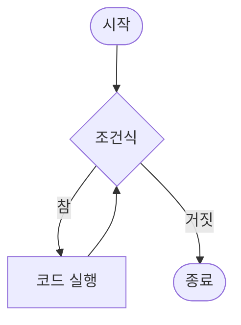
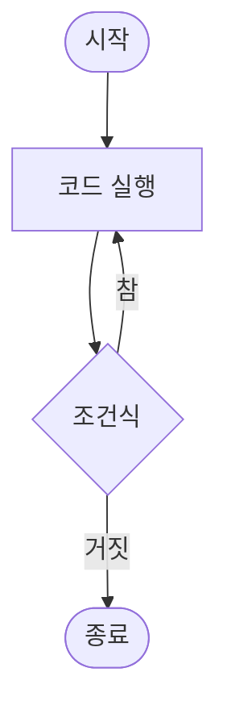

# Day 2-3교시: while과 do-while 반복문 (50분)

## 🎯 학습 목표
- while 문의 작동 원리와 사용법을 완벽히 이해한다
- do-while 문의 특성과 활용 시나리오를 파악한다
- for, while, do-while의 차이점을 명확히 구분한다
- 무한 루프의 개념과 적절한 사용법을 학습한다
- 반복문 선택 기준을 이해하고 실전에 적용한다

## 📚 목차
1. [while 문 기초](#1-while-문-기초)
2. [while 문 활용](#2-while-문-활용)
3. [do-while 문](#3-do-while-문)
4. [while vs do-while](#4-while-vs-do-while)
5. [무한 루프](#5-무한-루프)
6. [실전 예제](#6-실전-예제)
7. [종합 실습](#7-종합-실습)

---

## 1. while 문 기초

### 1.1 while 문이란?

**while 문**은 조건이 참(true)인 동안 코드 블록을 반복 실행하는 제어문입니다.

**특징:**
- 반복 횟수가 미리 정해지지 않은 경우에 적합
- 조건을 먼저 검사한 후 실행 (선검사 후실행)
- 조건이 처음부터 거짓이면 한 번도 실행되지 않음
- 무한 루프 구현 가능

### 1.2 기본 문법

```cpp
while (조건식) {
    // 조건이 참인 동안 반복 실행될 코드
    // 조건을 언젠가는 거짓으로 만들어야 함
}
```

**while 문 흐름도:**



**ASCII 흐름도:**
```
        ┌─────────┐
        │  시작   │
        └────┬────┘
             │
             ▼
        ┌─────────┐
     ┌─→│ 조건식? │
     │  └────┬────┘
     │       │
     │  ┌────┴────┐
     │  │         │
     │참▼         ▼ 거짓
     │┌──────┐    │
     ││코드  │    │
     ││실행  │    │
     │└───┬──┘    │
     │    │       │
     └────┘       │
                  ▼
             ┌─────────┐
             │  종료   │
             └─────────┘
```

**실행 흐름:**
1. 조건식을 평가
2. 조건식이 참이면 코드 블록 실행
3. 코드 블록 실행 후 다시 1번으로
4. 조건식이 거짓이면 while 문 종료

### 1.3 첫 번째 예제 - 기본 카운팅

```cpp
#include <iostream>
using namespace std;

int main() {
    int count = 1;

    cout << "=== 1부터 5까지 출력 ===" << endl;

    while (count <= 5) {
        cout << "카운트: " << count << endl;
        count++;  // 반드시 조건을 변경해야 함!
    }

    cout << "while 문 종료" << endl;

    return 0;
}
```

**출력:**
```
=== 1부터 5까지 출력 ===
카운트: 1
카운트: 2
카운트: 3
카운트: 4
카운트: 5
while 문 종료
```

### 1.4 거꾸로 세기

```cpp
#include <iostream>
using namespace std;

int main() {
    int countdown = 10;

    cout << "=== 카운트다운 ===" << endl;

    while (countdown > 0) {
        cout << countdown << "초..." << endl;
        countdown--;
    }

    cout << "발사!" << endl;

    return 0;
}
```

**출력:**
```
=== 카운트다운 ===
10초...
9초...
8초...
...
1초...
발사!
```

### 1.5 while 문의 실행 흐름 상세 분석

```cpp
#include <iostream>
using namespace std;

int main() {
    int num = 1;

    cout << "while 문 시작 전: num = " << num << endl;

    while (num <= 3) {
        cout << "  반복 시작: num = " << num << endl;
        num = num + 1;
        cout << "  반복 끝: num = " << num << endl;
    }

    cout << "while 문 종료 후: num = " << num << endl;

    return 0;
}
```

**출력:**
```
while 문 시작 전: num = 1
  반복 시작: num = 1
  반복 끝: num = 2
  반복 시작: num = 2
  반복 끝: num = 3
  반복 시작: num = 3
  반복 끝: num = 4
while 문 종료 후: num = 4
```

**분석:**
1. num = 1일 때: 1 <= 3 (참) → 실행 → num = 2
2. num = 2일 때: 2 <= 3 (참) → 실행 → num = 3
3. num = 3일 때: 3 <= 3 (참) → 실행 → num = 4
4. num = 4일 때: 4 <= 3 (거짓) → 종료

---

## 2. while 문 활용

### 2.1 합계 계산

```cpp
#include <iostream>
using namespace std;

int main() {
    int n;
    cout << "몇까지 더할까요? ";
    cin >> n;

    int sum = 0;
    int i = 1;

    while (i <= n) {
        sum += i;
        i++;
    }

    cout << "1부터 " << n << "까지의 합: " << sum << endl;

    return 0;
}
```

**실행 예:**
```
몇까지 더할까요? 10
1부터 10까지의 합: 55
```

### 2.2 팩토리얼 계산

```cpp
#include <iostream>
using namespace std;

int main() {
    int n;
    cout << "팩토리얼을 계산할 숫자: ";
    cin >> n;

    long long factorial = 1;
    int i = 1;

    while (i <= n) {
        factorial *= i;
        cout << i << "! = " << factorial << endl;
        i++;
    }

    cout << "\n최종 결과: " << n << "! = " << factorial << endl;

    return 0;
}
```

**실행 예:**
```
팩토리얼을 계산할 숫자: 5
1! = 1
2! = 2
3! = 6
4! = 24
5! = 120

최종 결과: 5! = 120
```

### 2.3 사용자 입력 받기

```cpp
#include <iostream>
using namespace std;

int main() {
    int number;
    int sum = 0;
    int count = 0;

    cout << "=== 평균 계산기 ===" << endl;
    cout << "숫자를 입력하세요 (0 입력 시 종료)" << endl;

    while (true) {  // 무한 루프
        cout << "숫자: ";
        cin >> number;

        if (number == 0) {
            break;  // 0 입력 시 반복 종료
        }

        sum += number;
        count++;
    }

    if (count > 0) {
        double average = (double)sum / count;
        cout << "\n=== 결과 ===" << endl;
        cout << "입력한 숫자 개수: " << count << endl;
        cout << "합계: " << sum << endl;
        cout << "평균: " << average << endl;
    } else {
        cout << "입력한 숫자가 없습니다." << endl;
    }

    return 0;
}
```

### 2.4 숫자 자릿수 세기

```cpp
#include <iostream>
using namespace std;

int main() {
    int number;
    cout << "숫자를 입력하세요: ";
    cin >> number;

    int original = number;
    int digits = 0;

    // 음수를 양수로 변환
    if (number < 0) {
        number = -number;
    }

    // 0은 1자리
    if (number == 0) {
        digits = 1;
    } else {
        while (number > 0) {
            number /= 10;  // 마지막 자리 제거
            digits++;
        }
    }

    cout << original << "은(는) " << digits << "자리 숫자입니다." << endl;

    return 0;
}
```

**실행 예:**
```
숫자를 입력하세요: 12345
12345은(는) 5자리 숫자입니다.
```

### 2.5 숫자 뒤집기

```cpp
#include <iostream>
using namespace std;

int main() {
    int number;
    cout << "숫자를 입력하세요: ";
    cin >> number;

    int original = number;
    int reversed = 0;

    cout << "뒤집는 과정:" << endl;

    while (number > 0) {
        int digit = number % 10;        // 마지막 자리 추출
        cout << "  " << digit << " 추출 ";

        reversed = reversed * 10 + digit;  // 뒤집힌 숫자에 추가
        cout << "→ reversed = " << reversed << endl;

        number /= 10;                   // 마지막 자리 제거
    }

    cout << "\n원본 숫자: " << original << endl;
    cout << "뒤집힌 숫자: " << reversed << endl;

    return 0;
}
```

**실행 예:**
```
숫자를 입력하세요: 1234
뒤집는 과정:
  4 추출 → reversed = 4
  3 추출 → reversed = 43
  2 추출 → reversed = 432
  1 추출 → reversed = 4321

원본 숫자: 1234
뒤집힌 숫자: 4321
```

---

## 3. do-while 문

### 3.1 do-while 문이란?

**do-while 문**은 코드를 먼저 실행한 후 조건을 검사하는 반복문입니다.

**특징:**
- 최소 한 번은 반드시 실행됨 (후검사)
- 메뉴 시스템, 입력 유효성 검사에 적합
- while 문과 달리 조건이 처음부터 거짓이어도 한 번은 실행

### 3.2 기본 문법

```cpp
do {
    // 최소 한 번은 실행되는 코드
} while (조건식);  // 세미콜론 필수!
```

**do-while 흐름도:**



**ASCII 흐름도:**
```
        ┌─────────┐
        │  시작   │
        └────┬────┘
             │
             ▼
        ┌──────┐
     ┌─→│코드  │
     │  │실행  │
     │  └───┬──┘
     │      │
     │      ▼
     │  ┌─────────┐
     └──│ 조건식? │
   참   └────┬────┘
             │거짓
             ▼
        ┌─────────┐
        │  종료   │
        └─────────┘
```

**while vs do-while 비교:**
```
while (조건식) {           do {
    코드 실행;                 코드 실행;
}                         } while (조건식);

┌─────────────────┐      ┌─────────────────┐
│ while (선검사)  │      │ do-while (후검사)│
├─────────────────┤      ├─────────────────┤
│  조건 확인      │      │  코드 먼저 실행 │
│     ↓           │      │     ↓           │
│ 참이면 실행     │      │  조건 나중 확인 │
│ 거짓이면 건너뜀 │      │  최소 1회 실행  │
└─────────────────┘      └─────────────────┘

예시:
int i = 10;              int i = 10;

while (i < 5) {          do {
    실행 안 됨               실행됨 (1회)
}                        } while (i < 5);
```

**주의:**
- `while` 뒤의 세미콜론(;)을 잊지 말 것!
- 조건 검사는 코드 실행 후에 이루어짐

### 3.3 기본 예제

```cpp
#include <iostream>
using namespace std;

int main() {
    int count = 1;

    cout << "=== do-while 예제 ===" << endl;

    do {
        cout << "카운트: " << count << endl;
        count++;
    } while (count <= 5);

    cout << "do-while 문 종료" << endl;

    return 0;
}
```

**출력:**
```
=== do-while 예제 ===
카운트: 1
카운트: 2
카운트: 3
카운트: 4
카운트: 5
do-while 문 종료
```

### 3.4 입력 유효성 검사

```cpp
#include <iostream>
using namespace std;

int main() {
    int age;

    cout << "=== 나이 입력 ===" << endl;

    do {
        cout << "나이를 입력하세요 (1-120): ";
        cin >> age;

        if (age < 1 || age > 120) {
            cout << "⚠️  올바른 나이를 입력하세요!" << endl;
        }
    } while (age < 1 || age > 120);

    cout << "\n입력한 나이: " << age << "세" << endl;

    return 0;
}
```

**실행 예:**
```
=== 나이 입력 ===
나이를 입력하세요 (1-120): 150
⚠️  올바른 나이를 입력하세요!
나이를 입력하세요 (1-120): -5
⚠️  올바른 나이를 입력하세요!
나이를 입력하세요 (1-120): 25

입력한 나이: 25세
```

### 3.5 메뉴 기반 프로그램

```cpp
#include <iostream>
using namespace std;

int main() {
    int choice;

    do {
        cout << "\n╔═══════════════════╗" << endl;
        cout << "║   메인 메뉴       ║" << endl;
        cout << "╚═══════════════════╝" << endl;
        cout << "1. 게임 시작" << endl;
        cout << "2. 설정" << endl;
        cout << "3. 도움말" << endl;
        cout << "4. 종료" << endl;
        cout << "선택 (1-4): ";
        cin >> choice;

        cout << endl;

        switch (choice) {
            case 1:
                cout << "🎮 게임을 시작합니다..." << endl;
                break;
            case 2:
                cout << "⚙️  설정 화면입니다." << endl;
                break;
            case 3:
                cout << "❓ 도움말을 표시합니다." << endl;
                break;
            case 4:
                cout << "👋 프로그램을 종료합니다." << endl;
                break;
            default:
                cout << "❌ 잘못된 선택입니다. 다시 선택하세요." << endl;
        }

    } while (choice != 4);

    return 0;
}
```

### 3.6 비밀번호 재입력

```cpp
#include <iostream>
#include <string>
using namespace std;

int main() {
    string password1, password2;

    cout << "=== 비밀번호 설정 ===" << endl;

    do {
        cout << "비밀번호를 입력하세요: ";
        cin >> password1;

        cout << "비밀번호를 다시 입력하세요: ";
        cin >> password2;

        if (password1 != password2) {
            cout << "❌ 비밀번호가 일치하지 않습니다. 다시 입력하세요.\n" << endl;
        }

    } while (password1 != password2);

    cout << "\n✅ 비밀번호가 성공적으로 설정되었습니다!" << endl;

    return 0;
}
```

---

## 4. while vs do-while

### 4.1 핵심 차이점

```cpp
#include <iostream>
using namespace std;

int main() {
    cout << "=== while vs do-while 비교 ===" << endl;

    // 조건이 처음부터 거짓인 경우
    int count1 = 10;

    cout << "\n[while 문]" << endl;
    cout << "시작 전 count1 = " << count1 << endl;

    while (count1 < 5) {
        cout << "while 실행: " << count1 << endl;
        count1++;
    }

    cout << "while 문 실행 횟수: 0번" << endl;

    // do-while은 최소 1번 실행
    int count2 = 10;

    cout << "\n[do-while 문]" << endl;
    cout << "시작 전 count2 = " << count2 << endl;

    do {
        cout << "do-while 실행: " << count2 << endl;
        count2++;
    } while (count2 < 5);

    cout << "do-while 문 실행 횟수: 1번" << endl;

    return 0;
}
```

**출력:**
```
=== while vs do-while 비교 ===

[while 문]
시작 전 count1 = 10
while 문 실행 횟수: 0번

[do-while 문]
시작 전 count2 = 10
do-while 실행: 10
do-while 문 실행 횟수: 1번
```

### 4.2 비교표

| 특성 | while | do-while |
|------|-------|----------|
| 조건 검사 시점 | 실행 전 (선검사) | 실행 후 (후검사) |
| 최소 실행 횟수 | 0번 | 1번 |
| 세미콜론 | 불필요 | 필수 (while 뒤) |
| 주요 용도 | 일반 반복 | 메뉴, 입력 검증 |

### 4.3 선택 가이드

**while 문을 사용할 때:**
- 반복 횟수를 예측할 수 없을 때
- 조건에 따라 아예 실행하지 않을 수도 있을 때
- 파일 읽기, 데이터 처리 등

**do-while 문을 사용할 때:**
- 최소 한 번은 반드시 실행해야 할 때
- 메뉴 시스템
- 사용자 입력 유효성 검사
- "다시 하시겠습니까?" 같은 반복 선택

### 4.4 실전 비교 예제

```cpp
#include <iostream>
using namespace std;

int main() {
    // 예제 1: while 사용이 적합한 경우
    cout << "=== 예제 1: 파일 읽기 시뮬레이션 ===" << endl;
    int dataCount = 0;  // 데이터가 없는 경우
    int i = 0;

    while (i < dataCount) {
        cout << "데이터 " << i << " 처리" << endl;
        i++;
    }
    cout << "처리된 데이터: " << i << "개\n" << endl;
    // 데이터가 없으면 한 번도 실행되지 않음 (올바름)

    // 예제 2: do-while 사용이 적합한 경우
    cout << "=== 예제 2: 재시도 시스템 ===" << endl;
    char retry;
    int attempts = 0;

    do {
        attempts++;
        cout << "작업 시도 #" << attempts << endl;
        cout << "다시 시도하시겠습니까? (y/n): ";
        cin >> retry;
    } while (retry == 'y' || retry == 'Y');

    cout << "총 시도 횟수: " << attempts << "번" << endl;
    // 최소 한 번은 시도해야 함 (올바름)

    return 0;
}
```

---

## 5. 무한 루프

### 5.1 무한 루프란?

**무한 루프(Infinite Loop)**는 종료 조건이 없어 계속 반복되는 루프입니다.

**용도:**
- 서버 프로그램 (항상 대기 상태)
- 게임 메인 루프
- 이벤트 처리 시스템
- 명시적 break로 종료하는 경우

### 5.2 무한 루프 만드는 방법

```cpp
#include <iostream>
using namespace std;

int main() {
    // 방법 1: while(true)
    cout << "방법 1: while(true)" << endl;
    int count1 = 0;
    while (true) {
        cout << "반복 " << count1 << endl;
        count1++;
        if (count1 >= 3) break;
    }

    // 방법 2: while(1)
    cout << "\n방법 2: while(1)" << endl;
    int count2 = 0;
    while (1) {
        cout << "반복 " << count2 << endl;
        count2++;
        if (count2 >= 3) break;
    }

    // 방법 3: for(;;)
    cout << "\n방법 3: for(;;)" << endl;
    int count3 = 0;
    for (;;) {
        cout << "반복 " << count3 << endl;
        count3++;
        if (count3 >= 3) break;
    }

    return 0;
}
```

### 5.3 무한 루프 + break 활용

```cpp
#include <iostream>
using namespace std;

int main() {
    cout << "=== 숫자 입력 프로그램 ===" << endl;
    cout << "0을 입력하면 종료됩니다." << endl;

    int sum = 0;
    int count = 0;

    while (true) {
        int number;
        cout << "\n숫자를 입력하세요: ";
        cin >> number;

        if (number == 0) {
            cout << "종료 신호를 받았습니다." << endl;
            break;
        }

        sum += number;
        count++;

        cout << "  현재까지 입력된 숫자: " << count << "개" << endl;
        cout << "  현재 합계: " << sum << endl;
    }

    if (count > 0) {
        double average = (double)sum / count;
        cout << "\n=== 최종 결과 ===" << endl;
        cout << "입력된 숫자 개수: " << count << endl;
        cout << "합계: " << sum << endl;
        cout << "평균: " << average << endl;
    } else {
        cout << "\n입력된 숫자가 없습니다." << endl;
    }

    return 0;
}
```

### 5.4 게임 루프 시뮬레이션

```cpp
#include <iostream>
using namespace std;

int main() {
    int playerHP = 100;
    int enemyHP = 80;
    int turn = 1;

    cout << "=== 전투 시작! ===" << endl;
    cout << "플레이어 HP: " << playerHP << endl;
    cout << "적 HP: " << enemyHP << endl;

    while (true) {
        cout << "\n--- 턴 " << turn << " ---" << endl;

        // 플레이어 공격
        int playerDamage = 20;
        enemyHP -= playerDamage;
        cout << "플레이어가 " << playerDamage << " 데미지를 입혔습니다!" << endl;
        cout << "적 HP: " << enemyHP << endl;

        if (enemyHP <= 0) {
            cout << "\n🎉 승리했습니다!" << endl;
            break;
        }

        // 적 공격
        int enemyDamage = 15;
        playerHP -= enemyDamage;
        cout << "적이 " << enemyDamage << " 데미지를 입혔습니다!" << endl;
        cout << "플레이어 HP: " << playerHP << endl;

        if (playerHP <= 0) {
            cout << "\n💀 패배했습니다..." << endl;
            break;
        }

        turn++;
    }

    cout << "\n전투 종료 (총 " << turn << " 턴)" << endl;

    return 0;
}
```

---

## 6. 실전 예제

### 6.1 숫자 맞히기 게임

```cpp
#include <iostream>
#include <cstdlib>
#include <ctime>
using namespace std;

int main() {
    // 난수 초기화
    srand(time(0));

    int secret = rand() % 100 + 1;  // 1-100 사이의 난수
    int guess;
    int attempts = 0;
    int maxAttempts = 7;

    cout << "╔══════════════════════════╗" << endl;
    cout << "║  숫자 맞히기 게임        ║" << endl;
    cout << "╚══════════════════════════╝" << endl;
    cout << "1부터 100 사이의 숫자를 맞혀보세요!" << endl;
    cout << "기회는 " << maxAttempts << "번입니다.\n" << endl;

    while (attempts < maxAttempts) {
        attempts++;
        cout << "[시도 " << attempts << "/" << maxAttempts << "] 예상 숫자: ";
        cin >> guess;

        if (guess == secret) {
            cout << "\n🎉 정답입니다!" << endl;
            cout << "총 " << attempts << "번 만에 맞혔습니다!" << endl;

            // 평가
            if (attempts <= 3) {
                cout << "평가: 천재! 🌟" << endl;
            } else if (attempts <= 5) {
                cout << "평가: 훌륭합니다! 👍" << endl;
            } else {
                cout << "평가: 성공! 😊" << endl;
            }

            break;
        } else if (guess < secret) {
            cout << "⬆️  UP! 더 큰 숫자입니다." << endl;
        } else {
            cout << "⬇️  DOWN! 더 작은 숫자입니다." << endl;
        }

        int remaining = maxAttempts - attempts;
        if (remaining > 0) {
            cout << "남은 기회: " << remaining << "번\n" << endl;
        }
    }

    if (attempts == maxAttempts && guess != secret) {
        cout << "\n😢 기회를 모두 사용했습니다." << endl;
        cout << "정답은 " << secret << "이었습니다." << endl;
    }

    return 0;
}
```

### 6.2 계산기 프로그램

```cpp
#include <iostream>
#include <iomanip>
using namespace std;

int main() {
    char continueCalc = 'y';

    cout << "╔══════════════════════════╗" << endl;
    cout << "║    간단한 계산기         ║" << endl;
    cout << "╚══════════════════════════╝" << endl;

    do {
        double num1, num2;
        char op;

        cout << "\n첫 번째 숫자: ";
        cin >> num1;

        cout << "연산자 (+, -, *, /): ";
        cin >> op;

        cout << "두 번째 숫자: ";
        cin >> num2;

        cout << "\n계산: " << num1 << " " << op << " " << num2 << " = ";
        cout << fixed << setprecision(2);

        switch (op) {
            case '+':
                cout << (num1 + num2) << endl;
                break;
            case '-':
                cout << (num1 - num2) << endl;
                break;
            case '*':
                cout << (num1 * num2) << endl;
                break;
            case '/':
                if (num2 != 0) {
                    cout << (num1 / num2) << endl;
                } else {
                    cout << "오류! 0으로 나눌 수 없습니다." << endl;
                }
                break;
            default:
                cout << "오류! 잘못된 연산자입니다." << endl;
        }

        cout << "\n계속 계산하시겠습니까? (y/n): ";
        cin >> continueCalc;

    } while (continueCalc == 'y' || continueCalc == 'Y');

    cout << "\n계산기를 종료합니다. 👋" << endl;

    return 0;
}
```

### 6.3 ATM 시뮬레이션

```cpp
#include <iostream>
#include <iomanip>
using namespace std;

int main() {
    int balance = 10000;  // 초기 잔액
    int choice;

    cout << "╔══════════════════════════╗" << endl;
    cout << "║   ATM 시스템             ║" << endl;
    cout << "╚══════════════════════════╝" << endl;

    do {
        cout << "\n=== 메뉴 ===" << endl;
        cout << "1. 잔액 조회" << endl;
        cout << "2. 입금" << endl;
        cout << "3. 출금" << endl;
        cout << "4. 종료" << endl;
        cout << "선택 (1-4): ";
        cin >> choice;

        cout << endl;

        switch (choice) {
            case 1: {  // 잔액 조회
                cout << "현재 잔액: " << balance << "원" << endl;
                break;
            }

            case 2: {  // 입금
                int deposit;
                cout << "입금할 금액: ";
                cin >> deposit;

                if (deposit > 0) {
                    balance += deposit;
                    cout << deposit << "원이 입금되었습니다." << endl;
                    cout << "현재 잔액: " << balance << "원" << endl;
                } else {
                    cout << "❌ 올바른 금액을 입력하세요." << endl;
                }
                break;
            }

            case 3: {  // 출금
                int withdraw;
                cout << "출금할 금액: ";
                cin >> withdraw;

                if (withdraw > 0 && withdraw <= balance) {
                    balance -= withdraw;
                    cout << withdraw << "원이 출금되었습니다." << endl;
                    cout << "현재 잔액: " << balance << "원" << endl;
                } else if (withdraw > balance) {
                    cout << "❌ 잔액이 부족합니다." << endl;
                    cout << "현재 잔액: " << balance << "원" << endl;
                } else {
                    cout << "❌ 올바른 금액을 입력하세요." << endl;
                }
                break;
            }

            case 4: {  // 종료
                cout << "ATM을 종료합니다. 이용해 주셔서 감사합니다. 👋" << endl;
                break;
            }

            default: {
                cout << "❌ 잘못된 선택입니다. 다시 선택하세요." << endl;
            }
        }

    } while (choice != 4);

    return 0;
}
```

### 6.4 로그인 시스템

```cpp
#include <iostream>
#include <string>
using namespace std;

int main() {
    const string CORRECT_ID = "admin";
    const string CORRECT_PASSWORD = "1234";
    const int MAX_ATTEMPTS = 3;

    string id, password;
    int attempts = 0;
    bool loggedIn = false;

    cout << "╔══════════════════════════╗" << endl;
    cout << "║   로그인 시스템          ║" << endl;
    cout << "╚══════════════════════════╝" << endl;

    while (attempts < MAX_ATTEMPTS && !loggedIn) {
        attempts++;

        cout << "\n[시도 " << attempts << "/" << MAX_ATTEMPTS << "]" << endl;
        cout << "아이디: ";
        cin >> id;

        cout << "비밀번호: ";
        cin >> password;

        if (id == CORRECT_ID && password == CORRECT_PASSWORD) {
            loggedIn = true;
            cout << "\n✅ 로그인 성공!" << endl;
            cout << "환영합니다, " << id << "님!" << endl;
        } else {
            int remaining = MAX_ATTEMPTS - attempts;

            if (remaining > 0) {
                cout << "\n❌ 로그인 실패!" << endl;
                cout << "아이디 또는 비밀번호가 틀렸습니다." << endl;
                cout << "남은 기회: " << remaining << "번" << endl;
            }
        }
    }

    if (!loggedIn) {
        cout << "\n🔒 로그인 시도 횟수를 초과했습니다." << endl;
        cout << "계정이 일시적으로 잠겼습니다." << endl;
    }

    return 0;
}
```

---

## 7. 종합 실습

### 7.1 실습 1: 구구단 선택 프로그램

```cpp
#include <iostream>
using namespace std;

int main() {
    int dan;
    char again;

    cout << "=== 구구단 프로그램 ===" << endl;

    do {
        cout << "\n몇 단을 출력할까요? (2-9): ";
        cin >> dan;

        if (dan < 2 || dan > 9) {
            cout << "❌ 2부터 9 사이의 숫자를 입력하세요." << endl;
            continue;
        }

        cout << "\n--- " << dan << "단 ---" << endl;

        int i = 1;
        while (i <= 9) {
            cout << dan << " × " << i << " = " << (dan * i) << endl;
            i++;
        }

        cout << "\n다시 하시겠습니까? (y/n): ";
        cin >> again;

    } while (again == 'y' || again == 'Y');

    cout << "\n프로그램을 종료합니다." << endl;

    return 0;
}
```

### 7.2 실습 2: 소수 판별기

```cpp
#include <iostream>
using namespace std;

int main() {
    int number;
    char continueCheck = 'y';

    cout << "=== 소수 판별 프로그램 ===" << endl;

    do {
        cout << "\n숫자를 입력하세요 (2 이상): ";
        cin >> number;

        if (number < 2) {
            cout << "❌ 2 이상의 숫자를 입력하세요." << endl;
            continue;
        }

        bool isPrime = true;
        int divisor = 2;

        // 소수 판별
        while (divisor * divisor <= number) {
            if (number % divisor == 0) {
                isPrime = false;
                cout << number << "은(는) " << divisor << "로 나누어떨어지므로 소수가 아닙니다." << endl;
                break;
            }
            divisor++;
        }

        if (isPrime) {
            cout << number << "은(는) 소수입니다! ✨" << endl;
        }

        cout << "\n계속 확인하시겠습니까? (y/n): ";
        cin >> continueCheck;

    } while (continueCheck == 'y' || continueCheck == 'Y');

    cout << "\n프로그램을 종료합니다." << endl;

    return 0;
}
```

### 7.3 실습 3: 최대공약수(GCD) 계산

```cpp
#include <iostream>
using namespace std;

int main() {
    int a, b;
    char again;

    cout << "=== 최대공약수(GCD) 계산기 ===" << endl;

    do {
        cout << "\n첫 번째 숫자: ";
        cin >> a;
        cout << "두 번째 숫자: ";
        cin >> b;

        if (a <= 0 || b <= 0) {
            cout << "❌ 양수를 입력하세요." << endl;
            continue;
        }

        int num1 = a;
        int num2 = b;

        cout << "\n유클리드 호제법 과정:" << endl;

        // 유클리드 호제법
        while (num2 != 0) {
            cout << num1 << " = " << num2 << " × " << (num1 / num2)
                 << " + " << (num1 % num2) << endl;

            int temp = num1 % num2;
            num1 = num2;
            num2 = temp;
        }

        cout << "\n결과: GCD(" << a << ", " << b << ") = " << num1 << endl;

        cout << "\n다시 계산하시겠습니까? (y/n): ";
        cin >> again;

    } while (again == 'y' || again == 'Y');

    cout << "\n계산기를 종료합니다." << endl;

    return 0;
}
```

---

## 📝 3교시 실습 과제

### 과제 1: 합계 계산기 ⭐
**난이도:** 쉬움

사용자가 0을 입력할 때까지 숫자를 계속 입력받아 합계를 출력하는 프로그램을 작성하세요.

**요구사항:**
- while 문 사용
- 0 입력 시 종료
- 입력된 숫자의 개수와 합계 출력
- 평균도 함께 계산

**출력 예시:**
```
숫자를 입력하세요 (0 입력 시 종료):
10
20
30
0

입력된 숫자: 3개
합계: 60
평균: 20.00
```

### 과제 2: 로그인 시스템 ⭐⭐
**난이도:** 중간

비밀번호를 최대 3번까지 입력받아 확인하는 로그인 시스템을 작성하세요.

**요구사항:**
- 올바른 비밀번호: "password123"
- 최대 3번 시도 가능
- 실패 시 남은 기회 표시
- 성공 시 환영 메시지
- 3번 실패 시 계정 잠금 메시지

**출력 예시:**
```
비밀번호를 입력하세요: wrong
❌ 틀렸습니다. 남은 기회: 2번

비밀번호를 입력하세요: password123
✅ 로그인 성공!
```

### 과제 3: 거꾸로 세기 타이머 ⭐⭐
**난이도:** 중간

사용자가 입력한 숫자부터 1까지 거꾸로 세는 프로그램을 작성하세요.

**요구사항:**
- 양수 입력 검증 (do-while 사용)
- 카운트다운 형식 출력
- "발사!" 메시지 표시
- 다시 실행 여부 선택

**출력 예시:**
```
카운트다운 시작 숫자: 5

5초...
4초...
3초...
2초...
1초...
🚀 발사!

다시 하시겠습니까? (y/n): n
```

### 과제 4: 입력 유효성 검사기 ⭐⭐⭐
**난이도:** 어려움

사용자에게 1-100 사이의 짝수를 입력받는 프로그램을 작성하세요.

**요구사항:**
- do-while 문 사용
- 범위 검증 (1-100)
- 짝수 검증
- 올바른 입력까지 반복
- 각 조건별 오류 메시지

**출력 예시:**
```
1-100 사이의 짝수를 입력하세요: 150
❌ 100 이하의 숫자를 입력하세요.

1-100 사이의 짝수를 입력하세요: 15
❌ 짝수를 입력하세요.

1-100 사이의 짝수를 입력하세요: 50
✅ 올바른 입력입니다!
```

---

## 💡 핵심 정리

### ✅ while 문
```cpp
while (조건식) {
    // 조건이 참인 동안 반복
}
```
- **특징:** 선검사 (조건 먼저 확인)
- **최소 실행 횟수:** 0번
- **용도:** 일반적인 조건 반복

### ✅ do-while 문
```cpp
do {
    // 최소 한 번은 실행
} while (조건식);
```
- **특징:** 후검사 (실행 후 조건 확인)
- **최소 실행 횟수:** 1번
- **용도:** 메뉴, 입력 검증

### ✅ for vs while vs do-while

| 반복문 | 반복 횟수 | 조건 검사 | 최소 실행 | 주요 용도 |
|--------|----------|----------|----------|----------|
| for | 정해진 경우 | 선검사 | 0번 | 카운팅 반복 |
| while | 불확실한 경우 | 선검사 | 0번 | 조건 기반 반복 |
| do-while | 불확실한 경우 | 후검사 | 1번 | 메뉴, 입력 검증 |

### ✅ 무한 루프 패턴

```cpp
// 패턴 1: while(true) + break
while (true) {
    if (종료조건) break;
}

// 패턴 2: 명확한 종료 조건
while (!종료플래그) {
    // 처리
}
```

---

## 🎓 학습 체크리스트

- [ ] while 문의 실행 흐름을 정확히 이해했다
- [ ] do-while 문의 특성을 이해했다
- [ ] while과 do-while의 차이를 설명할 수 있다
- [ ] 무한 루프를 안전하게 사용할 수 있다
- [ ] 적절한 반복문을 선택할 수 있다
- [ ] 반복문 내에서 입력을 처리할 수 있다
- [ ] break를 사용하여 반복을 제어할 수 있다

---

## 📚 다음 시간 예고

**Day 2-4교시: break와 continue**
- break 문으로 반복문 탈출하기
- continue 문으로 반복 건너뛰기
- 중첩 반복문에서 break/continue
- 실전 활용 예제

**준비사항:**
- 오늘 배운 while, do-while 복습
- 반복문 제어의 필요성 생각해보기

---

## ❓ 자주 묻는 질문 (FAQ)

### Q1: while과 for 중 무엇을 사용해야 하나요?
**A:**
- **for:** 반복 횟수가 명확할 때 (예: 1-10까지)
- **while:** 조건에 따라 반복할 때 (예: 입력이 0일 때까지)

### Q2: do-while의 세미콜론을 자주 잊어버려요.
**A:** do-while은 문장이므로 세미콜론이 필수입니다. IDE의 자동 완성 기능을 활용하세요.

```cpp
do {
    // 코드
} while (조건);  // 세미콜론 필수!
```

### Q3: 무한 루프가 걱정됩니다.
**A:**
1. 항상 종료 조건을 명확히 설정
2. break 문으로 탈출 경로 확보
3. 디버깅 시 반복 횟수 제한

```cpp
int safetyCount = 0;
while (true) {
    if (++safetyCount > 1000) {
        cout << "안전 종료" << endl;
        break;
    }
    // 작업
}
```

### Q4: while(1)과 while(true)의 차이는?
**A:** 기능적으로 동일하지만, `while(true)`가 더 명확하고 가독성이 좋습니다.

### Q5: 입력 오류 처리는 어떻게 하나요?
**A:**
```cpp
int number;
while (true) {
    cout << "숫자 입력: ";
    cin >> number;

    if (cin.fail()) {
        cin.clear();  // 오류 플래그 초기화
        cin.ignore(1000, '\n');  // 잘못된 입력 제거
        cout << "올바른 숫자를 입력하세요." << endl;
    } else {
        break;
    }
}
```

---

## 🔍 디버깅 팁

### 1. 무한 루프 디버깅
```cpp
int debugCount = 0;
while (조건) {
    cout << "DEBUG: 반복 " << ++debugCount << endl;
    if (debugCount > 10) {
        cout << "DEBUG: 강제 종료" << endl;
        break;
    }
    // 나머지 코드
}
```

### 2. 조건 변화 확인
```cpp
while (count < 10) {
    cout << "시작: count = " << count << endl;
    // 작업
    count++;
    cout << "끝: count = " << count << endl;
}
```

### 3. 입력 버퍼 문제
```cpp
int number;
char choice;

cin >> number;
cin.ignore();  // 버퍼의 개행 문자 제거

cout << "계속? (y/n): ";
cin >> choice;
```

---

## 🎯 실력 향상 문제

### 도전 1: 완전수 찾기
1부터 1000까지의 완전수를 모두 찾아 출력하세요.
(완전수: 자신을 제외한 약수의 합이 자기 자신과 같은 수, 예: 6 = 1+2+3)

### 도전 2: 피보나치 수열
n번째 피보나치 수가 1000을 넘는 첫 번째 위치를 찾으세요.

### 도전 3: 회문 판별기
사용자가 입력한 숫자가 회문인지 판별하세요.
(회문: 123321, 12321처럼 앞뒤가 같은 숫자)

---

**수고하셨습니다! 다음 시간에는 break와 continue를 배워보겠습니다.** 🚀
