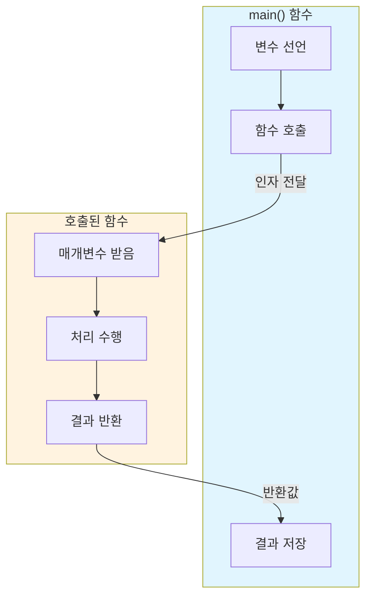

# Day 4-1교시: 함수 기초

## 학습 목표
- 함수의 개념과 필요성 이해하기
- 함수 선언, 정의, 호출하기
- 매개변수와 반환값 사용하기
- 함수 호출 스택과 메모리 동작 이해하기
- 함수 작성 시 Best Practice 익히기

## 1. 함수란?

### 1.1 함수의 개념

**함수(Function)**는 특정 작업을 수행하는 코드 블록입니다. 마치 수학의 함수처럼 입력(매개변수)을 받아 처리하고 결과(반환값)를 출력합니다.

```
수학에서의 함수 vs 프로그래밍에서의 함수:

[수학]                          [프로그래밍]
f(x) = x² + 2x + 1              int f(int x) {
                                    return x*x + 2*x + 1;
x = 3 → f(3) = 16               }

                                f(3) → 16

┌─────────────────────────────────────────────────────────────────┐
│                     함수의 기본 구조                              │
├─────────────────────────────────────────────────────────────────┤
│                                                                 │
│     입력 (Input)           처리 (Process)        출력 (Output)  │
│   ┌──────────────┐       ┌──────────────┐      ┌──────────────┐│
│   │  매개변수     │  ───▶ │   함수 본문   │ ───▶ │   반환값     ││
│   │ (Parameters) │       │  (Function   │      │  (Return     ││
│   │              │       │    Body)     │      │   Value)     ││
│   └──────────────┘       └──────────────┘      └──────────────┘│
│                                                                 │
│   예: int a, int b        int result = a + b;    return result;│
│                                                                 │
└─────────────────────────────────────────────────────────────────┘
```

### 1.2 프로그램에서 함수의 역할

```
프로그램에서 함수의 역할:
┌────────────────────────────────────────────────────────────────────┐
│                          main() 함수                                │
│  ┌──────────────────────────────────────────────────────────────┐ │
│  │  작업1: 사용자 입력 받기                                        │ │
│  │    ↓                                                          │ │
│  │  작업2: 데이터 처리하기 ──────────────────────────┐            │ │
│  │    ↓                       ↓                    │            │ │
│  │  작업3: 결과 출력하기   ┌──────────────┐  ┌──────────────┐    │ │
│  │    ↓                   │   함수 A()   │  │   함수 B()   │    │ │
│  │  작업4: 다시 데이터 처리 │ 데이터 검증  │  │  데이터 계산  │    │ │
│  │          ↓              └──────────────┘  └──────────────┘    │ │
│  │          └───────────────────┬─────────────────┘              │ │
│  │                              ↓                                │ │
│  │                         (재사용!)                              │ │
│  └──────────────────────────────────────────────────────────────┘ │
└────────────────────────────────────────────────────────────────────┘

실제 프로그램 구조 예시:
┌────────────────────────────────────────────────────────────────────┐
│                        계산기 프로그램                               │
├────────────────────────────────────────────────────────────────────┤
│                                                                    │
│   main()                                                           │
│     │                                                              │
│     ├──▶ displayMenu()      ← 메뉴 출력                            │
│     │                                                              │
│     ├──▶ getInput()         ← 사용자 입력                          │
│     │                                                              │
│     ├──▶ add(a, b)          ← 덧셈 연산                            │
│     ├──▶ subtract(a, b)     ← 뺄셈 연산                            │
│     ├──▶ multiply(a, b)     ← 곱셈 연산                            │
│     ├──▶ divide(a, b)       ← 나눗셈 연산                          │
│     │                                                              │
│     └──▶ displayResult()    ← 결과 출력                            │
│                                                                    │
└────────────────────────────────────────────────────────────────────┘
```

### 1.3 함수가 필요한 이유

**함수가 필요한 5가지 이유:**

| 장점 | 설명 | 예시 |
|------|------|------|
| **코드 재사용** | 같은 코드를 여러 번 작성할 필요 없음 | 평균 계산을 10번 해야 할 때 함수 1개로 해결 |
| **가독성 향상** | 코드의 의미를 함수 이름으로 표현 | `calculateAverage()` vs 긴 계산 코드 |
| **유지보수 용이** | 수정이 필요할 때 함수 하나만 변경 | 버그 수정을 한 곳에서만 |
| **디버깅 편의** | 문제 발생 시 해당 함수만 확인 | 오류 범위 축소 |
| **협업 효율** | 기능별로 분담하여 개발 가능 | 팀원 A는 입력, B는 처리 담당 |

```cpp
// ❌ 함수 없이 작성한 코드 (반복적, 가독성 낮음)
#include <iostream>
using namespace std;

int main() {
    // 첫 번째 학생의 평균 계산
    int score1_1 = 85, score1_2 = 90, score1_3 = 78;
    int sum1 = score1_1 + score1_2 + score1_3;
    double avg1 = sum1 / 3.0;
    cout << "학생1 평균: " << avg1 << endl;

    // 두 번째 학생의 평균 계산 (똑같은 코드 반복!)
    int score2_1 = 92, score2_2 = 88, score2_3 = 95;
    int sum2 = score2_1 + score2_2 + score2_3;
    double avg2 = sum2 / 3.0;
    cout << "학생2 평균: " << avg2 << endl;

    // 세 번째 학생의 평균 계산 (또 반복!)
    int score3_1 = 70, score3_2 = 75, score3_3 = 80;
    int sum3 = score3_1 + score3_2 + score3_3;
    double avg3 = sum3 / 3.0;
    cout << "학생3 평균: " << avg3 << endl;

    // 문제점: 평균 계산 방식을 바꾸려면 3곳 모두 수정해야 함!
    return 0;
}
```

```cpp
// ✅ 함수를 사용한 코드 (재사용, 가독성 높음)
#include <iostream>
using namespace std;

// 평균 계산 함수
double calculateAverage(int a, int b, int c) {
    return (a + b + c) / 3.0;
}

// 결과 출력 함수
void printStudentAverage(string name, double avg) {
    cout << name << " 평균: " << avg << endl;
}

int main() {
    // 훨씬 깔끔하고 가독성 높음!
    double avg1 = calculateAverage(85, 90, 78);
    double avg2 = calculateAverage(92, 88, 95);
    double avg3 = calculateAverage(70, 75, 80);

    printStudentAverage("학생1", avg1);
    printStudentAverage("학생2", avg2);
    printStudentAverage("학생3", avg3);

    // 장점: 평균 계산 방식을 바꾸려면 함수 하나만 수정!
    return 0;
}
```

### 1.4 DRY 원칙 (Don't Repeat Yourself)

```
┌─────────────────────────────────────────────────────────────────┐
│                    DRY 원칙 (Don't Repeat Yourself)              │
├─────────────────────────────────────────────────────────────────┤
│                                                                 │
│  "모든 지식은 시스템 내에서 단일하고 명확한 표현을 가져야 한다"    │
│                                                                 │
│  ❌ WET (Write Everything Twice)                                │
│  ┌──────────────────────────────────────────────────┐          │
│  │  // 코드 A에서                                     │          │
│  │  int result = num * num;                          │          │
│  │                                                   │          │
│  │  // 코드 B에서도 같은 계산                         │          │
│  │  int result = num * num;                          │          │
│  │                                                   │          │
│  │  // 버그 발생 시 모든 곳을 찾아서 수정해야 함!     │          │
│  └──────────────────────────────────────────────────┘          │
│                                                                 │
│  ✅ DRY (Don't Repeat Yourself)                                 │
│  ┌──────────────────────────────────────────────────┐          │
│  │  int square(int num) {                            │          │
│  │      return num * num;                            │          │
│  │  }                                                │          │
│  │                                                   │          │
│  │  // 어디서든 함수 호출                             │          │
│  │  int result1 = square(5);                         │          │
│  │  int result2 = square(10);                        │          │
│  │                                                   │          │
│  │  // 수정이 필요하면 함수 하나만 변경!              │          │
│  └──────────────────────────────────────────────────┘          │
│                                                                 │
└─────────────────────────────────────────────────────────────────┘
```

## 2. 함수 문법

### 2.1 함수의 기본 구조

```cpp
반환타입 함수이름(매개변수목록) {
    // 함수 본문
    return 반환값;
}
```

**함수 구성 요소:**

```
┌─────────────────────────────────────────────────────────────────┐
│                       함수 구성 요소 상세                         │
├─────────────────────────────────────────────────────────────────┤
│                                                                 │
│  ┌───────────────────────────────────────────────────────────┐ │
│  │    반환타입   함수이름   (   매개변수1,  매개변수2   )      │ │
│  │       ↓         ↓           ↓            ↓                │ │
│  │      int       add     (  int a   ,   int b   )   {       │ │
│  │                                                    ↓       │ │
│  │                                            함수 본문 시작   │ │
│  │          int result = a + b;              ← 지역 변수      │ │
│  │          return result;                   ← 반환문         │ │
│  │      }                                    ← 함수 종료      │ │
│  └───────────────────────────────────────────────────────────┘ │
│                                                                 │
│  구성 요소 설명:                                                 │
│  ┌──────────────┬─────────────────────────────────────────────┐│
│  │ 반환타입      │ 함수가 반환하는 값의 자료형                   ││
│  │              │ int, double, char, void(없음) 등             ││
│  ├──────────────┼─────────────────────────────────────────────┤│
│  │ 함수이름      │ 함수를 호출할 때 사용하는 이름                ││
│  │              │ 동사형 권장: calculate, get, set, print 등    ││
│  ├──────────────┼─────────────────────────────────────────────┤│
│  │ 매개변수      │ 함수가 받는 입력값                           ││
│  │              │ 여러 개일 수 있고, 없을 수도 있음              ││
│  ├──────────────┼─────────────────────────────────────────────┤│
│  │ 함수 본문     │ 실제 동작을 수행하는 코드 블록                ││
│  │              │ 중괄호 {}로 감싸짐                           ││
│  ├──────────────┼─────────────────────────────────────────────┤│
│  │ return 문    │ 함수의 결과값을 호출자에게 반환                ││
│  │              │ void 함수는 return 생략 가능                  ││
│  └──────────────┴─────────────────────────────────────────────┘│
│                                                                 │
└─────────────────────────────────────────────────────────────────┘
```

### 2.2 함수의 4가지 형태

함수는 매개변수와 반환값의 유무에 따라 4가지 형태로 분류됩니다:

```
┌─────────────────────────────────────────────────────────────────┐
│                      함수의 4가지 형태                            │
├─────────────────────────────────────────────────────────────────┤
│                                                                 │
│         매개변수 없음                    매개변수 있음            │
│  ┌──────────────────────────┐  ┌──────────────────────────┐    │
│  │                          │  │                          │    │
│  │  Type 1: void 함수       │  │  Type 3: void 함수       │    │
│  │  (매개변수 ✗, 반환값 ✗)  │  │  (매개변수 ✓, 반환값 ✗)  │    │
반 │  ┌────────────────────┐  │  │  ┌────────────────────┐  │    │
환 │  │ void greet() {     │  │  │  │ void print(int n) {│  │    │
값 │  │   cout << "Hello"; │  │  │  │   cout << n;       │  │    │
없 │  │ }                  │  │  │  │ }                  │  │    │
음 │  └────────────────────┘  │  │  └────────────────────┘  │    │
│  │                          │  │                          │    │
│  │  용도: 고정된 동작 수행   │  │  용도: 입력값 처리/출력   │    │
│  └──────────────────────────┘  └──────────────────────────┘    │
│  ┌──────────────────────────┐  ┌──────────────────────────┐    │
│  │                          │  │                          │    │
│  │  Type 2: 값 반환 함수    │  │  Type 4: 값 반환 함수    │    │
반 │  (매개변수 ✗, 반환값 ✓)  │  │  (매개변수 ✓, 반환값 ✓)  │    │
환 │  ┌────────────────────┐  │  │  ┌────────────────────┐  │    │
값 │  │ int getNumber() {  │  │  │  │ int add(int a,     │  │    │
있 │  │   return 42;       │  │  │  │         int b) {   │  │    │
음 │  │ }                  │  │  │  │   return a + b;    │  │    │
│  │  └────────────────────┘  │  │  │ }                  │  │    │
│  │                          │  │  └────────────────────┘  │    │
│  │  용도: 고정값/상수 제공   │  │  용도: 계산 후 결과 반환 │    │
│  └──────────────────────────┘  └──────────────────────────┘    │
│                                                                 │
└─────────────────────────────────────────────────────────────────┘
```

**각 형태별 상세 예제:**

```cpp
#include <iostream>
#include <ctime>
using namespace std;

// ════════════════════════════════════════════════════════════
// Type 1: 매개변수 없음, 반환값 없음 (void + void)
// ════════════════════════════════════════════════════════════

void printLine() {
    cout << "================================" << endl;
}

void printWelcome() {
    printLine();
    cout << "  환영합니다! C++ 함수 학습" << endl;
    printLine();
}

void showCurrentTime() {
    time_t now = time(0);
    cout << "현재 시간: " << ctime(&now);
}

// ════════════════════════════════════════════════════════════
// Type 2: 매개변수 없음, 반환값 있음 (void + return)
// ════════════════════════════════════════════════════════════

int getMaxInt() {
    return 2147483647;  // int의 최대값
}

double getPi() {
    return 3.14159265359;
}

int getRandomNumber() {
    return rand() % 100 + 1;  // 1~100 사이 랜덤
}

char getFirstVowel() {
    return 'A';
}

// ════════════════════════════════════════════════════════════
// Type 3: 매개변수 있음, 반환값 없음 (param + void)
// ════════════════════════════════════════════════════════════

void printNumber(int num) {
    cout << "숫자: " << num << endl;
}

void printRepeat(string text, int times) {
    for (int i = 0; i < times; i++) {
        cout << text;
    }
    cout << endl;
}

void drawRectangle(int width, int height) {
    for (int i = 0; i < height; i++) {
        for (int j = 0; j < width; j++) {
            cout << "*";
        }
        cout << endl;
    }
}

// ════════════════════════════════════════════════════════════
// Type 4: 매개변수 있음, 반환값 있음 (param + return)
// ════════════════════════════════════════════════════════════

int add(int a, int b) {
    return a + b;
}

double average(double a, double b, double c) {
    return (a + b + c) / 3.0;
}

int max(int a, int b) {
    return (a > b) ? a : b;
}

bool isPositive(int num) {
    return num > 0;
}

int main() {
    srand(time(0));

    // Type 1 사용
    printWelcome();

    // Type 2 사용
    cout << "PI 값: " << getPi() << endl;
    cout << "랜덤 숫자: " << getRandomNumber() << endl;

    // Type 3 사용
    printNumber(42);
    printRepeat("*", 10);

    // Type 4 사용
    cout << "10 + 20 = " << add(10, 20) << endl;
    cout << "평균: " << average(85, 90, 78) << endl;

    return 0;
}
```

### 2.3 반환 타입 상세

```
┌─────────────────────────────────────────────────────────────────┐
│                     반환 타입 종류와 용도                         │
├─────────────────────────────────────────────────────────────────┤
│                                                                 │
│  기본 타입:                                                      │
│  ┌──────────┬───────────────────────────────────────────────┐  │
│  │ void     │ 반환값 없음 (출력, 상태 변경 함수)              │  │
│  │ int      │ 정수 반환 (카운트, 인덱스, 연산 결과)           │  │
│  │ double   │ 실수 반환 (계산 결과, 비율)                    │  │
│  │ float    │ 단정밀도 실수 (메모리 절약 필요시)             │  │
│  │ char     │ 문자 반환 (등급, 상태 코드)                    │  │
│  │ bool     │ 참/거짓 반환 (조건 판별)                       │  │
│  │ string   │ 문자열 반환 (텍스트 생성)                      │  │
│  └──────────┴───────────────────────────────────────────────┘  │
│                                                                 │
│  예시:                                                          │
│  ┌───────────────────────────────────────────────────────────┐ │
│  │ void    print()        → 출력만 하고 끝                    │ │
│  │ int     count()        → 개수 세서 반환                    │ │
│  │ double  calculate()    → 계산 결과 반환                    │ │
│  │ bool    isValid()      → 유효성 검사 결과 반환             │ │
│  │ char    getGrade()     → 학점 반환 ('A', 'B', ...)         │ │
│  │ string  getName()      → 이름 문자열 반환                  │ │
│  └───────────────────────────────────────────────────────────┘ │
│                                                                 │
└─────────────────────────────────────────────────────────────────┘
```

```cpp
#include <iostream>
#include <string>
using namespace std;

// 다양한 반환 타입 예제

// void - 반환값 없음
void displayMessage(string msg) {
    cout << "[메시지] " << msg << endl;
}

// int - 정수 반환
int countDigits(int num) {
    int count = 0;
    if (num == 0) return 1;
    while (num != 0) {
        count++;
        num /= 10;
    }
    return count;
}

// double - 실수 반환
double calculateBMI(double weight, double height) {
    return weight / (height * height);
}

// bool - 참/거짓 반환
bool isLeapYear(int year) {
    return (year % 4 == 0 && year % 100 != 0) || (year % 400 == 0);
}

// char - 문자 반환
char getGrade(int score) {
    if (score >= 90) return 'A';
    else if (score >= 80) return 'B';
    else if (score >= 70) return 'C';
    else if (score >= 60) return 'D';
    else return 'F';
}

// string - 문자열 반환
string getWeekday(int day) {
    string weekdays[] = {"일", "월", "화", "수", "목", "금", "토"};
    if (day >= 0 && day <= 6) {
        return weekdays[day] + "요일";
    }
    return "잘못된 요일";
}

int main() {
    displayMessage("프로그램 시작");

    cout << "12345의 자릿수: " << countDigits(12345) << endl;
    cout << "BMI: " << calculateBMI(70.0, 1.75) << endl;
    cout << "2024년 윤년 여부: " << (isLeapYear(2024) ? "예" : "아니오") << endl;
    cout << "85점의 학점: " << getGrade(85) << endl;
    cout << "3번째 요일: " << getWeekday(3) << endl;

    return 0;
}
```

## 3. 함수 선언과 정의

### 3.1 함수 선언 (Function Declaration/Prototype)

함수 선언은 컴파일러에게 "이런 함수가 있을 것이다"라고 미리 알려주는 것입니다.

```
┌─────────────────────────────────────────────────────────────────┐
│                    함수 선언 vs 함수 정의                         │
├─────────────────────────────────────────────────────────────────┤
│                                                                 │
│  함수 선언 (프로토타입)              함수 정의 (구현)             │
│  ┌───────────────────────┐         ┌───────────────────────┐   │
│  │                       │         │                       │   │
│  │  int add(int, int);   │   vs    │  int add(int a,       │   │
│  │         ↑             │         │          int b) {     │   │
│  │    세미콜론으로 끝     │         │      return a + b;    │   │
│  │                       │         │  }                    │   │
│  │  - 함수의 형태만 선언  │         │  - 실제 구현 코드 포함 │   │
│  │  - 본문 없음          │         │  - 중괄호로 본문 정의  │   │
│  │  - 헤더 파일에 주로    │         │  - 소스 파일에 주로    │   │
│  │    위치               │         │    위치               │   │
│  │                       │         │                       │   │
│  └───────────────────────┘         └───────────────────────┘   │
│                                                                 │
│  선언의 목적:                                                    │
│  ┌───────────────────────────────────────────────────────────┐ │
│  │  1. 컴파일러에게 함수 존재를 미리 알림                       │ │
│  │  2. main() 함수 이전에 위치하여 호출 가능하게 함              │ │
│  │  3. 헤더 파일과 소스 파일 분리를 가능하게 함                  │ │
│  │  4. 여러 파일에서 같은 함수를 사용 가능하게 함                │ │
│  └───────────────────────────────────────────────────────────┘ │
│                                                                 │
└─────────────────────────────────────────────────────────────────┘
```

### 3.2 선언이 필요한 이유

```
┌─────────────────────────────────────────────────────────────────┐
│                   컴파일러의 소스 코드 처리 방식                   │
├─────────────────────────────────────────────────────────────────┤
│                                                                 │
│  컴파일러는 소스 코드를 위에서 아래로 순차적으로 읽습니다.          │
│                                                                 │
│  ❌ 에러 발생 (선언 없이 호출)                                   │
│  ┌───────────────────────────────────────────────────────────┐ │
│  │  int main() {                                              │ │
│  │      int result = add(10, 20);  ← 에러! add가 뭔지 모름    │ │
│  │      return 0;                                             │ │
│  │  }                                                         │ │
│  │                                                            │ │
│  │  int add(int a, int b) {  ← 여기서 정의해도 이미 늦음      │ │
│  │      return a + b;                                         │ │
│  │  }                                                         │ │
│  └───────────────────────────────────────────────────────────┘ │
│                                                                 │
│  ✅ 해결 방법 1: 함수를 먼저 정의                                │
│  ┌───────────────────────────────────────────────────────────┐ │
│  │  int add(int a, int b) {   ← 먼저 정의                     │ │
│  │      return a + b;                                         │ │
│  │  }                                                         │ │
│  │                                                            │ │
│  │  int main() {                                              │ │
│  │      int result = add(10, 20);  ← 이제 알고 있음           │ │
│  │      return 0;                                             │ │
│  │  }                                                         │ │
│  └───────────────────────────────────────────────────────────┘ │
│                                                                 │
│  ✅ 해결 방법 2: 함수 선언 사용 (권장)                            │
│  ┌───────────────────────────────────────────────────────────┐ │
│  │  int add(int a, int b);   ← 선언 (프로토타입)               │ │
│  │                                                            │ │
│  │  int main() {                                              │ │
│  │      int result = add(10, 20);  ← 선언 덕분에 사용 가능    │ │
│  │      return 0;                                             │ │
│  │  }                                                         │ │
│  │                                                            │ │
│  │  int add(int a, int b) {   ← 나중에 정의                   │ │
│  │      return a + b;                                         │ │
│  │  }                                                         │ │
│  └───────────────────────────────────────────────────────────┘ │
│                                                                 │
└─────────────────────────────────────────────────────────────────┘
```

### 3.3 함수 선언 문법

```cpp
// 함수 선언 형식들

// 1. 매개변수 이름 포함 (권장)
int add(int a, int b);

// 2. 매개변수 이름 생략 (가능)
int add(int, int);

// 3. 여러 함수 선언
void greet();
int multiply(int x, int y);
double divide(double numerator, double denominator);
bool isEven(int number);
```

### 3.4 완전한 예제

```cpp
#include <iostream>
using namespace std;

// ════════════════════════════════════════════════════════════
// 함수 선언 (프로토타입) - 프로그램 상단에 위치
// ════════════════════════════════════════════════════════════
void displayMenu();
int getChoice();
int add(int a, int b);
int subtract(int a, int b);
int multiply(int a, int b);
double divide(double a, double b);
void printResult(string operation, double result);

// ════════════════════════════════════════════════════════════
// main 함수 - 프로그램 진입점
// ════════════════════════════════════════════════════════════
int main() {
    int a = 20, b = 5;
    int choice;

    displayMenu();
    choice = getChoice();

    switch (choice) {
        case 1:
            printResult("덧셈", add(a, b));
            break;
        case 2:
            printResult("뺄셈", subtract(a, b));
            break;
        case 3:
            printResult("곱셈", multiply(a, b));
            break;
        case 4:
            printResult("나눗셈", divide(a, b));
            break;
        default:
            cout << "잘못된 선택입니다." << endl;
    }

    return 0;
}

// ════════════════════════════════════════════════════════════
// 함수 정의 (구현) - main 함수 아래에 위치
// ════════════════════════════════════════════════════════════
void displayMenu() {
    cout << "\n===== 계산기 =====" << endl;
    cout << "1. 덧셈" << endl;
    cout << "2. 뺄셈" << endl;
    cout << "3. 곱셈" << endl;
    cout << "4. 나눗셈" << endl;
    cout << "==================" << endl;
}

int getChoice() {
    int choice;
    cout << "선택: ";
    cin >> choice;
    return choice;
}

int add(int a, int b) {
    return a + b;
}

int subtract(int a, int b) {
    return a - b;
}

int multiply(int a, int b) {
    return a * b;
}

double divide(double a, double b) {
    if (b == 0) {
        cout << "오류: 0으로 나눌 수 없습니다!" << endl;
        return 0;
    }
    return a / b;
}

void printResult(string operation, double result) {
    cout << operation << " 결과: " << result << endl;
}
```

## 4. 함수 호출 과정과 메모리

### 4.1 함수 호출 스택 (Call Stack)

함수가 호출되면 **스택 메모리**에 새로운 프레임이 생성됩니다.

```
┌─────────────────────────────────────────────────────────────────┐
│                       함수 호출 스택 동작                         │
├─────────────────────────────────────────────────────────────────┤
│                                                                 │
│  코드:                                                          │
│  ┌───────────────────────────────────────────────────────────┐ │
│  │  int multiply(int a, int b) {                              │ │
│  │      return a * b;                                         │ │
│  │  }                                                         │ │
│  │                                                            │ │
│  │  int square(int n) {                                       │ │
│  │      return multiply(n, n);                                │ │
│  │  }                                                         │ │
│  │                                                            │ │
│  │  int main() {                                              │ │
│  │      int result = square(5);                               │ │
│  │      return 0;                                             │ │
│  │  }                                                         │ │
│  └───────────────────────────────────────────────────────────┘ │
│                                                                 │
│  스택 변화:                                                      │
│                                                                 │
│   단계 1           단계 2           단계 3           단계 4      │
│  main() 호출     square(5) 호출  multiply(5,5)호출   결과 반환   │
│                                                                 │
│  ┌─────────┐    ┌─────────┐    ┌─────────┐    ┌─────────┐     │
│  │         │    │         │    │multiply │    │         │     │
│  │         │    │         │    │a=5, b=5 │    │         │     │
│  │         │    │ square  │    ├─────────┤    │         │     │
│  │         │    │ n=5     │    │ square  │    │ square  │     │
│  │         │    │         │    │ n=5     │    │ ret=25  │     │
│  ├─────────┤    ├─────────┤    ├─────────┤    ├─────────┤     │
│  │ main    │    │ main    │    │ main    │    │ main    │     │
│  │result=? │    │result=? │    │result=? │    │result=25│     │
│  └─────────┘    └─────────┘    └─────────┘    └─────────┘     │
│       ↑              ↑              ↑              ↑          │
│    스택 바닥       스택 성장      스택 최대       결과 반환      │
│                                                                 │
└─────────────────────────────────────────────────────────────────┘
```

### 4.2 스택 프레임 상세

```
┌─────────────────────────────────────────────────────────────────┐
│                       스택 프레임 구조                            │
├─────────────────────────────────────────────────────────────────┤
│                                                                 │
│  함수가 호출되면 스택 프레임에 다음 정보가 저장됩니다:             │
│                                                                 │
│  ┌───────────────────────────────────────────────────────────┐ │
│  │                    스택 프레임                              │ │
│  ├───────────────────────────────────────────────────────────┤ │
│  │  반환 주소 (Return Address)                                │ │
│  │  → 함수 종료 후 돌아갈 위치                                 │ │
│  ├───────────────────────────────────────────────────────────┤ │
│  │  이전 프레임 포인터 (Frame Pointer)                         │ │
│  │  → 호출한 함수의 프레임 위치                                │ │
│  ├───────────────────────────────────────────────────────────┤ │
│  │  매개변수 (Parameters)                                     │ │
│  │  → 함수에 전달된 값들의 복사본                              │ │
│  ├───────────────────────────────────────────────────────────┤ │
│  │  지역 변수 (Local Variables)                               │ │
│  │  → 함수 내부에서 선언된 변수들                              │ │
│  ├───────────────────────────────────────────────────────────┤ │
│  │  반환값 공간 (Return Value)                                │ │
│  │  → 결과를 저장할 임시 공간                                  │ │
│  └───────────────────────────────────────────────────────────┘ │
│                                                                 │
│  예시: int add(int a, int b) { int sum = a + b; return sum; }   │
│                                                                 │
│  ┌───────────────────────────────────────────────────────────┐ │
│  │  add() 스택 프레임                                         │ │
│  ├───────────────────────────────────────────────────────────┤ │
│  │  반환 주소: main()의 다음 명령어 주소                       │ │
│  │  매개변수: a = 10, b = 20                                  │ │
│  │  지역변수: sum = 30                                        │ │
│  │  반환값: 30                                                │ │
│  └───────────────────────────────────────────────────────────┘ │
│                                                                 │
└─────────────────────────────────────────────────────────────────┘
```

### 4.3 값에 의한 전달 (Pass by Value)

C++에서 기본적인 함수 호출은 **값에 의한 전달**입니다.

```
┌─────────────────────────────────────────────────────────────────┐
│                     값에 의한 전달 (Pass by Value)               │
├─────────────────────────────────────────────────────────────────┤
│                                                                 │
│  코드:                                                          │
│  ┌───────────────────────────────────────────────────────────┐ │
│  │  void increment(int num) {                                 │ │
│  │      num = num + 1;    // num은 복사본!                    │ │
│  │      cout << "함수 내: " << num << endl;  // 11            │ │
│  │  }                                                         │ │
│  │                                                            │ │
│  │  int main() {                                              │ │
│  │      int value = 10;                                       │ │
│  │      increment(value);                                     │ │
│  │      cout << "함수 후: " << value << endl;  // 여전히 10! │ │
│  │      return 0;                                             │ │
│  │  }                                                         │ │
│  └───────────────────────────────────────────────────────────┘ │
│                                                                 │
│  메모리 상태:                                                    │
│                                                                 │
│    호출 전              호출 중              호출 후             │
│  ┌─────────────┐    ┌─────────────┐    ┌─────────────┐        │
│  │ main:       │    │ increment:  │    │             │        │
│  │ value = 10  │    │ num = 10→11 │    │ (프레임 삭제)│        │
│  │      │      │    │      ↑      │    │             │        │
│  │      │      │    │   복사본     │    │             │        │
│  │      ↓      │    ├─────────────┤    ├─────────────┤        │
│  │   (원본)    │    │ main:       │    │ main:       │        │
│  └─────────────┘    │ value = 10  │    │ value = 10  │        │
│                     │   (원본)     │    │  (변경 없음)│        │
│                     └─────────────┘    └─────────────┘        │
│                                                                 │
│  핵심: 매개변수는 원본의 "복사본"이므로 원본에 영향 없음!         │
│                                                                 │
└─────────────────────────────────────────────────────────────────┘
```

```cpp
#include <iostream>
using namespace std;

// 값에 의한 전달 예제
void tryToDouble(int num) {
    cout << "함수 시작 - num: " << num << endl;
    num = num * 2;
    cout << "함수 내부 - num: " << num << endl;
}

int main() {
    int value = 5;

    cout << "호출 전 - value: " << value << endl;
    tryToDouble(value);
    cout << "호출 후 - value: " << value << endl;

    // 출력:
    // 호출 전 - value: 5
    // 함수 시작 - num: 5
    // 함수 내부 - num: 10
    // 호출 후 - value: 5   <-- 변하지 않음!

    return 0;
}
```

## 5. 다양한 함수 예제

### 5.1 수학 관련 함수

```cpp
#include <iostream>
#include <cmath>
using namespace std;

// 최댓값 찾기
int findMax(int a, int b) {
    return (a > b) ? a : b;
}

// 세 수 중 최댓값
int findMaxOfThree(int a, int b, int c) {
    return findMax(findMax(a, b), c);
}

// 절댓값
int absolute(int num) {
    return (num < 0) ? -num : num;
}

// 거듭제곱
long long power(int base, int exponent) {
    long long result = 1;
    for (int i = 0; i < exponent; i++) {
        result *= base;
    }
    return result;
}

// 팩토리얼
long long factorial(int n) {
    long long result = 1;
    for (int i = 2; i <= n; i++) {
        result *= i;
    }
    return result;
}

// 최대공약수 (GCD)
int gcd(int a, int b) {
    while (b != 0) {
        int temp = b;
        b = a % b;
        a = temp;
    }
    return a;
}

// 최소공배수 (LCM)
int lcm(int a, int b) {
    return (a * b) / gcd(a, b);
}

int main() {
    cout << "max(10, 20) = " << findMax(10, 20) << endl;
    cout << "max(15, 8, 23) = " << findMaxOfThree(15, 8, 23) << endl;
    cout << "|-7| = " << absolute(-7) << endl;
    cout << "2^10 = " << power(2, 10) << endl;
    cout << "5! = " << factorial(5) << endl;
    cout << "GCD(48, 18) = " << gcd(48, 18) << endl;
    cout << "LCM(4, 6) = " << lcm(4, 6) << endl;

    return 0;
}
```

### 5.2 판별 함수 (Boolean Functions)

```cpp
#include <iostream>
using namespace std;

// 짝수 판별
bool isEven(int num) {
    return num % 2 == 0;
}

// 홀수 판별
bool isOdd(int num) {
    return num % 2 != 0;
}

// 소수 판별
bool isPrime(int num) {
    if (num < 2) return false;
    if (num == 2) return true;
    if (num % 2 == 0) return false;

    for (int i = 3; i * i <= num; i += 2) {
        if (num % i == 0) return false;
    }
    return true;
}

// 완전수 판별 (자신을 제외한 약수의 합 = 자신)
bool isPerfect(int num) {
    if (num < 2) return false;

    int sum = 1;
    for (int i = 2; i * i <= num; i++) {
        if (num % i == 0) {
            sum += i;
            if (i != num / i) {
                sum += num / i;
            }
        }
    }
    return sum == num;
}

// 회문수 판별 (앞뒤로 읽어도 같은 수)
bool isPalindrome(int num) {
    if (num < 0) return false;

    int original = num;
    int reversed = 0;

    while (num > 0) {
        reversed = reversed * 10 + num % 10;
        num /= 10;
    }

    return original == reversed;
}

// 윤년 판별
bool isLeapYear(int year) {
    return (year % 4 == 0 && year % 100 != 0) || (year % 400 == 0);
}

int main() {
    int num;
    cout << "숫자 입력: ";
    cin >> num;

    cout << num << "은(는) ";
    cout << (isEven(num) ? "짝수" : "홀수") << "입니다." << endl;
    cout << (isPrime(num) ? "소수입니다." : "소수가 아닙니다.") << endl;
    cout << (isPalindrome(num) ? "회문수입니다." : "회문수가 아닙니다.") << endl;

    // 완전수 찾기
    cout << "\n1~10000 사이의 완전수: ";
    for (int i = 1; i <= 10000; i++) {
        if (isPerfect(i)) {
            cout << i << " ";
        }
    }
    cout << endl;

    return 0;
}
```

### 5.3 도형 관련 함수

```cpp
#include <iostream>
#include <cmath>
using namespace std;

const double PI = 3.14159265359;

// ━━━━━━━━━━━━━━━━━━━━━━━━━━━━━━━━━━━━━━━━━━━━━━━━━━━━━━━
// 원 관련 함수
// ━━━━━━━━━━━━━━━━━━━━━━━━━━━━━━━━━━━━━━━━━━━━━━━━━━━━━━━

double circleArea(double radius) {
    return PI * radius * radius;
}

double circlePerimeter(double radius) {
    return 2 * PI * radius;
}

// ━━━━━━━━━━━━━━━━━━━━━━━━━━━━━━━━━━━━━━━━━━━━━━━━━━━━━━━
// 삼각형 관련 함수
// ━━━━━━━━━━━━━━━━━━━━━━━━━━━━━━━━━━━━━━━━━━━━━━━━━━━━━━━

double triangleArea(double base, double height) {
    return 0.5 * base * height;
}

// 헤론의 공식: 세 변의 길이로 넓이 계산
double triangleAreaHeron(double a, double b, double c) {
    double s = (a + b + c) / 2;  // 반둘레
    return sqrt(s * (s - a) * (s - b) * (s - c));
}

double trianglePerimeter(double a, double b, double c) {
    return a + b + c;
}

// ━━━━━━━━━━━━━━━━━━━━━━━━━━━━━━━━━━━━━━━━━━━━━━━━━━━━━━━
// 사각형 관련 함수
// ━━━━━━━━━━━━━━━━━━━━━━━━━━━━━━━━━━━━━━━━━━━━━━━━━━━━━━━

double rectangleArea(double width, double height) {
    return width * height;
}

double rectanglePerimeter(double width, double height) {
    return 2 * (width + height);
}

double squareArea(double side) {
    return side * side;
}

// ━━━━━━━━━━━━━━━━━━━━━━━━━━━━━━━━━━━━━━━━━━━━━━━━━━━━━━━
// 입체도형 함수
// ━━━━━━━━━━━━━━━━━━━━━━━━━━━━━━━━━━━━━━━━━━━━━━━━━━━━━━━

double sphereVolume(double radius) {
    return (4.0 / 3.0) * PI * pow(radius, 3);
}

double sphereSurfaceArea(double radius) {
    return 4 * PI * radius * radius;
}

double cubeVolume(double side) {
    return pow(side, 3);
}

double cubeSurfaceArea(double side) {
    return 6 * side * side;
}

int main() {
    double r, w, h, a, b, c;

    cout << "=== 원 계산 ===" << endl;
    cout << "반지름 입력: ";
    cin >> r;
    cout << "넓이: " << circleArea(r) << endl;
    cout << "둘레: " << circlePerimeter(r) << endl;

    cout << "\n=== 직사각형 계산 ===" << endl;
    cout << "가로, 세로 입력: ";
    cin >> w >> h;
    cout << "넓이: " << rectangleArea(w, h) << endl;
    cout << "둘레: " << rectanglePerimeter(w, h) << endl;

    cout << "\n=== 삼각형 계산 (세 변) ===" << endl;
    cout << "세 변의 길이 입력: ";
    cin >> a >> b >> c;
    cout << "넓이 (헤론): " << triangleAreaHeron(a, b, c) << endl;
    cout << "둘레: " << trianglePerimeter(a, b, c) << endl;

    return 0;
}
```

### 5.4 문자열 처리 함수

```cpp
#include <iostream>
#include <string>
using namespace std;

// 문자열 길이 계산 (직접 구현)
int stringLength(string str) {
    int count = 0;
    for (char c : str) {
        count++;
    }
    return count;
}

// 대문자로 변환
string toUpperCase(string str) {
    string result = "";
    for (char c : str) {
        if (c >= 'a' && c <= 'z') {
            result += (c - 32);
        } else {
            result += c;
        }
    }
    return result;
}

// 소문자로 변환
string toLowerCase(string str) {
    string result = "";
    for (char c : str) {
        if (c >= 'A' && c <= 'Z') {
            result += (c + 32);
        } else {
            result += c;
        }
    }
    return result;
}

// 문자열 뒤집기
string reverseString(string str) {
    string result = "";
    for (int i = str.length() - 1; i >= 0; i--) {
        result += str[i];
    }
    return result;
}

// 특정 문자 개수 세기
int countChar(string str, char target) {
    int count = 0;
    for (char c : str) {
        if (c == target) count++;
    }
    return count;
}

// 문자열 회문 판별
bool isPalindromeString(string str) {
    int left = 0;
    int right = str.length() - 1;

    while (left < right) {
        if (str[left] != str[right]) {
            return false;
        }
        left++;
        right--;
    }
    return true;
}

// 공백 제거
string removeSpaces(string str) {
    string result = "";
    for (char c : str) {
        if (c != ' ') {
            result += c;
        }
    }
    return result;
}

int main() {
    string text = "Hello World";

    cout << "원본: " << text << endl;
    cout << "길이: " << stringLength(text) << endl;
    cout << "대문자: " << toUpperCase(text) << endl;
    cout << "소문자: " << toLowerCase(text) << endl;
    cout << "뒤집기: " << reverseString(text) << endl;
    cout << "'l' 개수: " << countChar(text, 'l') << endl;
    cout << "공백 제거: " << removeSpaces(text) << endl;

    cout << "\n=== 회문 검사 ===" << endl;
    string words[] = {"level", "hello", "radar", "world"};
    for (string word : words) {
        cout << word << ": "
             << (isPalindromeString(word) ? "회문" : "회문 아님") << endl;
    }

    return 0;
}
```

## 6. 함수 작성 Best Practices

### 6.1 좋은 함수의 특징

```
┌─────────────────────────────────────────────────────────────────┐
│                     좋은 함수의 7가지 원칙                        │
├─────────────────────────────────────────────────────────────────┤
│                                                                 │
│  1. 단일 책임 원칙 (Single Responsibility)                       │
│     → 함수는 한 가지 일만 해야 한다                              │
│                                                                 │
│  2. 적절한 이름 (Descriptive Name)                               │
│     → 함수 이름만 보고 기능을 알 수 있어야 한다                   │
│                                                                 │
│  3. 짧은 길이 (Short Length)                                     │
│     → 20~30줄 이내가 이상적                                     │
│                                                                 │
│  4. 적은 매개변수 (Few Parameters)                               │
│     → 3개 이하가 이상적, 최대 5개                                │
│                                                                 │
│  5. 부수 효과 없음 (No Side Effects)                             │
│     → 예상치 못한 동작을 하지 않는다                             │
│                                                                 │
│  6. 일관된 추상화 수준 (Consistent Abstraction)                   │
│     → 함수 내 코드의 추상화 수준이 일정해야 한다                  │
│                                                                 │
│  7. 재사용 가능 (Reusable)                                       │
│     → 다른 상황에서도 사용할 수 있어야 한다                       │
│                                                                 │
└─────────────────────────────────────────────────────────────────┘
```

### 6.2 함수 이름 작성 규칙

```
┌─────────────────────────────────────────────────────────────────┐
│                     함수 이름 작성 가이드                         │
├─────────────────────────────────────────────────────────────────┤
│                                                                 │
│  동사 + 명사 형태 사용:                                          │
│  ┌───────────────────────────────────────────────────────────┐ │
│  │  calculateSum()      - 합계 계산                            │ │
│  │  findMaxValue()      - 최대값 찾기                          │ │
│  │  printReport()       - 리포트 출력                          │ │
│  │  getUserInput()      - 사용자 입력 받기                     │ │
│  │  validateEmail()     - 이메일 유효성 검사                   │ │
│  │  convertToUpperCase()- 대문자로 변환                        │ │
│  └───────────────────────────────────────────────────────────┘ │
│                                                                 │
│  Boolean 반환 함수는 is/has/can/should로 시작:                   │
│  ┌───────────────────────────────────────────────────────────┐ │
│  │  isValid()           - 유효한가?                            │ │
│  │  isEven()            - 짝수인가?                            │ │
│  │  hasPermission()     - 권한이 있는가?                       │ │
│  │  canExecute()        - 실행할 수 있는가?                    │ │
│  │  shouldRetry()       - 재시도해야 하는가?                   │ │
│  └───────────────────────────────────────────────────────────┘ │
│                                                                 │
│  ❌ 나쁜 예시:                                                   │
│  ┌───────────────────────────────────────────────────────────┐ │
│  │  data()              - 무슨 동작인지 모호함                 │ │
│  │  process()           - 너무 일반적                          │ │
│  │  doStuff()           - 의미 없음                            │ │
│  │  func1()             - 숫자 사용 금지                       │ │
│  │  handleXYZ()         - 약어 사용 주의                       │ │
│  └───────────────────────────────────────────────────────────┘ │
│                                                                 │
└─────────────────────────────────────────────────────────────────┘
```

### 6.3 나쁜 함수 vs 좋은 함수

```cpp
// ❌ 나쁜 함수 예시
void processData(int arr[], int size, int mode, bool flag1, bool flag2) {
    // 함수가 너무 많은 일을 함
    // 매개변수가 너무 많음
    // 이름이 모호함

    if (mode == 1) {
        // 모드 1 처리
        for (int i = 0; i < size; i++) {
            if (flag1) {
                arr[i] *= 2;
            }
            if (flag2) {
                cout << arr[i] << " ";
            }
        }
    } else if (mode == 2) {
        // 모드 2 처리 - 완전히 다른 동작
        int sum = 0;
        for (int i = 0; i < size; i++) {
            sum += arr[i];
        }
        cout << "Sum: " << sum << endl;
    }
    // ... 더 많은 모드들
}

// ✅ 좋은 함수 예시 - 단일 책임으로 분리
void doubleArrayElements(int arr[], int size) {
    for (int i = 0; i < size; i++) {
        arr[i] *= 2;
    }
}

void printArray(int arr[], int size) {
    for (int i = 0; i < size; i++) {
        cout << arr[i] << " ";
    }
    cout << endl;
}

int calculateSum(int arr[], int size) {
    int sum = 0;
    for (int i = 0; i < size; i++) {
        sum += arr[i];
    }
    return sum;
}

void printSum(int arr[], int size) {
    cout << "Sum: " << calculateSum(arr, size) << endl;
}
```

## 7. 일반적인 오류와 디버깅

### 7.1 흔한 함수 오류

```cpp
// ❌ 오류 1: 반환값 없는 non-void 함수
int add(int a, int b) {
    int sum = a + b;
    // return 문을 잊음! 컴파일러 경고 발생
}

// ❌ 오류 2: 반환 타입 불일치
int divide(int a, int b) {
    return a / b;  // 정수 나눗셈으로 소수점 버림
    // 예: divide(5, 2) → 2 (2.5가 아님)
}

// ✅ 수정
double divideCorrect(double a, double b) {
    return a / b;  // 5.0 / 2.0 → 2.5
}

// ❌ 오류 3: 선언과 정의 불일치
void greet(string name);  // 선언

void greet(string n) {    // 정의 - 매개변수 이름은 달라도 됨
    cout << "Hello, " << n << endl;
}

// ❌ 오류 4: 함수 호출 시 인자 개수 불일치
int multiply(int a, int b, int c);

int main() {
    int result = multiply(2, 3);  // 에러! 인자 3개 필요
    return 0;
}

// ❌ 오류 5: 함수 내 다른 함수 정의 (중첩 금지)
int outer() {
    int inner() {  // 에러! C++에서는 중첩 함수 불가
        return 1;
    }
    return inner();
}
```

### 7.2 디버깅 팁

```cpp
#include <iostream>
using namespace std;

// 디버깅을 위한 함수 추적
void debugPrint(string funcName, string message) {
    cout << "[DEBUG] " << funcName << ": " << message << endl;
}

int factorial(int n) {
    debugPrint("factorial", "입력값 n = " + to_string(n));

    if (n <= 1) {
        debugPrint("factorial", "기저 조건 도달, 반환값 = 1");
        return 1;
    }

    int result = n * factorial(n - 1);
    debugPrint("factorial", "계산 완료, " + to_string(n) + "! = " + to_string(result));

    return result;
}

int main() {
    cout << "=== 팩토리얼 5 계산 ===" << endl;
    int result = factorial(5);
    cout << "\n최종 결과: " << result << endl;

    return 0;
}

/* 출력:
=== 팩토리얼 5 계산 ===
[DEBUG] factorial: 입력값 n = 5
[DEBUG] factorial: 입력값 n = 4
[DEBUG] factorial: 입력값 n = 3
[DEBUG] factorial: 입력값 n = 2
[DEBUG] factorial: 입력값 n = 1
[DEBUG] factorial: 기저 조건 도달, 반환값 = 1
[DEBUG] factorial: 계산 완료, 2! = 2
[DEBUG] factorial: 계산 완료, 3! = 6
[DEBUG] factorial: 계산 완료, 4! = 24
[DEBUG] factorial: 계산 완료, 5! = 120

최종 결과: 120
*/
```

## 8. 실습 과제

### 과제 1: 기본 계산기 함수

사칙연산을 수행하는 함수들을 작성하세요.

```cpp
int add(int a, int b);
int subtract(int a, int b);
int multiply(int a, int b);
double divide(double a, double b);
int modulo(int a, int b);
```

**요구사항:**
- 0으로 나누기 예외 처리
- 메뉴 기반 인터페이스

### 과제 2: 온도 변환기

온도를 변환하는 함수들을 작성하세요.

```cpp
double celsiusToFahrenheit(double celsius);
double fahrenheitToCelsius(double fahrenheit);
double celsiusToKelvin(double celsius);
double kelvinToCelsius(double kelvin);
```

**변환 공식:**
- F = C × 9/5 + 32
- K = C + 273.15

### 과제 3: 성적 처리 프로그램

학생의 점수를 처리하는 함수들을 작성하세요.

```cpp
char getGrade(int score);
string getGradeMessage(char grade);
bool isPassing(int score);
double calculateAverage(int scores[], int count);
```

**기대 출력:**
```
점수 입력: 85
학점: B
메시지: 좋은 성적입니다!
합격 여부: 합격
```

### 과제 4: 숫자 분석 프로그램

숫자를 분석하는 함수들을 작성하세요.

```cpp
int countDigits(int num);
int sumOfDigits(int num);
int reverseNumber(int num);
bool isArmstrong(int num);  // 암스트롱 수 판별
```

**암스트롱 수:** 각 자릿수의 n제곱의 합이 자기 자신인 수
- 153 = 1³ + 5³ + 3³ = 1 + 125 + 27 = 153

### 과제 5: 날짜 처리 함수

날짜 관련 함수들을 작성하세요.

```cpp
bool isLeapYear(int year);
int daysInMonth(int month, int year);
int dayOfYear(int day, int month, int year);
string getDayName(int dayNumber);  // 0=일요일, 6=토요일
```

## 핵심 정리

### 오늘 배운 내용

```
┌─────────────────────────────────────────────────────────────────┐
│                       Day 4-1교시 핵심 정리                       │
├─────────────────────────────────────────────────────────────────┤
│                                                                 │
│  1. 함수의 정의                                                  │
│     → 특정 작업을 수행하는 재사용 가능한 코드 블록                │
│                                                                 │
│  2. 함수의 4가지 형태                                            │
│     → (매개변수X, 반환값X), (매개변수X, 반환값O)                  │
│     → (매개변수O, 반환값X), (매개변수O, 반환값O)                  │
│                                                                 │
│  3. 함수 선언 vs 정의                                            │
│     → 선언(프로토타입): 함수 존재를 알림                         │
│     → 정의(구현): 실제 동작 코드                                 │
│                                                                 │
│  4. 함수 호출 스택                                               │
│     → 호출 시 스택 프레임 생성                                   │
│     → 종료 시 스택 프레임 제거                                   │
│                                                                 │
│  5. 값에 의한 전달                                               │
│     → 매개변수는 원본의 복사본                                   │
│     → 함수 내에서 수정해도 원본 불변                             │
│                                                                 │
└─────────────────────────────────────────────────────────────────┘
```

### 함수 핵심 개념표

| 개념 | 설명 | 예시 |
|------|------|------|
| 함수 선언 | 함수 원형 (프로토타입) | `int add(int a, int b);` |
| 함수 정의 | 함수 구현 코드 | `int add(int a, int b) { return a+b; }` |
| 함수 호출 | 함수 실행 | `result = add(10, 20);` |
| 매개변수 | 함수가 받는 입력값 | `int a, int b` |
| 반환값 | 함수가 돌려주는 결과 | `return a + b;` |
| void 함수 | 반환값 없는 함수 | `void print() { ... }` |
| 지역 변수 | 함수 내부 변수 | 함수 끝나면 소멸 |
| 스택 프레임 | 함수 호출 시 생성되는 메모리 영역 | 매개변수, 지역변수, 반환주소 저장 |

### Mermaid 다이어그램: 함수 호출 흐름



### 다음 시간 예고
- 참조에 의한 전달 (Pass by Reference)
- 포인터 매개변수
- const 매개변수
- 배열을 함수에 전달하기
