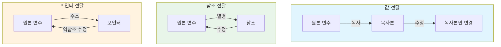

# Day 4-2교시: 참조와 포인터 매개변수

## 학습 목표
- 값에 의한 전달과 참조에 의한 전달의 차이점 이해하기
- 포인터 매개변수 사용법 완전히 익히기
- const 매개변수로 안전한 코드 작성하기
- 배열을 함수에 전달하는 방법 이해하기
- 상황에 맞는 전달 방식 선택하기

## 1. 값에 의한 전달 (Call by Value)

### 1.1 기본 개념

**값에 의한 전달**은 함수에 인자를 전달할 때 **값의 복사본**을 만들어 전달하는 방식입니다.

```
┌─────────────────────────────────────────────────────────────────┐
│                    값에 의한 전달 (Call by Value)                 │
├─────────────────────────────────────────────────────────────────┤
│                                                                 │
│  특징:                                                          │
│  ┌───────────────────────────────────────────────────────────┐ │
│  │  1. 원본 값의 복사본이 함수에 전달됨                         │ │
│  │  2. 함수 내에서 매개변수를 수정해도 원본에 영향 없음          │ │
│  │  3. 안전하지만, 큰 데이터의 경우 복사 비용 발생              │ │
│  │  4. 기본 자료형 (int, double, char 등)에 주로 사용           │ │
│  └───────────────────────────────────────────────────────────┘ │
│                                                                 │
│  동작 과정:                                                      │
│                                                                 │
│    main()에서 호출          func(int x)에서                     │
│  ┌───────────────┐        ┌───────────────┐                    │
│  │ int a = 10;   │   ───▶ │ x = 10 (복사) │                    │
│  │               │  복사   │ x = x + 5     │                    │
│  │ func(a);      │        │ // x = 15     │                    │
│  │               │        └───────────────┘                    │
│  │ // a는 여전히 │               ↓                              │
│  │ // 10         │        함수 종료 시 x 소멸                   │
│  └───────────────┘                                              │
│                                                                 │
└─────────────────────────────────────────────────────────────────┘
```

### 1.2 기본 동작 예제

```cpp
#include <iostream>
using namespace std;

void increment(int num) {
    cout << "함수 시작 - num: " << num << endl;
    num++;  // 복사본만 증가
    cout << "함수 내부 - num: " << num << endl;
}

int main() {
    int value = 10;

    cout << "호출 전 - value: " << value << endl;
    increment(value);
    cout << "호출 후 - value: " << value << endl;  // 10 (변경되지 않음)

    return 0;
}
```

**출력:**
```
호출 전 - value: 10
함수 시작 - num: 10
함수 내부 - num: 11
호출 후 - value: 10
```

### 1.3 메모리 시각화

```
┌─────────────────────────────────────────────────────────────────┐
│                    값 전달 메모리 동작 상세                        │
├─────────────────────────────────────────────────────────────────┤
│                                                                 │
│  1단계: main() 실행                                              │
│  ┌───────────────────────────────────────────────────────────┐ │
│  │              Stack Memory                                  │ │
│  │  ┌─────────────────────────────────────────────────────┐  │ │
│  │  │ main() frame                                        │  │ │
│  │  │   value: [    10    ] @0x7fff0010                   │  │ │
│  │  └─────────────────────────────────────────────────────┘  │ │
│  └───────────────────────────────────────────────────────────┘ │
│                                                                 │
│  2단계: increment(value) 호출 - 값 복사                          │
│  ┌───────────────────────────────────────────────────────────┐ │
│  │              Stack Memory                                  │ │
│  │  ┌─────────────────────────────────────────────────────┐  │ │
│  │  │ increment() frame        ← 스택 위에 추가           │  │ │
│  │  │   num: [    10    ] @0x7fff0020  ← 복사본!          │  │ │
│  │  ├─────────────────────────────────────────────────────┤  │ │
│  │  │ main() frame                                        │  │ │
│  │  │   value: [    10    ] @0x7fff0010  ← 원본           │  │ │
│  │  └─────────────────────────────────────────────────────┘  │ │
│  └───────────────────────────────────────────────────────────┘ │
│                                                                 │
│  3단계: num++ 실행                                               │
│  ┌───────────────────────────────────────────────────────────┐ │
│  │              Stack Memory                                  │ │
│  │  ┌─────────────────────────────────────────────────────┐  │ │
│  │  │ increment() frame                                   │  │ │
│  │  │   num: [    11    ] @0x7fff0020  ← 복사본만 변경!   │  │ │
│  │  ├─────────────────────────────────────────────────────┤  │ │
│  │  │ main() frame                                        │  │ │
│  │  │   value: [    10    ] @0x7fff0010  ← 원본 그대로!   │  │ │
│  │  └─────────────────────────────────────────────────────┘  │ │
│  └───────────────────────────────────────────────────────────┘ │
│                                                                 │
│  4단계: 함수 종료                                                │
│  ┌───────────────────────────────────────────────────────────┐ │
│  │              Stack Memory                                  │ │
│  │  ┌─────────────────────────────────────────────────────┐  │ │
│  │  │ main() frame                                        │  │ │
│  │  │   value: [    10    ] @0x7fff0010  ← 여전히 10!     │  │ │
│  │  └─────────────────────────────────────────────────────┘  │ │
│  │                                                            │ │
│  │  increment() 프레임은 스택에서 제거됨 (num 소멸)           │ │
│  └───────────────────────────────────────────────────────────┘ │
│                                                                 │
└─────────────────────────────────────────────────────────────────┘
```

### 1.4 값 전달의 장단점

```
┌─────────────────────────────────────────────────────────────────┐
│                    값 전달의 장단점                               │
├─────────────────────────────────────────────────────────────────┤
│                                                                 │
│  ✅ 장점:                                                        │
│  ┌───────────────────────────────────────────────────────────┐ │
│  │  1. 안전성: 원본 데이터가 보호됨                            │ │
│  │  2. 단순성: 함수 내부에서 자유롭게 수정 가능                 │ │
│  │  3. 독립성: 함수가 외부 상태에 영향받지 않음                 │ │
│  │  4. 디버깅 용이: 부작용(side effect)이 없음                 │ │
│  └───────────────────────────────────────────────────────────┘ │
│                                                                 │
│  ❌ 단점:                                                        │
│  ┌───────────────────────────────────────────────────────────┐ │
│  │  1. 메모리 비용: 큰 객체 복사 시 성능 저하                   │ │
│  │  2. 원본 수정 불가: 여러 값 반환 시 불편함                   │ │
│  │  3. 배열 전달 불가: 배열은 자동으로 포인터로 변환            │ │
│  └───────────────────────────────────────────────────────────┘ │
│                                                                 │
│  사용 권장 상황:                                                 │
│  • int, double, char 등 기본 자료형                             │
│  • 원본을 수정할 필요가 없는 경우                                │
│  • 함수 내에서 값을 자유롭게 수정하고 싶은 경우                   │
│                                                                 │
└─────────────────────────────────────────────────────────────────┘
```

## 2. 참조에 의한 전달 (Call by Reference)

### 2.1 참조(Reference)란?

```
┌─────────────────────────────────────────────────────────────────┐
│                       참조 (Reference)                           │
├─────────────────────────────────────────────────────────────────┤
│                                                                 │
│  참조는 기존 변수에 대한 "별명(alias)"입니다.                     │
│                                                                 │
│  선언 문법:                                                      │
│  ┌───────────────────────────────────────────────────────────┐ │
│  │  int original = 10;                                        │ │
│  │  int& ref = original;  // ref는 original의 별명            │ │
│  │                                                            │ │
│  │  ref = 20;  // original도 20이 됨!                         │ │
│  │  cout << original;  // 출력: 20                            │ │
│  └───────────────────────────────────────────────────────────┘ │
│                                                                 │
│  메모리 구조:                                                    │
│  ┌───────────────────────────────────────────────────────────┐ │
│  │                                                            │ │
│  │    original ──────────┐                                    │ │
│  │                       ▼                                    │ │
│  │                 ┌─────────┐                                │ │
│  │                 │   20    │  메모리 @0x1000                │ │
│  │                 └─────────┘                                │ │
│  │                       ▲                                    │ │
│  │    ref ───────────────┘                                    │ │
│  │                                                            │ │
│  │    original과 ref는 같은 메모리를 가리킴!                    │ │
│  │                                                            │ │
│  └───────────────────────────────────────────────────────────┘ │
│                                                                 │
│  참조의 특징:                                                    │
│  • 선언 시 반드시 초기화해야 함                                  │
│  • 한 번 참조하면 다른 변수를 참조할 수 없음                      │
│  • nullptr을 가질 수 없음 (포인터와의 차이점)                     │
│  • 문법적으로 일반 변수처럼 사용                                  │
│                                                                 │
└─────────────────────────────────────────────────────────────────┘
```

### 2.2 참조 매개변수 기본

```cpp
#include <iostream>
using namespace std;

void increment(int& num) {  // 참조 매개변수 (& 기호)
    cout << "함수 시작 - num: " << num << endl;
    num++;  // 원본 값이 직접 증가
    cout << "함수 내부 - num: " << num << endl;
}

int main() {
    int value = 10;

    cout << "호출 전 - value: " << value << endl;
    increment(value);
    cout << "호출 후 - value: " << value << endl;  // 11 (변경됨!)

    return 0;
}
```

**출력:**
```
호출 전 - value: 10
함수 시작 - num: 10
함수 내부 - num: 11
호출 후 - value: 11
```

### 2.3 참조 전달 메모리 구조

```
┌─────────────────────────────────────────────────────────────────┐
│                    참조 전달 메모리 동작 상세                      │
├─────────────────────────────────────────────────────────────────┤
│                                                                 │
│  1단계: main() 실행                                              │
│  ┌───────────────────────────────────────────────────────────┐ │
│  │              Stack Memory                                  │ │
│  │  ┌─────────────────────────────────────────────────────┐  │ │
│  │  │ main() frame                                        │  │ │
│  │  │   value: [    10    ] @0x7fff0010                   │  │ │
│  │  └─────────────────────────────────────────────────────┘  │ │
│  └───────────────────────────────────────────────────────────┘ │
│                                                                 │
│  2단계: increment(value) 호출 - 참조 전달                        │
│  ┌───────────────────────────────────────────────────────────┐ │
│  │              Stack Memory                                  │ │
│  │  ┌─────────────────────────────────────────────────────┐  │ │
│  │  │ increment() frame                                   │  │ │
│  │  │   num → value (별명)  ← 같은 메모리를 참조!          │  │ │
│  │  ├─────────────────────────────────────────────────────┤  │ │
│  │  │ main() frame                                        │  │ │
│  │  │   value: [    10    ] @0x7fff0010                   │  │ │
│  │  └─────────────────────────────────────────────────────┘  │ │
│  │                                                            │ │
│  │  num과 value는 완전히 같은 메모리 위치를 가리킴!            │ │
│  └───────────────────────────────────────────────────────────┘ │
│                                                                 │
│  3단계: num++ 실행                                               │
│  ┌───────────────────────────────────────────────────────────┐ │
│  │              Stack Memory                                  │ │
│  │  ┌─────────────────────────────────────────────────────┐  │ │
│  │  │ increment() frame                                   │  │ │
│  │  │   num → value (별명)                                │  │ │
│  │  ├─────────────────────────────────────────────────────┤  │ │
│  │  │ main() frame                                        │  │ │
│  │  │   value: [    11    ] @0x7fff0010  ← 직접 변경!     │  │ │
│  │  └─────────────────────────────────────────────────────┘  │ │
│  │                                                            │ │
│  │  num++은 value++과 동일!                                   │ │
│  └───────────────────────────────────────────────────────────┘ │
│                                                                 │
│  4단계: 함수 종료                                                │
│  ┌───────────────────────────────────────────────────────────┐ │
│  │              Stack Memory                                  │ │
│  │  ┌─────────────────────────────────────────────────────┐  │ │
│  │  │ main() frame                                        │  │ │
│  │  │   value: [    11    ] @0x7fff0010  ← 변경된 채로!   │  │ │
│  │  └─────────────────────────────────────────────────────┘  │ │
│  └───────────────────────────────────────────────────────────┘ │
│                                                                 │
└─────────────────────────────────────────────────────────────────┘
```

### 2.4 실용적인 예제: 두 값 교환

```cpp
#include <iostream>
using namespace std;

// ❌ 잘못된 방법 (값 전달) - 교환되지 않음
void swapByValue(int a, int b) {
    int temp = a;
    a = b;
    b = temp;
    cout << "함수 내부: a=" << a << ", b=" << b << endl;
}

// ✅ 올바른 방법 (참조 전달) - 교환됨
void swapByRef(int& a, int& b) {
    int temp = a;
    a = b;
    b = temp;
    cout << "함수 내부: a=" << a << ", b=" << b << endl;
}

int main() {
    int x = 5, y = 10;

    cout << "===== 값 전달 테스트 =====" << endl;
    cout << "교환 전: x=" << x << ", y=" << y << endl;
    swapByValue(x, y);
    cout << "교환 후: x=" << x << ", y=" << y << endl;  // 변화 없음!

    cout << "\n===== 참조 전달 테스트 =====" << endl;
    cout << "교환 전: x=" << x << ", y=" << y << endl;
    swapByRef(x, y);
    cout << "교환 후: x=" << x << ", y=" << y << endl;  // 교환됨!

    return 0;
}
```

**출력:**
```
===== 값 전달 테스트 =====
교환 전: x=5, y=10
함수 내부: a=10, b=5
교환 후: x=5, y=10

===== 참조 전달 테스트 =====
교환 전: x=5, y=10
함수 내부: a=10, b=5
교환 후: x=10, y=5
```

### 2.5 여러 값 반환하기

참조 매개변수를 사용하면 함수에서 여러 값을 반환할 수 있습니다.

```cpp
#include <iostream>
using namespace std;

// 나눗셈의 몫과 나머지를 동시에 반환
void divmod(int dividend, int divisor, int& quotient, int& remainder) {
    quotient = dividend / divisor;
    remainder = dividend % divisor;
}

// 배열의 합계와 평균을 동시에 반환
void calcStats(int arr[], int size, int& sum, double& average) {
    sum = 0;
    for (int i = 0; i < size; i++) {
        sum += arr[i];
    }
    average = static_cast<double>(sum) / size;
}

// 최소값, 최대값, 평균을 동시에 반환
void findMinMaxAvg(int arr[], int size, int& minVal, int& maxVal, double& avg) {
    minVal = arr[0];
    maxVal = arr[0];
    int sum = arr[0];

    for (int i = 1; i < size; i++) {
        if (arr[i] < minVal) minVal = arr[i];
        if (arr[i] > maxVal) maxVal = arr[i];
        sum += arr[i];
    }

    avg = static_cast<double>(sum) / size;
}

int main() {
    // divmod 테스트
    int q, r;
    divmod(17, 5, q, r);
    cout << "17 ÷ 5 = " << q << " 나머지 " << r << endl;

    // calcStats 테스트
    int numbers[] = {10, 20, 30, 40, 50};
    int size = 5;
    int sum;
    double avg;
    calcStats(numbers, size, sum, avg);
    cout << "합계: " << sum << ", 평균: " << avg << endl;

    // findMinMaxAvg 테스트
    int data[] = {45, 12, 67, 23, 89, 34, 56};
    int minVal, maxVal;
    findMinMaxAvg(data, 7, minVal, maxVal, avg);
    cout << "최소: " << minVal << ", 최대: " << maxVal << ", 평균: " << avg << endl;

    return 0;
}
```

## 3. 포인터 매개변수 (Call by Pointer)

### 3.1 포인터 복습

```
┌─────────────────────────────────────────────────────────────────┐
│                       포인터 기본 개념                            │
├─────────────────────────────────────────────────────────────────┤
│                                                                 │
│  포인터는 메모리 주소를 저장하는 변수입니다.                       │
│                                                                 │
│  기본 연산자:                                                    │
│  ┌───────────────────────────────────────────────────────────┐ │
│  │  &변수    : 주소 연산자 - 변수의 메모리 주소를 얻음          │ │
│  │  *포인터  : 역참조 연산자 - 포인터가 가리키는 값에 접근       │ │
│  └───────────────────────────────────────────────────────────┘ │
│                                                                 │
│  예시:                                                          │
│  ┌───────────────────────────────────────────────────────────┐ │
│  │  int num = 10;                                             │ │
│  │  int* ptr = &num;  // ptr은 num의 주소를 저장               │ │
│  │                                                            │ │
│  │  cout << num;      // 10 (값)                              │ │
│  │  cout << &num;     // 0x7fff0010 (주소)                    │ │
│  │  cout << ptr;      // 0x7fff0010 (포인터가 저장한 주소)     │ │
│  │  cout << *ptr;     // 10 (포인터가 가리키는 값)             │ │
│  │                                                            │ │
│  │  *ptr = 20;        // num도 20이 됨!                       │ │
│  └───────────────────────────────────────────────────────────┘ │
│                                                                 │
│  메모리 구조:                                                    │
│  ┌─────────────────────────────────────────────┐               │
│  │     변수         메모리          주소        │               │
│  │   ────────────────────────────────────────  │               │
│  │     num    ─▶   [    10    ]   @0x7fff0010  │               │
│  │                      ▲                      │               │
│  │                      │                      │               │
│  │     ptr    ─▶   [0x7fff0010]   @0x7fff0020  │               │
│  │                                             │               │
│  └─────────────────────────────────────────────┘               │
│                                                                 │
└─────────────────────────────────────────────────────────────────┘
```

### 3.2 포인터 매개변수 기본

```cpp
#include <iostream>
using namespace std;

void increment(int* numPtr) {  // 포인터 매개변수
    cout << "포인터가 가리키는 주소: " << numPtr << endl;
    cout << "포인터가 가리키는 값: " << *numPtr << endl;

    (*numPtr)++;  // 포인터가 가리키는 값 증가

    cout << "증가 후 값: " << *numPtr << endl;
}

int main() {
    int value = 10;

    cout << "value의 주소: " << &value << endl;
    cout << "호출 전 - value: " << value << endl;

    increment(&value);  // 주소 전달

    cout << "호출 후 - value: " << value << endl;  // 11 (변경됨)

    return 0;
}
```

### 3.3 포인터 전달 메모리 구조

```
┌─────────────────────────────────────────────────────────────────┐
│                    포인터 전달 메모리 동작 상세                    │
├─────────────────────────────────────────────────────────────────┤
│                                                                 │
│  1단계: main() 실행                                              │
│  ┌───────────────────────────────────────────────────────────┐ │
│  │              Stack Memory                                  │ │
│  │  ┌─────────────────────────────────────────────────────┐  │ │
│  │  │ main() frame                                        │  │ │
│  │  │   value: [    10    ] @0x7fff0010                   │  │ │
│  │  └─────────────────────────────────────────────────────┘  │ │
│  └───────────────────────────────────────────────────────────┘ │
│                                                                 │
│  2단계: increment(&value) 호출 - 주소 복사                       │
│  ┌───────────────────────────────────────────────────────────┐ │
│  │              Stack Memory                                  │ │
│  │  ┌─────────────────────────────────────────────────────┐  │ │
│  │  │ increment() frame                                   │  │ │
│  │  │   numPtr: [0x7fff0010] @0x7fff0020  ← 주소값 복사!  │  │ │
│  │  ├─────────────────────────────────────────────────────┤  │ │
│  │  │ main() frame                                        │  │ │
│  │  │   value: [    10    ] @0x7fff0010                   │  │ │
│  │  └─────────────────────────────────────────────────────┘  │ │
│  │                                                            │ │
│  │  numPtr은 value의 주소(0x7fff0010)를 저장                   │ │
│  └───────────────────────────────────────────────────────────┘ │
│                                                                 │
│  3단계: (*numPtr)++ 실행                                        │
│  ┌───────────────────────────────────────────────────────────┐ │
│  │              Stack Memory                                  │ │
│  │  ┌─────────────────────────────────────────────────────┐  │ │
│  │  │ increment() frame                                   │  │ │
│  │  │   numPtr: [0x7fff0010]                              │  │ │
│  │  │           │                                         │  │ │
│  │  │           └──▶ *numPtr로 간접 접근                   │  │ │
│  │  ├─────────────────────────────────────────────────────┤  │ │
│  │  │ main() frame                     ↓                  │  │ │
│  │  │   value: [    11    ] @0x7fff0010  ← 값 변경!       │  │ │
│  │  └─────────────────────────────────────────────────────┘  │ │
│  └───────────────────────────────────────────────────────────┘ │
│                                                                 │
│  4단계: 함수 종료                                                │
│  ┌───────────────────────────────────────────────────────────┐ │
│  │              Stack Memory                                  │ │
│  │  ┌─────────────────────────────────────────────────────┐  │ │
│  │  │ main() frame                                        │  │ │
│  │  │   value: [    11    ] @0x7fff0010  ← 변경된 채로!   │  │ │
│  │  └─────────────────────────────────────────────────────┘  │ │
│  └───────────────────────────────────────────────────────────┘ │
│                                                                 │
└─────────────────────────────────────────────────────────────────┘
```

### 3.4 포인터를 사용한 swap 함수

```cpp
#include <iostream>
using namespace std;

void swapByPointer(int* a, int* b) {
    int temp = *a;  // a가 가리키는 값을 temp에 저장
    *a = *b;        // b가 가리키는 값을 a가 가리키는 곳에 저장
    *b = temp;      // temp를 b가 가리키는 곳에 저장
}

int main() {
    int x = 5, y = 10;

    cout << "교환 전: x=" << x << ", y=" << y << endl;

    swapByPointer(&x, &y);  // 주소 전달

    cout << "교환 후: x=" << x << ", y=" << y << endl;

    return 0;
}
```

### 3.5 nullptr 체크의 중요성

포인터 매개변수의 중요한 특징은 **nullptr**을 받을 수 있다는 것입니다.

```cpp
#include <iostream>
using namespace std;

// ❌ 위험한 함수 - nullptr 체크 없음
void unsafeIncrement(int* ptr) {
    (*ptr)++;  // ptr이 nullptr이면 크래시!
}

// ✅ 안전한 함수 - nullptr 체크 있음
bool safeIncrement(int* ptr) {
    if (ptr == nullptr) {
        cout << "오류: null 포인터입니다!" << endl;
        return false;
    }
    (*ptr)++;
    return true;
}

// ✅ 더 안전한 함수 - 조건부 증가
void conditionalIncrement(int* ptr, int defaultValue = 0) {
    if (ptr != nullptr) {
        (*ptr)++;
    } else {
        cout << "기본값 사용: " << defaultValue << endl;
    }
}

int main() {
    int value = 10;
    int* nullPtr = nullptr;

    // 정상 케이스
    if (safeIncrement(&value)) {
        cout << "증가 성공: " << value << endl;
    }

    // null 포인터 케이스
    safeIncrement(nullPtr);  // 안전하게 처리됨

    return 0;
}
```

## 4. 참조 vs 포인터 상세 비교

### 4.1 비교표

```
┌─────────────────────────────────────────────────────────────────┐
│                   참조 vs 포인터 완전 비교                        │
├─────────────────────────────────────────────────────────────────┤
│                                                                 │
│  ┌────────────────┬───────────────────┬───────────────────┐    │
│  │      항목       │      참조(&)       │     포인터(*)     │    │
│  ├────────────────┼───────────────────┼───────────────────┤    │
│  │ 선언           │ int& ref = var;   │ int* ptr = &var;  │    │
│  ├────────────────┼───────────────────┼───────────────────┤    │
│  │ 초기화 필수     │ 반드시 필요        │ 선택적            │    │
│  ├────────────────┼───────────────────┼───────────────────┤    │
│  │ null 가능      │ ❌ 불가능          │ ✅ 가능           │    │
│  ├────────────────┼───────────────────┼───────────────────┤    │
│  │ 재할당         │ ❌ 불가능          │ ✅ 가능           │    │
│  ├────────────────┼───────────────────┼───────────────────┤    │
│  │ 값 접근        │ 그냥 사용 (ref)    │ 역참조 (*ptr)     │    │
│  ├────────────────┼───────────────────┼───────────────────┤    │
│  │ 메모리 사용    │ 내부적으로 포인터  │ 명시적 포인터     │    │
│  ├────────────────┼───────────────────┼───────────────────┤    │
│  │ 함수 호출 문법  │ func(var)         │ func(&var)        │    │
│  ├────────────────┼───────────────────┼───────────────────┤    │
│  │ 안전성         │ 더 안전           │ 주의 필요         │    │
│  ├────────────────┼───────────────────┼───────────────────┤    │
│  │ 사용 용이성    │ 더 쉬움           │ 복잡함            │    │
│  └────────────────┴───────────────────┴───────────────────┘    │
│                                                                 │
└─────────────────────────────────────────────────────────────────┘
```

### 4.2 언제 무엇을 사용할까?

```
┌─────────────────────────────────────────────────────────────────┐
│                    상황별 권장 전달 방식                          │
├─────────────────────────────────────────────────────────────────┤
│                                                                 │
│  1️⃣ 값 전달 (Call by Value) 사용:                                │
│  ┌───────────────────────────────────────────────────────────┐ │
│  │  • 기본 자료형 (int, double, char, bool)                   │ │
│  │  • 작은 구조체 (8~16바이트 이하)                            │ │
│  │  • 원본을 수정하면 안 되는 경우                             │ │
│  │  • 함수 내에서 값을 자유롭게 수정하고 싶은 경우              │ │
│  └───────────────────────────────────────────────────────────┘ │
│                                                                 │
│  2️⃣ const 참조 전달 사용:                                        │
│  ┌───────────────────────────────────────────────────────────┐ │
│  │  • 큰 객체를 읽기만 할 때 (string, vector, 구조체 등)       │ │
│  │  • 복사 비용을 피하면서 원본 보호가 필요할 때               │ │
│  │  • 대부분의 "읽기 전용" 매개변수에 권장                     │ │
│  │                                                            │ │
│  │  void print(const string& text);                           │ │
│  │  void process(const vector<int>& data);                    │ │
│  └───────────────────────────────────────────────────────────┘ │
│                                                                 │
│  3️⃣ 참조 전달 사용:                                              │
│  ┌───────────────────────────────────────────────────────────┐ │
│  │  • 원본 값을 수정해야 할 때                                 │ │
│  │  • 여러 값을 반환해야 할 때 (출력 매개변수)                 │ │
│  │  • null이 아님을 보장할 수 있을 때                          │ │
│  │                                                            │ │
│  │  void swap(int& a, int& b);                                │ │
│  │  void getMinMax(int arr[], int& min, int& max);            │ │
│  └───────────────────────────────────────────────────────────┘ │
│                                                                 │
│  4️⃣ 포인터 전달 사용:                                            │
│  ┌───────────────────────────────────────────────────────────┐ │
│  │  • 배열을 전달할 때 (배열은 자동으로 포인터로 변환)         │ │
│  │  • null이 유효한 입력일 수 있을 때 (선택적 매개변수)        │ │
│  │  • 동적 메모리를 다룰 때                                    │ │
│  │  • C 스타일 API와 호환이 필요할 때                          │ │
│  │                                                            │ │
│  │  void processArray(int* arr, int size);                    │ │
│  │  void optionalCallback(void (*callback)());                │ │
│  └───────────────────────────────────────────────────────────┘ │
│                                                                 │
└─────────────────────────────────────────────────────────────────┘
```

### 4.3 세 가지 방식 비교 예제

```cpp
#include <iostream>
using namespace std;

// 1. 값 전달
int addByValue(int a, int b) {
    a = a + 1;  // 원본에 영향 없음
    return a + b;
}

// 2. 참조 전달
void addByReference(int& result, int a, int b) {
    result = a + b;  // result는 원본을 직접 수정
}

// 3. 포인터 전달
void addByPointer(int* result, int a, int b) {
    if (result != nullptr) {
        *result = a + b;  // 포인터가 가리키는 값 수정
    }
}

int main() {
    int x = 10, y = 20;

    // 값 전달 방식
    int sum1 = addByValue(x, y);
    cout << "값 전달: " << sum1 << ", x=" << x << endl;

    // 참조 전달 방식
    int sum2;
    addByReference(sum2, x, y);
    cout << "참조 전달: " << sum2 << endl;

    // 포인터 전달 방식
    int sum3;
    addByPointer(&sum3, x, y);
    cout << "포인터 전달: " << sum3 << endl;

    return 0;
}
```

## 5. const 매개변수

### 5.1 const의 중요성

```
┌─────────────────────────────────────────────────────────────────┐
│                    const 매개변수의 중요성                        │
├─────────────────────────────────────────────────────────────────┤
│                                                                 │
│  const는 "읽기 전용"을 의미합니다.                               │
│                                                                 │
│  사용 이유:                                                      │
│  ┌───────────────────────────────────────────────────────────┐ │
│  │  1. 안전성: 실수로 인한 값 변경 방지                        │ │
│  │  2. 의도 명확화: 이 매개변수는 읽기만 한다는 것을 명시       │ │
│  │  3. 최적화: 컴파일러가 최적화할 수 있는 힌트 제공           │ │
│  │  4. 상수 전달 가능: 리터럴 값을 참조로 전달 가능            │ │
│  └───────────────────────────────────────────────────────────┘ │
│                                                                 │
│  예시:                                                          │
│  ┌───────────────────────────────────────────────────────────┐ │
│  │  // const 없이 - 리터럴 전달 불가                          │ │
│  │  void print(string& text);                                 │ │
│  │  print("Hello");  // ❌ 에러! 임시 객체를 참조할 수 없음    │ │
│  │                                                            │ │
│  │  // const 사용 - 리터럴 전달 가능                          │ │
│  │  void print(const string& text);                           │ │
│  │  print("Hello");  // ✅ OK! const 참조는 임시 객체 허용    │ │
│  └───────────────────────────────────────────────────────────┘ │
│                                                                 │
└─────────────────────────────────────────────────────────────────┘
```

### 5.2 const 참조

```cpp
#include <iostream>
#include <string>
using namespace std;

// const 참조 - 읽기 전용
void printPerson(const string& name, const int& age) {
    cout << "이름: " << name << ", 나이: " << age << endl;

    // name = "변경";  // ❌ 컴파일 에러! const로 보호됨
    // age = 30;       // ❌ 컴파일 에러!
}

// const 없는 참조 - 수정 가능
void incrementAge(int& age) {
    age++;  // ✅ OK
}

int main() {
    string myName = "홍길동";
    int myAge = 25;

    printPerson(myName, myAge);  // 읽기 전용으로 전달

    // 리터럴 직접 전달도 가능 (const 참조이므로)
    printPerson("김철수", 30);

    incrementAge(myAge);
    cout << "증가된 나이: " << myAge << endl;

    return 0;
}
```

### 5.3 const 포인터 종류

```
┌─────────────────────────────────────────────────────────────────┐
│                    const 포인터의 4가지 형태                      │
├─────────────────────────────────────────────────────────────────┤
│                                                                 │
│  1. 일반 포인터 (non-const)                                     │
│  ┌───────────────────────────────────────────────────────────┐ │
│  │  int* ptr;                                                 │ │
│  │  // 포인터 변경 가능, 가리키는 값 변경 가능                  │ │
│  │  ptr = &other;  // ✅                                      │ │
│  │  *ptr = 20;     // ✅                                      │ │
│  └───────────────────────────────────────────────────────────┘ │
│                                                                 │
│  2. 포인터 to const (값 보호)                                    │
│  ┌───────────────────────────────────────────────────────────┐ │
│  │  const int* ptr;  또는  int const* ptr;                    │ │
│  │  // 포인터 변경 가능, 가리키는 값 변경 불가                  │ │
│  │  ptr = &other;  // ✅                                      │ │
│  │  *ptr = 20;     // ❌ 에러!                                │ │
│  └───────────────────────────────────────────────────────────┘ │
│                                                                 │
│  3. const 포인터 (포인터 보호)                                   │
│  ┌───────────────────────────────────────────────────────────┐ │
│  │  int* const ptr = &var;                                    │ │
│  │  // 포인터 변경 불가, 가리키는 값 변경 가능                  │ │
│  │  ptr = &other;  // ❌ 에러!                                │ │
│  │  *ptr = 20;     // ✅                                      │ │
│  └───────────────────────────────────────────────────────────┘ │
│                                                                 │
│  4. const 포인터 to const (둘 다 보호)                           │
│  ┌───────────────────────────────────────────────────────────┐ │
│  │  const int* const ptr = &var;                              │ │
│  │  // 포인터 변경 불가, 가리키는 값 변경 불가                  │ │
│  │  ptr = &other;  // ❌ 에러!                                │ │
│  │  *ptr = 20;     // ❌ 에러!                                │ │
│  └───────────────────────────────────────────────────────────┘ │
│                                                                 │
│  기억하는 방법:                                                  │
│  ┌───────────────────────────────────────────────────────────┐ │
│  │  const가 *의 왼쪽: 가리키는 값 보호                         │ │
│  │  const가 *의 오른쪽: 포인터 자체 보호                       │ │
│  └───────────────────────────────────────────────────────────┘ │
│                                                                 │
└─────────────────────────────────────────────────────────────────┘
```

### 5.4 const 포인터 매개변수 예제

```cpp
#include <iostream>
using namespace std;

// 배열 읽기 전용 - 값 변경 불가
void printArray(const int* arr, int size) {
    cout << "배열 내용: ";
    for (int i = 0; i < size; i++) {
        cout << arr[i] << " ";
        // arr[i] = 0;  // ❌ 에러! const로 보호됨
    }
    cout << endl;
}

// 배열 수정 가능
void doubleArray(int* arr, int size) {
    for (int i = 0; i < size; i++) {
        arr[i] *= 2;  // ✅ OK
    }
}

// 합계 계산 - 읽기 전용
int sumArray(const int* arr, int size) {
    int sum = 0;
    for (int i = 0; i < size; i++) {
        sum += arr[i];
    }
    return sum;
}

int main() {
    int numbers[] = {1, 2, 3, 4, 5};
    int size = 5;

    printArray(numbers, size);  // 읽기만 함

    cout << "합계: " << sumArray(numbers, size) << endl;

    doubleArray(numbers, size);  // 값 변경

    printArray(numbers, size);  // 변경된 값 출력

    return 0;
}
```

## 6. 배열을 함수에 전달하기

### 6.1 배열 전달의 특수성

```
┌─────────────────────────────────────────────────────────────────┐
│                    배열 전달의 특수성                              │
├─────────────────────────────────────────────────────────────────┤
│                                                                 │
│  C++에서 배열은 함수에 전달될 때 자동으로 포인터로 변환됩니다.     │
│  이것을 "배열의 붕괴(array decay)"라고 합니다.                    │
│                                                                 │
│  예시:                                                          │
│  ┌───────────────────────────────────────────────────────────┐ │
│  │  void func(int arr[]);     // 사실은 int* arr            │ │
│  │  void func(int arr[10]);   // 사실은 int* arr (10 무시됨) │ │
│  │  void func(int* arr);      // 가장 명확한 형태            │ │
│  │                                                            │ │
│  │  // 위 세 가지는 모두 동일함!                              │ │
│  └───────────────────────────────────────────────────────────┘ │
│                                                                 │
│  중요한 점:                                                      │
│  ┌───────────────────────────────────────────────────────────┐ │
│  │  • 배열의 크기 정보가 함수에 전달되지 않음                   │ │
│  │  • 따라서 크기를 별도의 매개변수로 전달해야 함               │ │
│  │  • 함수 내에서 sizeof(arr)은 포인터 크기를 반환함            │ │
│  └───────────────────────────────────────────────────────────┘ │
│                                                                 │
│  메모리 구조:                                                    │
│                                                                 │
│    main()                          func()                       │
│  ┌─────────────────┐            ┌─────────────────┐            │
│  │ int arr[5] =    │            │ int* arr =      │            │
│  │ {1,2,3,4,5}     │───────────▶│ 0x7fff0010      │            │
│  │ @0x7fff0010     │  주소만     │ (포인터만 전달) │            │
│  └─────────────────┘  전달       └─────────────────┘            │
│                                                                 │
└─────────────────────────────────────────────────────────────────┘
```

### 6.2 배열 전달 예제

```cpp
#include <iostream>
using namespace std;

// 배열 출력 - const로 보호
void printArray(const int* arr, int size) {
    cout << "[";
    for (int i = 0; i < size; i++) {
        cout << arr[i];
        if (i < size - 1) cout << ", ";
    }
    cout << "]" << endl;
}

// 배열 모든 원소 증가
void incrementAll(int arr[], int size) {
    for (int i = 0; i < size; i++) {
        arr[i]++;  // 원본 배열이 직접 수정됨!
    }
}

// 배열 합계 계산
int sumArray(const int arr[], int size) {
    int sum = 0;
    for (int i = 0; i < size; i++) {
        sum += arr[i];
    }
    return sum;
}

// 배열 평균 계산
double averageArray(const int* arr, int size) {
    return static_cast<double>(sumArray(arr, size)) / size;
}

// 배열에서 최대값 찾기
int maxArray(const int arr[], int size) {
    int maxVal = arr[0];
    for (int i = 1; i < size; i++) {
        if (arr[i] > maxVal) {
            maxVal = arr[i];
        }
    }
    return maxVal;
}

// 배열 뒤집기
void reverseArray(int arr[], int size) {
    for (int i = 0; i < size / 2; i++) {
        int temp = arr[i];
        arr[i] = arr[size - 1 - i];
        arr[size - 1 - i] = temp;
    }
}

int main() {
    int numbers[] = {10, 20, 30, 40, 50};
    int size = sizeof(numbers) / sizeof(numbers[0]);

    cout << "원본 배열: ";
    printArray(numbers, size);

    cout << "합계: " << sumArray(numbers, size) << endl;
    cout << "평균: " << averageArray(numbers, size) << endl;
    cout << "최대값: " << maxArray(numbers, size) << endl;

    incrementAll(numbers, size);
    cout << "증가 후: ";
    printArray(numbers, size);

    reverseArray(numbers, size);
    cout << "뒤집기 후: ";
    printArray(numbers, size);

    return 0;
}
```

### 6.3 2차원 배열 전달

```cpp
#include <iostream>
using namespace std;

const int COLS = 3;

// 2차원 배열 전달 - 열 크기는 지정 필요
void print2DArray(int arr[][COLS], int rows) {
    for (int i = 0; i < rows; i++) {
        for (int j = 0; j < COLS; j++) {
            cout << arr[i][j] << " ";
        }
        cout << endl;
    }
}

// 2차원 배열 합계
int sum2DArray(int arr[][COLS], int rows) {
    int sum = 0;
    for (int i = 0; i < rows; i++) {
        for (int j = 0; j < COLS; j++) {
            sum += arr[i][j];
        }
    }
    return sum;
}

// 포인터로 전달하는 방법
void print2DByPointer(int* arr, int rows, int cols) {
    for (int i = 0; i < rows; i++) {
        for (int j = 0; j < cols; j++) {
            cout << *(arr + i * cols + j) << " ";
        }
        cout << endl;
    }
}

int main() {
    int matrix[2][3] = {
        {1, 2, 3},
        {4, 5, 6}
    };

    cout << "2차원 배열:" << endl;
    print2DArray(matrix, 2);

    cout << "합계: " << sum2DArray(matrix, 2) << endl;

    cout << "\n포인터로 출력:" << endl;
    print2DByPointer(&matrix[0][0], 2, 3);

    return 0;
}
```

## 7. 실전 예제 모음

### 7.1 배열 유틸리티 함수들

```cpp
#include <iostream>
#include <cstdlib>
#include <ctime>
using namespace std;

// 배열을 랜덤 값으로 채우기
void fillRandom(int arr[], int size, int min, int max) {
    for (int i = 0; i < size; i++) {
        arr[i] = rand() % (max - min + 1) + min;
    }
}

// 배열 정렬 (버블 정렬)
void sortArray(int arr[], int size) {
    for (int i = 0; i < size - 1; i++) {
        for (int j = 0; j < size - i - 1; j++) {
            if (arr[j] > arr[j + 1]) {
                int temp = arr[j];
                arr[j] = arr[j + 1];
                arr[j + 1] = temp;
            }
        }
    }
}

// 배열에서 특정 값 찾기
int findValue(const int arr[], int size, int target) {
    for (int i = 0; i < size; i++) {
        if (arr[i] == target) {
            return i;  // 찾은 인덱스 반환
        }
    }
    return -1;  // 못 찾음
}

// 배열 복사
void copyArray(const int source[], int dest[], int size) {
    for (int i = 0; i < size; i++) {
        dest[i] = source[i];
    }
}

// 배열 출력
void printArray(const int arr[], int size, const char* label = "") {
    if (label[0] != '\0') {
        cout << label << ": ";
    }
    cout << "[";
    for (int i = 0; i < size; i++) {
        cout << arr[i];
        if (i < size - 1) cout << ", ";
    }
    cout << "]" << endl;
}

int main() {
    srand(time(0));

    const int SIZE = 10;
    int numbers[SIZE];
    int backup[SIZE];

    // 랜덤 값으로 채우기
    fillRandom(numbers, SIZE, 1, 100);
    printArray(numbers, SIZE, "원본");

    // 백업 만들기
    copyArray(numbers, backup, SIZE);

    // 정렬
    sortArray(numbers, SIZE);
    printArray(numbers, SIZE, "정렬 후");

    // 값 찾기
    int target = numbers[5];
    int index = findValue(numbers, SIZE, target);
    cout << target << "의 위치: " << index << endl;

    // 백업 확인
    printArray(backup, SIZE, "백업");

    return 0;
}
```

### 7.2 성적 처리 시스템

```cpp
#include <iostream>
#include <string>
using namespace std;

// 학생 정보 입력
void inputStudent(string& name, int scores[], int subjectCount) {
    cout << "학생 이름: ";
    cin >> name;

    string subjects[] = {"국어", "영어", "수학", "과학", "사회"};
    for (int i = 0; i < subjectCount; i++) {
        cout << subjects[i] << " 점수: ";
        cin >> scores[i];
    }
}

// 통계 계산
void calculateStats(const int scores[], int count,
                    int& sum, double& avg, int& max, int& min) {
    sum = 0;
    max = scores[0];
    min = scores[0];

    for (int i = 0; i < count; i++) {
        sum += scores[i];
        if (scores[i] > max) max = scores[i];
        if (scores[i] < min) min = scores[i];
    }

    avg = static_cast<double>(sum) / count;
}

// 학점 계산
char getGrade(double avg) {
    if (avg >= 90) return 'A';
    if (avg >= 80) return 'B';
    if (avg >= 70) return 'C';
    if (avg >= 60) return 'D';
    return 'F';
}

// 결과 출력
void printResult(const string& name, const int scores[], int count,
                 int sum, double avg, int max, int min, char grade) {
    cout << "\n========== 성적표 ==========" << endl;
    cout << "학생: " << name << endl;
    cout << "─────────────────────────" << endl;

    string subjects[] = {"국어", "영어", "수학", "과학", "사회"};
    for (int i = 0; i < count; i++) {
        cout << subjects[i] << ": " << scores[i] << "점" << endl;
    }

    cout << "─────────────────────────" << endl;
    cout << "총점: " << sum << "점" << endl;
    cout << "평균: " << avg << "점" << endl;
    cout << "최고: " << max << "점" << endl;
    cout << "최저: " << min << "점" << endl;
    cout << "학점: " << grade << endl;
    cout << "=============================" << endl;
}

int main() {
    string name;
    const int SUBJECTS = 5;
    int scores[SUBJECTS];
    int sum, max, min;
    double avg;

    inputStudent(name, scores, SUBJECTS);
    calculateStats(scores, SUBJECTS, sum, avg, max, min);
    char grade = getGrade(avg);
    printResult(name, scores, SUBJECTS, sum, avg, max, min, grade);

    return 0;
}
```

## 8. 실습 과제

### 과제 1: 배열 뒤집기
배열을 거꾸로 뒤집는 함수를 작성하세요.

```cpp
void reverseArray(int arr[], int size);
```

**테스트:**
```
입력: [1, 2, 3, 4, 5]
출력: [5, 4, 3, 2, 1]
```

### 과제 2: 두 값 정렬
두 개의 정수를 받아서 작은 값이 a에, 큰 값이 b에 들어가도록 하는 함수를 작성하세요.

```cpp
void sortTwo(int& a, int& b);
```

**테스트:**
```
a=10, b=5 → a=5, b=10
a=3, b=7 → a=3, b=7 (이미 정렬됨)
```

### 과제 3: 배열 통계
배열의 합계, 평균, 최대값, 최소값을 한 번에 계산하는 함수를 작성하세요.

```cpp
void getArrayStats(const int arr[], int size,
                   int& sum, double& avg, int& maxVal, int& minVal);
```

### 과제 4: 문자열 대소문자 변환
문자열의 대소문자를 서로 바꾸는 함수를 작성하세요 (참조 사용).

```cpp
void swapCase(string& str);
```

**테스트:**
```
"Hello World" → "hELLO wORLD"
```

### 과제 5: 배열 회전
배열을 n칸만큼 왼쪽으로 회전시키는 함수를 작성하세요.

```cpp
void rotateLeft(int arr[], int size, int n);
```

**테스트:**
```
[1, 2, 3, 4, 5], n=2 → [3, 4, 5, 1, 2]
```

## 핵심 정리

### 전달 방식 비교표

| 항목 | 값 전달 | 참조 전달 | 포인터 전달 |
|------|---------|----------|------------|
| 문법 | `void f(int x)` | `void f(int& x)` | `void f(int* x)` |
| 호출 | `f(a)` | `f(a)` | `f(&a)` |
| 메모리 | 복사본 생성 | 원본 참조 | 주소 복사 |
| 원본 변경 | 불가능 | 가능 | 가능 (*x) |
| 안전성 | 안전 | 주의 필요 | 주의 필요 |
| 성능 | 느림 (복사) | 빠름 | 빠름 |
| NULL 가능 | 불가능 | 불가능 | 가능 |

### 언제 무엇을 사용할까?

```
┌─────────────────────────────────────────────────────────────────┐
│                       선택 가이드                                │
├─────────────────────────────────────────────────────────────────┤
│                                                                 │
│  📌 값 전달: 작은 데이터, 변경 불필요                            │
│  📌 const 참조: 큰 데이터, 읽기만                                │
│  📌 참조/포인터: 원본 수정 필요                                  │
│  📌 포인터: 배열, 동적 메모리, nullable                          │
│                                                                 │
└─────────────────────────────────────────────────────────────────┘
```

### Mermaid 다이어그램: 매개변수 전달 방식



### 다음 시간 예고
- 함수 오버로딩 (Function Overloading)
- 디폴트 매개변수 (Default Parameters)
- 인라인 함수 (Inline Functions)
