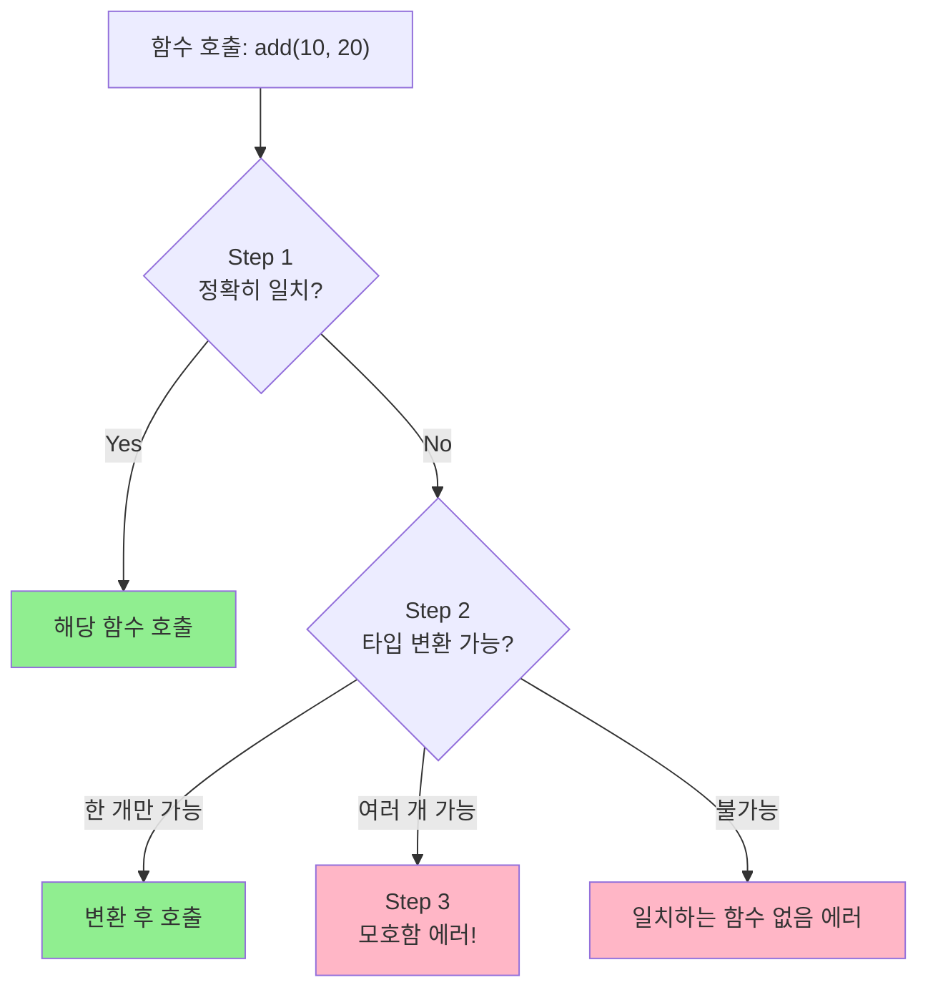
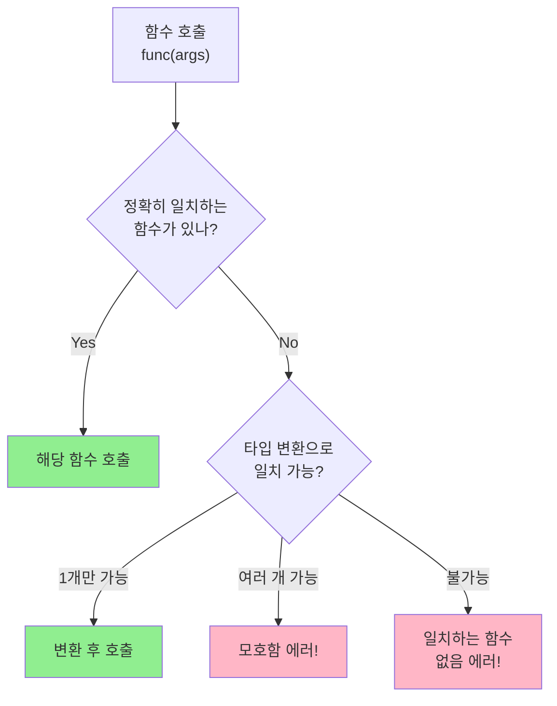

# Day 4-3교시: 함수 오버로딩과 디폴트 매개변수

## 학습 목표
- 함수 오버로딩의 개념과 규칙 이해하기
- 오버로딩 해결 과정(Overload Resolution) 알기
- 디폴트 매개변수 사용법과 규칙 익히기
- 인라인 함수의 원리와 활용법 배우기
- 오버로딩과 디폴트 매개변수의 적절한 사용 시점 판단하기

## 1. 함수 오버로딩 (Function Overloading)

### 1.1 오버로딩이란?

**함수 오버로딩**은 같은 이름의 함수를 여러 개 정의하는 것입니다. C++에서는 매개변수가 다르면 같은 이름의 함수를 여러 개 만들 수 있습니다.

```
┌─────────────────────────────────────────────────────────────────┐
│                      함수 오버로딩이란?                           │
├─────────────────────────────────────────────────────────────────┤
│                                                                 │
│  정의:                                                          │
│  ┌───────────────────────────────────────────────────────────┐ │
│  │  같은 이름의 함수를 매개변수를 달리하여 여러 개 정의하는 것    │ │
│  │                                                            │ │
│  │  print(int)     → 정수 출력                                │ │
│  │  print(double)  → 실수 출력                                │ │
│  │  print(string)  → 문자열 출력                              │ │
│  │                                                            │ │
│  │  → 모두 같은 "print"라는 이름이지만 다른 동작!              │ │
│  └───────────────────────────────────────────────────────────┘ │
│                                                                 │
│  오버로딩 조건:                                                  │
│  ┌───────────────────────────────────────────────────────────┐ │
│  │  ✅ 매개변수의 개수가 다름                                  │ │
│  │  ✅ 매개변수의 타입이 다름                                  │ │
│  │  ✅ 매개변수의 순서가 다름 (타입이 다를 경우)                │ │
│  │                                                            │ │
│  │  ❌ 반환 타입만 다른 것은 불가능                            │ │
│  │  ❌ 매개변수 이름만 다른 것은 불가능                         │ │
│  └───────────────────────────────────────────────────────────┘ │
│                                                                 │
│  왜 필요한가?                                                    │
│  ┌───────────────────────────────────────────────────────────┐ │
│  │  • 같은 개념의 작업을 일관된 이름으로 처리                   │ │
│  │  • 다양한 타입을 지원하면서도 사용법 통일                    │ │
│  │  • 코드 가독성과 사용 편의성 향상                           │ │
│  └───────────────────────────────────────────────────────────┘ │
│                                                                 │
└─────────────────────────────────────────────────────────────────┘
```

### 1.2 오버로딩이 가능한 경우 vs 불가능한 경우

```
┌─────────────────────────────────────────────────────────────────┐
│                    오버로딩 가능/불가능 판별                       │
├─────────────────────────────────────────────────────────────────┤
│                                                                 │
│  ✅ 오버로딩 가능한 경우:                                        │
│                                                                 │
│  1. 매개변수 개수가 다름                                         │
│  ┌───────────────────────────────────────────────────────────┐ │
│  │  int add(int a);                // 1개                     │ │
│  │  int add(int a, int b);         // 2개                     │ │
│  │  int add(int a, int b, int c);  // 3개                     │ │
│  └───────────────────────────────────────────────────────────┘ │
│                                                                 │
│  2. 매개변수 타입이 다름                                         │
│  ┌───────────────────────────────────────────────────────────┐ │
│  │  void print(int num);           // int                     │ │
│  │  void print(double num);        // double                  │ │
│  │  void print(string str);        // string                  │ │
│  └───────────────────────────────────────────────────────────┘ │
│                                                                 │
│  3. 매개변수 순서가 다름 (타입이 다를 경우)                       │
│  ┌───────────────────────────────────────────────────────────┐ │
│  │  void func(int a, double b);    // int, double             │ │
│  │  void func(double a, int b);    // double, int             │ │
│  └───────────────────────────────────────────────────────────┘ │
│                                                                 │
│  4. const 한정자 차이                                           │
│  ┌───────────────────────────────────────────────────────────┐ │
│  │  void process(int& ref);        // non-const 참조          │ │
│  │  void process(const int& ref);  // const 참조              │ │
│  └───────────────────────────────────────────────────────────┘ │
│                                                                 │
│  ❌ 오버로딩 불가능한 경우:                                       │
│                                                                 │
│  1. 반환 타입만 다름                                             │
│  ┌───────────────────────────────────────────────────────────┐ │
│  │  int getValue();                                           │ │
│  │  double getValue();  // ❌ 에러! 매개변수가 같음            │ │
│  └───────────────────────────────────────────────────────────┘ │
│                                                                 │
│  2. 매개변수 이름만 다름                                         │
│  ┌───────────────────────────────────────────────────────────┐ │
│  │  void func(int a);                                         │ │
│  │  void func(int x);   // ❌ 에러! 타입이 같음               │ │
│  └───────────────────────────────────────────────────────────┘ │
│                                                                 │
│  3. typedef로 만든 같은 타입                                     │
│  ┌───────────────────────────────────────────────────────────┐ │
│  │  typedef int Integer;                                      │ │
│  │  void func(int a);                                         │ │
│  │  void func(Integer a);  // ❌ 에러! 실제로 같은 타입        │ │
│  └───────────────────────────────────────────────────────────┘ │
│                                                                 │
└─────────────────────────────────────────────────────────────────┘
```

### 1.3 오버로딩 해결 과정 (Overload Resolution)

컴파일러가 어떤 오버로딩 함수를 호출할지 결정하는 과정입니다.

```
┌─────────────────────────────────────────────────────────────────┐
│                   오버로딩 해결 과정 (3단계)                       │
├─────────────────────────────────────────────────────────────────┤
│                                                                 │
│  컴파일러의 함수 선택 규칙:                                       │
│                                                                 │
│  Step 1: 정확히 일치 (Exact Match)                               │
│  ┌───────────────────────────────────────────────────────────┐ │
│  │  add(10, 20)    →  add(int, int)         ✓ 정확히 일치    │ │
│  │  add(3.14, 2.5) →  add(double, double)   ✓ 정확히 일치    │ │
│  └───────────────────────────────────────────────────────────┘ │
│                                                                 │
│  Step 2: 승격/표준 변환 (Promotion/Conversion)                   │
│  ┌───────────────────────────────────────────────────────────┐ │
│  │  승격 (Promotion) - 정보 손실 없음:                        │ │
│  │    char → int                                              │ │
│  │    short → int                                             │ │
│  │    float → double                                          │ │
│  │                                                            │ │
│  │  표준 변환 (Standard Conversion) - 정보 손실 가능:          │ │
│  │    int → double                                            │ │
│  │    double → int (주의: 소수점 손실)                        │ │
│  │    int → long                                              │ │
│  └───────────────────────────────────────────────────────────┘ │
│                                                                 │
│  Step 3: 모호함 에러 (Ambiguity Error)                          │
│  ┌───────────────────────────────────────────────────────────┐ │
│  │  void func(int a, double b);                               │ │
│  │  void func(double a, int b);                               │ │
│  │                                                            │ │
│  │  func(10, 20);  // ❌ 에러! 어느 함수를 호출해야 할지 모호  │ │
│  │                 // 두 경우 모두 변환이 필요하므로           │ │
│  └───────────────────────────────────────────────────────────┘ │
│                                                                 │
└─────────────────────────────────────────────────────────────────┘
```



### 1.4 기본 예제: 덧셈 함수 오버로딩

```cpp
#include <iostream>
using namespace std;

// ════════════════════════════════════════════════════════════
// 덧셈 함수 오버로딩 - 다양한 타입과 개수 지원
// ════════════════════════════════════════════════════════════

// 정수 2개 덧셈
int add(int a, int b) {
    cout << "[int, int] 호출 → ";
    return a + b;
}

// 실수 2개 덧셈
double add(double a, double b) {
    cout << "[double, double] 호출 → ";
    return a + b;
}

// 정수 3개 덧셈
int add(int a, int b, int c) {
    cout << "[int, int, int] 호출 → ";
    return a + b + c;
}

// 실수 3개 덧셈
double add(double a, double b, double c) {
    cout << "[double, double, double] 호출 → ";
    return a + b + c;
}

int main() {
    cout << "=== 덧셈 함수 오버로딩 테스트 ===" << endl;

    // 정확히 일치하는 경우
    cout << add(10, 20) << endl;           // int 버전
    cout << add(3.14, 2.86) << endl;       // double 버전
    cout << add(1, 2, 3) << endl;          // int 3개 버전
    cout << add(1.1, 2.2, 3.3) << endl;    // double 3개 버전

    // 타입 변환이 필요한 경우
    cout << "\n--- 타입 변환 ---" << endl;
    cout << add(10.0, 20.0) << endl;       // int → double 변환

    return 0;
}
```

### 1.5 실전 예제: print 함수 오버로딩

```cpp
#include <iostream>
#include <string>
using namespace std;

// ════════════════════════════════════════════════════════════
// print 함수 오버로딩 - 다양한 타입 출력
// ════════════════════════════════════════════════════════════

void print(int num) {
    cout << "정수: " << num << endl;
}

void print(double num) {
    cout << "실수: " << num << endl;
}

void print(char ch) {
    cout << "문자: '" << ch << "'" << endl;
}

void print(const string& str) {
    cout << "문자열: \"" << str << "\"" << endl;
}

void print(bool flag) {
    cout << "불리언: " << (flag ? "true" : "false") << endl;
}

// 배열 출력 - 정수 배열
void print(int arr[], int size) {
    cout << "정수 배열: [";
    for (int i = 0; i < size; i++) {
        cout << arr[i];
        if (i < size - 1) cout << ", ";
    }
    cout << "]" << endl;
}

// 배열 출력 - 실수 배열
void print(double arr[], int size) {
    cout << "실수 배열: [";
    for (int i = 0; i < size; i++) {
        cout << arr[i];
        if (i < size - 1) cout << ", ";
    }
    cout << "]" << endl;
}

int main() {
    cout << "=== print 함수 오버로딩 테스트 ===" << endl;

    print(42);
    print(3.14159);
    print('A');
    print("Hello, World!");
    print(true);

    int intArr[] = {1, 2, 3, 4, 5};
    double doubleArr[] = {1.1, 2.2, 3.3};

    print(intArr, 5);
    print(doubleArr, 3);

    return 0;
}
```

### 1.6 오버로딩 예제: 수학 유틸리티

```cpp
#include <iostream>
#include <cmath>
using namespace std;

// ════════════════════════════════════════════════════════════
// 수학 유틸리티 함수 오버로딩
// ════════════════════════════════════════════════════════════

// 절댓값
int absolute(int num) {
    return (num < 0) ? -num : num;
}

double absolute(double num) {
    return (num < 0) ? -num : num;
}

// 최댓값 - 2개
int maximum(int a, int b) {
    return (a > b) ? a : b;
}

double maximum(double a, double b) {
    return (a > b) ? a : b;
}

// 최댓값 - 3개
int maximum(int a, int b, int c) {
    return maximum(maximum(a, b), c);
}

double maximum(double a, double b, double c) {
    return maximum(maximum(a, b), c);
}

// 최솟값 - 2개
int minimum(int a, int b) {
    return (a < b) ? a : b;
}

double minimum(double a, double b) {
    return (a < b) ? a : b;
}

// 최솟값 - 3개
int minimum(int a, int b, int c) {
    return minimum(minimum(a, b), c);
}

// 거듭제곱
int power(int base, int exp) {
    int result = 1;
    for (int i = 0; i < exp; i++) {
        result *= base;
    }
    return result;
}

double power(double base, int exp) {
    double result = 1.0;
    for (int i = 0; i < exp; i++) {
        result *= base;
    }
    return result;
}

double power(double base, double exp) {
    return pow(base, exp);  // cmath의 pow 사용
}

int main() {
    cout << "=== 수학 유틸리티 오버로딩 ===" << endl;

    // 절댓값
    cout << "absolute(-5) = " << absolute(-5) << endl;
    cout << "absolute(-3.14) = " << absolute(-3.14) << endl;

    // 최댓값
    cout << "maximum(10, 20) = " << maximum(10, 20) << endl;
    cout << "maximum(1.5, 2.5) = " << maximum(1.5, 2.5) << endl;
    cout << "maximum(5, 8, 3) = " << maximum(5, 8, 3) << endl;

    // 최솟값
    cout << "minimum(10, 20) = " << minimum(10, 20) << endl;
    cout << "minimum(5, 8, 3) = " << minimum(5, 8, 3) << endl;

    // 거듭제곱
    cout << "power(2, 10) = " << power(2, 10) << endl;
    cout << "power(2.5, 3) = " << power(2.5, 3) << endl;
    cout << "power(2.0, 0.5) = " << power(2.0, 0.5) << endl;  // √2

    return 0;
}
```

### 1.7 오버로딩 주의사항

```cpp
#include <iostream>
using namespace std;

// ════════════════════════════════════════════════════════════
// 오버로딩 시 주의사항 예제
// ════════════════════════════════════════════════════════════

// ⚠️ 주의 1: 모호한 호출

void process(int a, double b) {
    cout << "process(int, double): " << a << ", " << b << endl;
}

void process(double a, int b) {
    cout << "process(double, int): " << a << ", " << b << endl;
}

// ⚠️ 주의 2: 디폴트 매개변수와의 충돌

void display(int a) {
    cout << "display(int): " << a << endl;
}

// 이것은 display(int)와 충돌할 수 있음!
// void display(int a, int b = 0) { ... }  // display(5)가 모호해짐

// ⚠️ 주의 3: 참조와 값 전달

void show(int x) {
    cout << "show(int): " << x << endl;
}

// 이것은 show(int)와 구별할 수 없음!
// void show(int& x) { ... }  // 컴파일러가 구별 못함

// ✅ 이것은 가능 - const 참조와 non-const 참조
void modify(int& x) {
    x = 100;
    cout << "modify(int&): " << x << endl;
}

void modify(const int& x) {
    // x = 100;  // 에러! const
    cout << "modify(const int&): " << x << endl;
}

int main() {
    // 정상 호출
    process(10, 20.5);   // process(int, double)
    process(10.5, 20);   // process(double, int)

    // 모호한 호출 - 컴파일 에러!
    // process(10, 20);  // 어느 버전? 두 경우 모두 변환 필요

    // 해결 방법: 명시적 형변환
    process(10, static_cast<double>(20));  // 첫 번째 버전 강제

    // const와 non-const 구별
    int value = 5;
    const int constValue = 10;

    modify(value);       // non-const 버전 호출
    modify(constValue);  // const 버전 호출
    modify(15);          // const 버전 호출 (리터럴은 const)

    return 0;
}
```

## 2. 디폴트 매개변수 (Default Parameters)

### 2.1 디폴트 매개변수란?

```
┌─────────────────────────────────────────────────────────────────┐
│                    디폴트 매개변수란?                             │
├─────────────────────────────────────────────────────────────────┤
│                                                                 │
│  정의:                                                          │
│  ┌───────────────────────────────────────────────────────────┐ │
│  │  함수 호출 시 인자를 생략하면 사용되는 기본값                  │ │
│  │                                                            │ │
│  │  void greet(string name = "Guest") {                       │ │
│  │      cout << "Hello, " << name << "!" << endl;             │ │
│  │  }                                                         │ │
│  │                                                            │ │
│  │  greet();         // "Hello, Guest!"                       │ │
│  │  greet("Kim");    // "Hello, Kim!"                         │ │
│  └───────────────────────────────────────────────────────────┘ │
│                                                                 │
│  규칙:                                                          │
│  ┌───────────────────────────────────────────────────────────┐ │
│  │  1. 오른쪽에서 왼쪽 순서로 지정해야 함                       │ │
│  │     ✅ void func(int a, int b = 10, int c = 20);           │ │
│  │     ❌ void func(int a = 10, int b, int c = 20);           │ │
│  │                                                            │ │
│  │  2. 선언에서만 지정하거나 정의에서만 지정 (중복 금지)        │ │
│  │     // 선언                                                 │ │
│  │     void func(int a, int b = 10);                          │ │
│  │     // 정의                                                 │ │
│  │     void func(int a, int b) { ... }  // 여기서 다시 쓰면 X  │ │
│  │                                                            │ │
│  │  3. 선언이 여러 곳에 있으면 가장 먼저 보이는 곳에서 지정      │ │
│  └───────────────────────────────────────────────────────────┘ │
│                                                                 │
│  장점:                                                          │
│  ┌───────────────────────────────────────────────────────────┐ │
│  │  • 함수 호출 간소화                                         │ │
│  │  • 하위 호환성 유지 (새 매개변수 추가 시)                    │ │
│  │  • 공통적인 기본 동작 제공                                  │ │
│  └───────────────────────────────────────────────────────────┘ │
│                                                                 │
└─────────────────────────────────────────────────────────────────┘
```

### 2.2 디폴트 매개변수 규칙

```
┌─────────────────────────────────────────────────────────────────┐
│                    디폴트 매개변수 배치 규칙                       │
├─────────────────────────────────────────────────────────────────┤
│                                                                 │
│  ✅ 올바른 예시 (오른쪽부터 순서대로):                            │
│                                                                 │
│  void func(int a, int b, int c = 30);                          │
│  //                              ↑ 마지막만                     │
│                                                                 │
│  void func(int a, int b = 20, int c = 30);                     │
│  //                 ↑          ↑ 뒤의 두 개                     │
│                                                                 │
│  void func(int a = 10, int b = 20, int c = 30);                │
│  //        ↑          ↑          ↑ 모두                        │
│                                                                 │
│  ❌ 잘못된 예시 (중간이 비어있음):                                │
│                                                                 │
│  void func(int a, int b = 20, int c);                          │
│  //                 ↑          ↑ c에 디폴트 없으면 b도 안됨!   │
│                                                                 │
│  void func(int a = 10, int b, int c = 30);                     │
│  //        ↑          ↑ 중간에 디폴트 없음 - 에러!              │
│                                                                 │
│  이유:                                                          │
│  ┌───────────────────────────────────────────────────────────┐ │
│  │  func(5, 10)을 호출할 때:                                  │ │
│  │  - a = 5, b = 10, c = ? (디폴트가 없으면 에러)             │ │
│  │  - 인자는 왼쪽부터 순서대로 채워지므로                       │ │
│  │  - 오른쪽 매개변수부터 생략 가능하게 해야 함                 │ │
│  └───────────────────────────────────────────────────────────┘ │
│                                                                 │
└─────────────────────────────────────────────────────────────────┘
```

### 2.3 기본 예제

```cpp
#include <iostream>
#include <string>
using namespace std;

// ════════════════════════════════════════════════════════════
// 디폴트 매개변수 기본 예제
// ════════════════════════════════════════════════════════════

// 메시지 출력 - count 기본값 1
void printMessage(string msg, int count = 1) {
    for (int i = 0; i < count; i++) {
        cout << msg << endl;
    }
}

// 구분선 그리기
void drawLine(char symbol = '-', int length = 40) {
    for (int i = 0; i < length; i++) {
        cout << symbol;
    }
    cout << endl;
}

// 사람 정보 출력
void printPerson(string name, int age = 0, string city = "Unknown") {
    cout << "이름: " << name;
    if (age > 0) {
        cout << ", 나이: " << age;
    }
    if (city != "Unknown") {
        cout << ", 도시: " << city;
    }
    cout << endl;
}

int main() {
    cout << "=== 디폴트 매개변수 테스트 ===" << endl;

    // printMessage 테스트
    drawLine('=', 35);
    printMessage("Hello!");           // count = 1 (디폴트)
    printMessage("반복!", 3);          // count = 3

    // drawLine 테스트
    drawLine();                        // '-', 40 (모두 디폴트)
    drawLine('*');                     // '*', 40 (length 디폴트)
    drawLine('#', 20);                 // '#', 20

    // printPerson 테스트
    drawLine('=', 35);
    printPerson("홍길동");                      // age, city 디폴트
    printPerson("김철수", 25);                   // city 디폴트
    printPerson("이영희", 30, "서울");           // 모두 지정

    return 0;
}
```

### 2.4 실전 예제: 로그 출력 함수

```cpp
#include <iostream>
#include <string>
#include <ctime>
using namespace std;

// ════════════════════════════════════════════════════════════
// 로그 출력 함수 - 디폴트 매개변수 활용
// ════════════════════════════════════════════════════════════

// 로그 레벨 열거형
enum LogLevel { DEBUG, INFO, WARNING, ERROR };

// 현재 시간 문자열 반환
string getCurrentTime() {
    time_t now = time(0);
    char buffer[20];
    strftime(buffer, 20, "%Y-%m-%d %H:%M:%S", localtime(&now));
    return string(buffer);
}

// 로그 출력 함수
void log(const string& message,
         LogLevel level = INFO,
         bool showTime = true,
         const string& prefix = "") {

    // 시간 출력
    if (showTime) {
        cout << "[" << getCurrentTime() << "] ";
    }

    // 로그 레벨
    switch (level) {
        case DEBUG:   cout << "[DEBUG] ";   break;
        case INFO:    cout << "[INFO] ";    break;
        case WARNING: cout << "[WARN] ";    break;
        case ERROR:   cout << "[ERROR] ";   break;
    }

    // 접두사
    if (!prefix.empty()) {
        cout << prefix << ": ";
    }

    // 메시지
    cout << message << endl;
}

int main() {
    cout << "=== 로그 함수 테스트 ===" << endl << endl;

    // 기본 사용 (모두 디폴트)
    log("프로그램 시작");

    // 로그 레벨 지정
    log("디버그 메시지", DEBUG);
    log("경고 메시지", WARNING);
    log("에러 발생!", ERROR);

    // 시간 없이 출력
    log("시간 없는 메시지", INFO, false);

    // 모든 옵션 사용
    log("데이터베이스 연결 성공", INFO, true, "DB");
    log("파일을 찾을 수 없음", ERROR, true, "FileSystem");

    return 0;
}
```

### 2.5 디폴트 매개변수와 함수 선언/정의 분리

```cpp
#include <iostream>
#include <string>
using namespace std;

// ════════════════════════════════════════════════════════════
// 헤더 파일 스타일 - 선언에서만 디폴트 값 지정
// ════════════════════════════════════════════════════════════

// 함수 선언 (헤더 파일에 해당)
void greet(string name, string greeting = "Hello");
void printBox(string text, char border = '*', int padding = 1);
int calculate(int a, int b = 0, char op = '+');

// ════════════════════════════════════════════════════════════
// 함수 정의 (소스 파일에 해당) - 디폴트 값 없이!
// ════════════════════════════════════════════════════════════

void greet(string name, string greeting) {  // 디폴트 값 없음!
    cout << greeting << ", " << name << "!" << endl;
}

void printBox(string text, char border, int padding) {
    int width = text.length() + padding * 2 + 2;

    // 상단 테두리
    for (int i = 0; i < width; i++) cout << border;
    cout << endl;

    // 내용
    cout << border;
    for (int i = 0; i < padding; i++) cout << ' ';
    cout << text;
    for (int i = 0; i < padding; i++) cout << ' ';
    cout << border << endl;

    // 하단 테두리
    for (int i = 0; i < width; i++) cout << border;
    cout << endl;
}

int calculate(int a, int b, char op) {
    switch (op) {
        case '+': return a + b;
        case '-': return a - b;
        case '*': return a * b;
        case '/': return (b != 0) ? a / b : 0;
        default: return 0;
    }
}

int main() {
    // greet 테스트
    greet("Kim");                    // "Hello, Kim!"
    greet("Park", "안녕하세요");      // "안녕하세요, Park!"

    cout << endl;

    // printBox 테스트
    printBox("Hello");               // 기본: '*', 패딩 1
    cout << endl;
    printBox("World", '#');          // 테두리 '#', 패딩 1
    cout << endl;
    printBox("C++", '@', 3);         // 테두리 '@', 패딩 3

    cout << endl;

    // calculate 테스트
    cout << "calculate(10) = " << calculate(10) << endl;           // 10 + 0
    cout << "calculate(10, 5) = " << calculate(10, 5) << endl;     // 10 + 5
    cout << "calculate(10, 5, '*') = " << calculate(10, 5, '*') << endl;  // 10 * 5

    return 0;
}
```

## 3. 인라인 함수 (Inline Functions)

### 3.1 인라인 함수란?

```
┌─────────────────────────────────────────────────────────────────┐
│                      인라인 함수란?                               │
├─────────────────────────────────────────────────────────────────┤
│                                                                 │
│  일반 함수 호출 과정:                                            │
│  ┌───────────────────────────────────────────────────────────┐ │
│  │                                                            │ │
│  │  main()                          square()                  │ │
│  │  ┌──────────────┐               ┌──────────────┐          │ │
│  │  │              │  1. 함수 호출  │              │          │ │
│  │  │ x = square(5)│ ────────────▶ │ return x*x   │          │ │
│  │  │              │  4. 결과 반환  │              │          │ │
│  │  │              │ ◀──────────── │              │          │ │
│  │  └──────────────┘               └──────────────┘          │ │
│  │                                                            │ │
│  │  오버헤드: 스택 프레임 생성, 매개변수 복사, 점프, 반환       │ │
│  └───────────────────────────────────────────────────────────┘ │
│                                                                 │
│  인라인 함수 동작:                                               │
│  ┌───────────────────────────────────────────────────────────┐ │
│  │                                                            │ │
│  │  main()                                                    │ │
│  │  ┌──────────────────────────────────────────────┐         │ │
│  │  │                                              │         │ │
│  │  │ x = 5 * 5;  ← 함수 코드가 직접 삽입됨!       │         │ │
│  │  │              (호출 오버헤드 없음)             │         │ │
│  │  │                                              │         │ │
│  │  └──────────────────────────────────────────────┘         │ │
│  │                                                            │ │
│  │  장점: 함수 호출 오버헤드 제거 → 실행 속도 향상             │ │
│  │  단점: 코드 크기 증가 (함수 코드가 호출 위치마다 복사)       │ │
│  └───────────────────────────────────────────────────────────┘ │
│                                                                 │
└─────────────────────────────────────────────────────────────────┘
```

### 3.2 인라인 함수 문법

```cpp
#include <iostream>
using namespace std;

// ════════════════════════════════════════════════════════════
// 인라인 함수 기본 예제
// ════════════════════════════════════════════════════════════

// inline 키워드 사용
inline int square(int x) {
    return x * x;
}

inline int max(int a, int b) {
    return (a > b) ? a : b;
}

inline int min(int a, int b) {
    return (a < b) ? a : b;
}

inline int abs(int x) {
    return (x < 0) ? -x : x;
}

inline bool isEven(int n) {
    return n % 2 == 0;
}

inline bool isPositive(int n) {
    return n > 0;
}

int main() {
    cout << "=== 인라인 함수 테스트 ===" << endl;

    int a = 5, b = 3;

    cout << "square(5) = " << square(a) << endl;
    cout << "max(5, 3) = " << max(a, b) << endl;
    cout << "min(5, 3) = " << min(a, b) << endl;
    cout << "abs(-7) = " << abs(-7) << endl;
    cout << "isEven(4) = " << (isEven(4) ? "true" : "false") << endl;
    cout << "isPositive(-5) = " << (isPositive(-5) ? "true" : "false") << endl;

    return 0;
}
```

### 3.3 인라인 함수 사용 지침

```
┌─────────────────────────────────────────────────────────────────┐
│                    인라인 함수 사용 지침                          │
├─────────────────────────────────────────────────────────────────┤
│                                                                 │
│  ✅ 인라인 함수에 적합한 경우:                                    │
│  ┌───────────────────────────────────────────────────────────┐ │
│  │  • 매우 작은 함수 (1-3줄)                                   │ │
│  │  • 자주 호출되는 함수                                       │ │
│  │  • 단순한 연산 (getter/setter)                              │ │
│  │  • 성능이 중요한 부분                                       │ │
│  │                                                            │ │
│  │  예시:                                                      │ │
│  │  inline int getX() { return x; }                           │ │
│  │  inline void setX(int val) { x = val; }                    │ │
│  │  inline int square(int n) { return n * n; }                │ │
│  └───────────────────────────────────────────────────────────┘ │
│                                                                 │
│  ❌ 인라인 함수에 부적합한 경우:                                  │
│  ┌───────────────────────────────────────────────────────────┐ │
│  │  • 큰 함수 (10줄 이상)                                      │ │
│  │  • 재귀 함수                                                │ │
│  │  • 루프가 있는 함수                                         │ │
│  │  • static 지역 변수가 있는 함수                             │ │
│  │  • 가상 함수                                                │ │
│  │                                                            │ │
│  │  → 이런 경우 컴파일러가 inline 요청을 무시할 수 있음         │ │
│  └───────────────────────────────────────────────────────────┘ │
│                                                                 │
│  참고:                                                          │
│  ┌───────────────────────────────────────────────────────────┐ │
│  │  • inline은 "힌트"일 뿐, 컴파일러가 최종 결정               │ │
│  │  • 최신 컴파일러는 자동으로 최적화하기도 함                  │ │
│  │  • 클래스 내부에서 정의된 멤버 함수는 암시적 inline          │ │
│  └───────────────────────────────────────────────────────────┘ │
│                                                                 │
└─────────────────────────────────────────────────────────────────┘
```

### 3.4 인라인 함수 vs 매크로

```cpp
#include <iostream>
using namespace std;

// ════════════════════════════════════════════════════════════
// 매크로 vs 인라인 함수 비교
// ════════════════════════════════════════════════════════════

// ❌ 매크로 (C 스타일) - 문제점 있음
#define SQUARE_MACRO(x) ((x) * (x))
#define MAX_MACRO(a, b) ((a) > (b) ? (a) : (b))

// ✅ 인라인 함수 (C++ 스타일) - 권장
inline int squareInline(int x) {
    return x * x;
}

inline int maxInline(int a, int b) {
    return (a > b) ? a : b;
}

int main() {
    int a = 5;

    cout << "=== 매크로 vs 인라인 함수 ===" << endl;

    // 정상 동작 케이스
    cout << "SQUARE_MACRO(5) = " << SQUARE_MACRO(5) << endl;
    cout << "squareInline(5) = " << squareInline(5) << endl;

    cout << endl;

    // 문제 케이스: 부작용 (side effect)
    int x = 5, y = 5;

    cout << "매크로 사용 전: x = " << x << endl;
    cout << "SQUARE_MACRO(x++) = " << SQUARE_MACRO(x++) << endl;
    // 확장: ((x++) * (x++)) → x가 두 번 증가!
    cout << "매크로 사용 후: x = " << x << endl;

    cout << endl;

    cout << "인라인 사용 전: y = " << y << endl;
    cout << "squareInline(y++) = " << squareInline(y++) << endl;
    // 함수이므로 y++은 한 번만 평가됨
    cout << "인라인 사용 후: y = " << y << endl;

    return 0;
}

/*
출력:
=== 매크로 vs 인라인 함수 ===
SQUARE_MACRO(5) = 25
squareInline(5) = 25

매크로 사용 전: x = 5
SQUARE_MACRO(x++) = 30  ← 잘못된 결과! (5*6 또는 6*5)
매크로 사용 후: x = 7   ← 두 번 증가됨!

인라인 사용 전: y = 5
squareInline(y++) = 25  ← 올바른 결과!
인라인 사용 후: y = 6   ← 한 번만 증가됨
*/
```

## 4. 오버로딩과 디폴트 매개변수 함께 사용

### 4.1 조합 시 주의사항

```
┌─────────────────────────────────────────────────────────────────┐
│               오버로딩 + 디폴트 매개변수 주의사항                   │
├─────────────────────────────────────────────────────────────────┤
│                                                                 │
│  ⚠️ 모호함 발생 가능!                                            │
│                                                                 │
│  문제 상황:                                                      │
│  ┌───────────────────────────────────────────────────────────┐ │
│  │  void func(int a) { ... }                                  │ │
│  │  void func(int a, int b = 10) { ... }                      │ │
│  │                                                            │ │
│  │  func(5);  // ❌ 에러! 어느 함수?                           │ │
│  │            // func(int) 인가?                              │ │
│  │            // func(int, int=10) 인가?                      │ │
│  └───────────────────────────────────────────────────────────┘ │
│                                                                 │
│  해결 방법:                                                      │
│  ┌───────────────────────────────────────────────────────────┐ │
│  │  1. 오버로딩만 사용                                         │ │
│  │     void func(int a) { ... }                               │ │
│  │     void func(int a, int b) { ... }                        │ │
│  │                                                            │ │
│  │  2. 디폴트 매개변수만 사용                                   │ │
│  │     void func(int a, int b = 10) { ... }                   │ │
│  │                                                            │ │
│  │  3. 타입이 다른 경우는 오버로딩                              │ │
│  │     void func(int a) { ... }                               │ │
│  │     void func(double a, double b = 1.0) { ... }            │ │
│  └───────────────────────────────────────────────────────────┘ │
│                                                                 │
└─────────────────────────────────────────────────────────────────┘
```

### 4.2 올바른 조합 예제

```cpp
#include <iostream>
#include <string>
using namespace std;

// ════════════════════════════════════════════════════════════
// 오버로딩 + 디폴트 매개변수 올바른 사용
// ════════════════════════════════════════════════════════════

// 타입이 다른 경우 - 오버로딩 사용
void display(int num) {
    cout << "정수: " << num << endl;
}

void display(double num, int precision = 2) {
    cout << fixed;
    cout.precision(precision);
    cout << "실수: " << num << endl;
    cout.unsetf(ios::fixed);
}

void display(const string& str, bool uppercase = false) {
    if (uppercase) {
        string upper = str;
        for (char& c : upper) {
            c = toupper(c);
        }
        cout << "문자열: " << upper << endl;
    } else {
        cout << "문자열: " << str << endl;
    }
}

// 배열 출력 - 오버로딩 + 디폴트 매개변수
void printArray(int arr[], int size, const string& sep = ", ") {
    cout << "[";
    for (int i = 0; i < size; i++) {
        cout << arr[i];
        if (i < size - 1) cout << sep;
    }
    cout << "]" << endl;
}

void printArray(double arr[], int size, const string& sep = ", ", int precision = 2) {
    cout << fixed;
    cout.precision(precision);
    cout << "[";
    for (int i = 0; i < size; i++) {
        cout << arr[i];
        if (i < size - 1) cout << sep;
    }
    cout << "]" << endl;
    cout.unsetf(ios::fixed);
}

int main() {
    cout << "=== display 함수 테스트 ===" << endl;

    display(42);                     // 정수 버전
    display(3.14159);                // 실수 버전, precision 2
    display(3.14159, 4);             // 실수 버전, precision 4
    display("Hello");                // 문자열 버전, lowercase
    display("Hello", true);          // 문자열 버전, uppercase

    cout << "\n=== printArray 함수 테스트 ===" << endl;

    int intArr[] = {1, 2, 3, 4, 5};
    double doubleArr[] = {1.111, 2.222, 3.333};

    printArray(intArr, 5);                      // 기본 구분자
    printArray(intArr, 5, " | ");               // 커스텀 구분자
    printArray(doubleArr, 3);                   // 기본 설정
    printArray(doubleArr, 3, " - ", 3);         // 커스텀 설정

    return 0;
}
```

## 5. 종합 실습 예제

### 5.1 다기능 계산기

```cpp
#include <iostream>
#include <cmath>
using namespace std;

// ════════════════════════════════════════════════════════════
// 다기능 계산기 - 오버로딩, 디폴트, 인라인 활용
// ════════════════════════════════════════════════════════════

// 인라인 유틸리티 함수들
inline double square(double x) { return x * x; }
inline double cube(double x) { return x * x * x; }
inline bool isZero(double x) { return abs(x) < 1e-9; }

// 덧셈 오버로딩
double add(double a, double b) { return a + b; }
double add(double a, double b, double c) { return a + b + c; }

// 뺄셈 (디폴트로 b=0 이면 부호 반전)
double subtract(double a, double b = 0) {
    return a - b;
}

// 곱셈 오버로딩
double multiply(double a, double b) { return a * b; }
double multiply(double a, double b, double c) { return a * b * c; }

// 나눗셈 (기본 정밀도 2)
double divide(double a, double b, bool showError = true) {
    if (isZero(b)) {
        if (showError) cout << "Error: Division by zero!" << endl;
        return 0;
    }
    return a / b;
}

// 거듭제곱 오버로딩
double power(double base, int exp = 2) {
    double result = 1;
    bool negative = exp < 0;
    exp = abs(exp);

    for (int i = 0; i < exp; i++) {
        result *= base;
    }

    return negative ? 1 / result : result;
}

double power(double base, double exp) {
    return pow(base, exp);
}

// 평균 계산 (다양한 개수)
double average(double a, double b) {
    return (a + b) / 2;
}

double average(double a, double b, double c) {
    return (a + b + c) / 3;
}

double average(double arr[], int size) {
    double sum = 0;
    for (int i = 0; i < size; i++) {
        sum += arr[i];
    }
    return sum / size;
}

int main() {
    cout << "=== 다기능 계산기 ===" << endl;

    cout << "\n--- 덧셈 ---" << endl;
    cout << "add(10, 20) = " << add(10, 20) << endl;
    cout << "add(10, 20, 30) = " << add(10, 20, 30) << endl;

    cout << "\n--- 뺄셈 ---" << endl;
    cout << "subtract(10, 3) = " << subtract(10, 3) << endl;
    cout << "subtract(10) = " << subtract(10) << endl;  // 부호 유지

    cout << "\n--- 곱셈 ---" << endl;
    cout << "multiply(4, 5) = " << multiply(4, 5) << endl;
    cout << "multiply(2, 3, 4) = " << multiply(2, 3, 4) << endl;

    cout << "\n--- 나눗셈 ---" << endl;
    cout << "divide(10, 3) = " << divide(10, 3) << endl;
    cout << "divide(10, 0) = " << divide(10, 0) << endl;

    cout << "\n--- 거듭제곱 ---" << endl;
    cout << "power(2) = " << power(2) << endl;        // 2^2 = 4
    cout << "power(2, 10) = " << power(2, 10) << endl;  // 2^10
    cout << "power(2, -3) = " << power(2, -3) << endl;  // 2^-3
    cout << "power(2.0, 0.5) = " << power(2.0, 0.5) << endl;  // √2

    cout << "\n--- 평균 ---" << endl;
    cout << "average(10, 20) = " << average(10, 20) << endl;
    cout << "average(10, 20, 30) = " << average(10, 20, 30) << endl;

    double values[] = {10, 20, 30, 40, 50};
    cout << "average(배열) = " << average(values, 5) << endl;

    return 0;
}
```

## 6. 실습 과제

### 과제 1: power 함수 오버로딩
다음 요구사항을 만족하는 `power` 함수를 작성하세요:
- `power(int base)`: base의 제곱
- `power(int base, int exp)`: base의 exp승
- `power(double base, double exp)`: 실수 거듭제곱

### 과제 2: drawShape 함수
도형을 그리는 함수를 작성하세요:
```cpp
void drawShape(char symbol = '*', int size = 5, string shape = "square");
// shape: "line", "square", "triangle"
```

### 과제 3: 인라인 수학 함수
다음 인라인 함수들을 작성하세요:
```cpp
inline int min(int a, int b);
inline int max(int a, int b);
inline int abs(int num);
inline bool isOdd(int num);
inline bool isInRange(int num, int min, int max);
```

### 과제 4: 배열 유틸리티 오버로딩
배열을 다루는 함수들을 오버로딩하세요:
```cpp
void print(int arr[], int size);
void print(double arr[], int size);
void print(string arr[], int size);

int sum(int arr[], int size);
double sum(double arr[], int size);
```

## 핵심 정리

### 오버로딩 vs 디폴트 매개변수 비교표

| 항목 | 함수 오버로딩 | 디폴트 매개변수 |
|------|-------------|---------------|
| 목적 | 다양한 타입/개수 처리 | 선택적 매개변수 제공 |
| 함수 개수 | 여러 개 | 1개 |
| 사용 시기 | 타입이 다를 때 | 같은 타입, 기본값 필요 |
| 예시 | `print(int)`, `print(string)` | `print(int a, int b=10)` |
| 장점 | 타입별 최적화 가능 | 간단, 호출 편리 |
| 단점 | 함수 많아짐 | 타입 변경 불가 |

### 오버로딩 가능/불가능 요약

```
✅ 가능:
  - 매개변수 개수 다름
  - 매개변수 타입 다름
  - 매개변수 순서 다름 (타입이 다를 때)
  - const 한정자 차이

❌ 불가능:
  - 반환 타입만 다름
  - 매개변수 이름만 다름
  - typedef 별칭만 다름
```

### 디폴트 매개변수 규칙

```
✅ 올바른 순서:
  void func(int a, int b = 10, int c = 20);
  //              오른쪽부터 순서대로

❌ 잘못된 순서:
  void func(int a = 10, int b, int c = 20);
  //              중간이 비어있음
```

### 인라인 함수 요약

```
✅ 적합: 작은 함수, 자주 호출, 단순 연산
❌ 부적합: 큰 함수, 재귀, 루프, 가상 함수
```

### Mermaid 다이어그램: 오버로딩 해결 과정



### 다음 시간 예고
- 재귀 함수 (Recursion) 기초
- 팩토리얼, 피보나치 수열
- 재귀 vs 반복
- 재귀의 장단점
