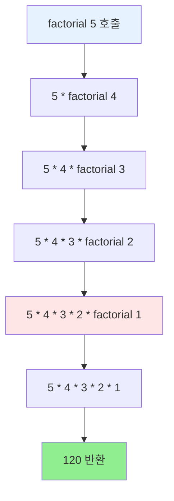
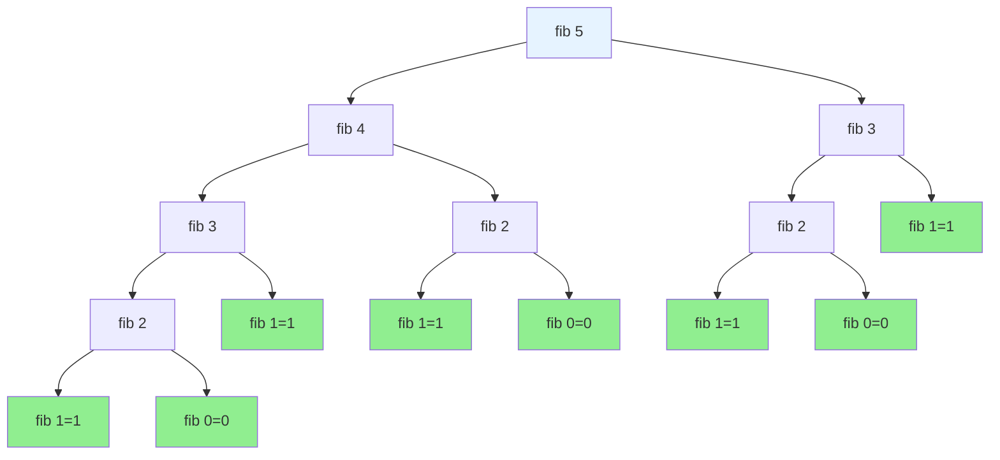
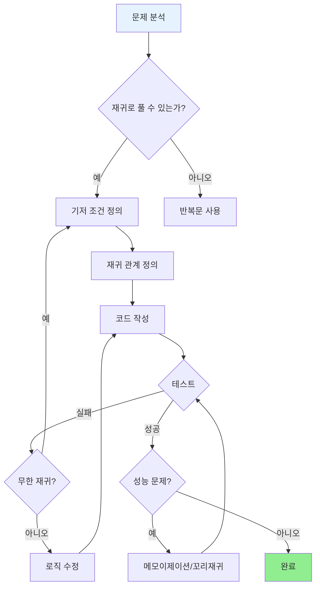

# Day 4-4교시: 재귀 함수

## 학습 목표
- 재귀 함수의 개념 이해하기
- 재귀 함수로 문제 해결하기
- 재귀와 반복의 차이 알기
- 꼬리 재귀와 최적화 이해하기
- 메모이제이션 기법 배우기

## 1. 재귀 함수란?

### 1.1 기본 개념

```
┌─────────────────────────────────────────────────────────────────┐
│                        재귀 (Recursion)                          │
├─────────────────────────────────────────────────────────────────┤
│                                                                  │
│   "자기 자신을 호출하는 함수"                                      │
│                                                                  │
│   ┌──────────┐     호출      ┌──────────┐                       │
│   │ function │ ──────────▶  │ function │ (더 작은 문제)          │
│   │   (n)    │              │  (n-1)   │                        │
│   └──────────┘  ◀──────────  └──────────┘                       │
│                    반환                                          │
│                                                                  │
│   핵심 구성요소:                                                  │
│   1. 기저 조건 (Base Case) - 재귀 종료 조건                       │
│   2. 재귀 호출 (Recursive Call) - 자기 자신 호출                  │
│   3. 문제 축소 - 매번 더 작은 문제로 진행                          │
│                                                                  │
└─────────────────────────────────────────────────────────────────┘
```

### 1.2 재귀의 핵심 원리

**수학적 귀납법과의 유사성:**
```
수학적 귀납법                     재귀 함수
─────────────                    ─────────
1. 기본 단계 (n=1 증명)     →    1. 기저 조건 (종료 조건)
2. 귀납 단계 (n→n+1 증명)   →    2. 재귀 단계 (n→n-1 호출)
```

**재귀의 3가지 법칙:**
| 법칙 | 설명 | 위반 시 결과 |
|------|------|-------------|
| 기저 조건 필수 | 재귀를 멈출 조건 필요 | 무한 재귀 |
| 상태 변화 필수 | 기저 조건에 가까워지는 변화 | 무한 재귀 |
| 자기 호출 필수 | 같은 함수를 호출 | 재귀 아님 |

### 1.3 간단한 예제: 카운트다운

```cpp
#include <iostream>
using namespace std;

void countdown(int n) {
    // 1. 기저 조건 (Base Case)
    if (n <= 0) {
        cout << "발사!" << endl;
        return;  // 재귀 종료
    }

    // 2. 현재 작업
    cout << n << " ";

    // 3. 재귀 호출 (Recursive Call)
    countdown(n - 1);  // 문제 크기 감소
}

int main() {
    countdown(5);
    return 0;
}
```

**출력:**
```
5 4 3 2 1 발사!
```

### 1.4 재귀 실행 흐름 시각화

```
countdown(5) 호출 과정:

countdown(5)
  │
  ├── 출력: "5 "
  └── countdown(4) 호출
        │
        ├── 출력: "4 "
        └── countdown(3) 호출
              │
              ├── 출력: "3 "
              └── countdown(2) 호출
                    │
                    ├── 출력: "2 "
                    └── countdown(1) 호출
                          │
                          ├── 출력: "1 "
                          └── countdown(0) 호출
                                │
                                └── 출력: "발사!" (기저 조건)
                                    반환 시작 ↩
```

### 1.5 재귀 vs 반복: 같은 문제 두 가지 방식

```cpp
#include <iostream>
using namespace std;

// 재귀 버전 - 카운트다운
void countdownRecursive(int n) {
    if (n <= 0) {
        cout << "발사!" << endl;
        return;
    }
    cout << n << " ";
    countdownRecursive(n - 1);
}

// 반복 버전 - 카운트다운
void countdownIterative(int n) {
    for (int i = n; i > 0; i--) {
        cout << i << " ";
    }
    cout << "발사!" << endl;
}

int main() {
    cout << "재귀: ";
    countdownRecursive(5);

    cout << "반복: ";
    countdownIterative(5);

    return 0;
}
```

## 2. 팩토리얼 (Factorial)

### 2.1 수학적 정의

```
┌─────────────────────────────────────────────────────────────────┐
│                      팩토리얼 정의                               │
├─────────────────────────────────────────────────────────────────┤
│                                                                  │
│   n! = n × (n-1) × (n-2) × ... × 2 × 1                          │
│                                                                  │
│   예시:                                                          │
│   5! = 5 × 4 × 3 × 2 × 1 = 120                                  │
│   4! = 4 × 3 × 2 × 1 = 24                                       │
│   3! = 3 × 2 × 1 = 6                                            │
│   2! = 2 × 1 = 2                                                │
│   1! = 1                                                        │
│   0! = 1 (정의)                                                 │
│                                                                  │
│   재귀적 정의:                                                   │
│   ┌─────────────────────────────┐                               │
│   │ n! = n × (n-1)!             │                               │
│   │ 0! = 1  (기저 조건)          │                               │
│   └─────────────────────────────┘                               │
│                                                                  │
│   관계: 5! = 5 × 4! = 5 × 24 = 120                              │
│                                                                  │
└─────────────────────────────────────────────────────────────────┘
```

### 2.2 재귀 구현

```cpp
#include <iostream>
using namespace std;

int factorial(int n) {
    // 기저 조건 (Base Case)
    if (n <= 1) {
        return 1;
    }

    // 재귀 호출 (Recursive Call)
    return n * factorial(n - 1);
}

int main() {
    cout << "0! = " << factorial(0) << endl;  // 1
    cout << "1! = " << factorial(1) << endl;  // 1
    cout << "5! = " << factorial(5) << endl;  // 120
    cout << "7! = " << factorial(7) << endl;  // 5040
    cout << "10! = " << factorial(10) << endl;  // 3628800

    return 0;
}
```

### 2.3 실행 과정 상세 분석

```
factorial(5) 호출 과정:

┌─────────────────────────────────────────────────────────────┐
│                    재귀 호출 단계 (Winding)                   │
├─────────────────────────────────────────────────────────────┤
│                                                              │
│   factorial(5)                                               │
│   = 5 × factorial(4)          ← 5를 기억하고 factorial(4) 호출│
│   = 5 × (4 × factorial(3))    ← 4를 기억하고 factorial(3) 호출│
│   = 5 × (4 × (3 × factorial(2)))   ← 3를 기억...            │
│   = 5 × (4 × (3 × (2 × factorial(1))))   ← 2를 기억...      │
│   = 5 × (4 × (3 × (2 × 1)))   ← 기저 조건! factorial(1)=1   │
│                                                              │
└─────────────────────────────────────────────────────────────┘

┌─────────────────────────────────────────────────────────────┐
│                    반환 단계 (Unwinding)                      │
├─────────────────────────────────────────────────────────────┤
│                                                              │
│   factorial(1) = 1 반환                                      │
│   factorial(2) = 2 × 1 = 2 반환                              │
│   factorial(3) = 3 × 2 = 6 반환                              │
│   factorial(4) = 4 × 6 = 24 반환                             │
│   factorial(5) = 5 × 24 = 120 반환  ← 최종 결과              │
│                                                              │
└─────────────────────────────────────────────────────────────┘
```

### 2.4 팩토리얼 재귀 호출 스택 다이어그램



### 2.5 스택 프레임 시각화

```
호출 단계 (Call Stack 쌓임):           반환 단계 (Unwinding):

Step 1:                               Step 5 (최종):
┌──────────────────┐                  ┌──────────────────┐
│ factorial(5)     │                  │ return 120       │
│ n=5, return ?   │                  │ 5 × 24 = 120    │
└──────────────────┘                  └──────────────────┘

Step 2:                               Step 4:
┌──────────────────┐                  ┌──────────────────┐
│ factorial(4)     │                  │ return 24        │
│ n=4, return ?   │                  │ 4 × 6 = 24      │
├──────────────────┤                  ├──────────────────┤
│ factorial(5)     │                  │ factorial(5)     │
└──────────────────┘                  └──────────────────┘

Step 3:                               Step 3:
┌──────────────────┐                  ┌──────────────────┐
│ factorial(3)     │                  │ return 6         │
│ n=3, return ?   │                  │ 3 × 2 = 6       │
├──────────────────┤                  ├──────────────────┤
│ factorial(4)     │                  │ factorial(4)     │
├──────────────────┤                  ├──────────────────┤
│ factorial(5)     │                  │ factorial(5)     │
└──────────────────┘                  └──────────────────┘

Step 4:                               Step 2:
┌──────────────────┐                  ┌──────────────────┐
│ factorial(2)     │                  │ return 2         │
│ n=2, return ?   │                  │ 2 × 1 = 2       │
├──────────────────┤                  ├──────────────────┤
│ factorial(3)     │                  │ factorial(3)     │
├──────────────────┤                  ├──────────────────┤
│ factorial(4)     │                  │ factorial(4)     │
├──────────────────┤                  ├──────────────────┤
│ factorial(5)     │                  │ factorial(5)     │
└──────────────────┘                  └──────────────────┘

Step 5 (기저 조건 도달):               Step 1:
┌──────────────────┐                  ┌──────────────────┐
│ factorial(1)     │                  │ return 1         │
│ n=1, return 1   │ ← 기저 조건!      │ 기저 조건        │
├──────────────────┤                  └──────────────────┘
│ factorial(2)     │
├──────────────────┤
│ factorial(3)     │
├──────────────────┤
│ factorial(4)     │
├──────────────────┤
│ factorial(5)     │
└──────────────────┘
   최대 스택 깊이: 5
```

### 2.6 반복문 버전 비교

```cpp
#include <iostream>
using namespace std;

// 재귀 버전
int factorialRecursive(int n) {
    if (n <= 1) return 1;
    return n * factorialRecursive(n - 1);
}

// 반복 버전
int factorialIterative(int n) {
    int result = 1;
    for (int i = 2; i <= n; i++) {
        result *= i;
    }
    return result;
}

// 꼬리 재귀 버전 (최적화 가능)
int factorialTailRecursive(int n, int accumulator = 1) {
    if (n <= 1) return accumulator;
    return factorialTailRecursive(n - 1, n * accumulator);
}

int main() {
    cout << "=== 팩토리얼 계산 비교 ===" << endl;
    cout << "재귀: " << factorialRecursive(5) << endl;      // 120
    cout << "반복: " << factorialIterative(5) << endl;      // 120
    cout << "꼬리재귀: " << factorialTailRecursive(5) << endl;  // 120

    return 0;
}
```

### 2.7 세 가지 구현 방식 비교

```
┌───────────────────────────────────────────────────────────────────┐
│               팩토리얼 구현 방식 비교                               │
├────────────┬───────────────┬───────────────┬─────────────────────┤
│   구분     │    일반 재귀   │    반복문     │     꼬리 재귀        │
├────────────┼───────────────┼───────────────┼─────────────────────┤
│  코드      │   간결함       │   약간 길다   │     중간             │
│  스택      │   O(n)         │   O(1)        │     O(1)*           │
│  속도      │   느림         │   빠름        │     빠름 (최적화시)  │
│  이해      │   직관적       │   덜 직관적   │     중간             │
├────────────┴───────────────┴───────────────┴─────────────────────┤
│  * 컴파일러가 꼬리 재귀 최적화를 지원하는 경우                        │
└───────────────────────────────────────────────────────────────────┘
```

## 3. 피보나치 수열 (Fibonacci)

### 3.1 수학적 정의

```
┌─────────────────────────────────────────────────────────────────┐
│                     피보나치 수열 정의                            │
├─────────────────────────────────────────────────────────────────┤
│                                                                  │
│   F(0) = 0                                                       │
│   F(1) = 1                                                       │
│   F(n) = F(n-1) + F(n-2)   (n ≥ 2)                              │
│                                                                  │
│   수열: 0, 1, 1, 2, 3, 5, 8, 13, 21, 34, 55, 89, ...            │
│                                                                  │
│   인덱스: 0  1  2  3  4  5  6   7   8   9  10  11                │
│                                                                  │
│   계산 예시:                                                     │
│   F(2) = F(1) + F(0) = 1 + 0 = 1                                │
│   F(3) = F(2) + F(1) = 1 + 1 = 2                                │
│   F(4) = F(3) + F(2) = 2 + 1 = 3                                │
│   F(5) = F(4) + F(3) = 3 + 2 = 5                                │
│                                                                  │
└─────────────────────────────────────────────────────────────────┘
```

### 3.2 재귀 구현 (기본)

```cpp
#include <iostream>
using namespace std;

int fibonacci(int n) {
    // 기저 조건 (두 개!)
    if (n == 0) return 0;
    if (n == 1) return 1;

    // 재귀 호출 (두 번!)
    return fibonacci(n - 1) + fibonacci(n - 2);
}

int main() {
    cout << "피보나치 수열: ";
    for (int i = 0; i < 15; i++) {
        cout << fibonacci(i) << " ";
    }
    cout << endl;

    // 출력: 0 1 1 2 3 5 8 13 21 34 55 89 144 233 377

    return 0;
}
```

### 3.3 피보나치 재귀 트리 다이어그램



### 3.4 호출 횟수 분석 (문제점!)

```
fibonacci(5) 계산 시 호출 트리:

                    fib(5)
                   /      \
              fib(4)      fib(3)
             /      \      /     \
        fib(3)   fib(2) fib(2) fib(1)
        /   \     /  \    /  \
    fib(2) fib(1) f(1) f(0) f(1) f(0)
     / \
  f(1) f(0)

총 호출 횟수: 15번
┌─────────────┬──────────────┐
│ 함수 호출   │ 호출 횟수     │
├─────────────┼──────────────┤
│ fib(5)      │ 1번          │
│ fib(4)      │ 1번          │
│ fib(3)      │ 2번  ← 중복! │
│ fib(2)      │ 3번  ← 중복! │
│ fib(1)      │ 5번  ← 중복! │
│ fib(0)      │ 3번  ← 중복! │
└─────────────┴──────────────┘

문제점: 같은 값이 여러 번 중복 계산됨!
시간복잡도: O(2^n) - 지수 시간

n 증가에 따른 호출 횟수:
┌─────┬──────────────┬──────────────┐
│  n  │  호출 횟수   │   걸리는 시간 │
├─────┼──────────────┼──────────────┤
│  10 │    177       │   즉시       │
│  20 │   21,891     │   ~1ms      │
│  30 │  2,692,537   │   ~1초      │
│  40 │  331,160,281 │   ~1분      │
│  50 │  40억+       │   ~1시간    │
└─────┴──────────────┴──────────────┘
```

### 3.5 메모이제이션으로 최적화

```cpp
#include <iostream>
using namespace std;

// 전역 캐시 배열 (메모이제이션)
const int MAX_N = 100;
long long memo[MAX_N];

// 메모이제이션 초기화
void initMemo() {
    for (int i = 0; i < MAX_N; i++) {
        memo[i] = -1;  // -1은 "아직 계산 안됨" 표시
    }
}

// 메모이제이션 버전 피보나치
long long fibMemo(int n) {
    // 기저 조건
    if (n <= 1) return n;

    // 이미 계산했으면 저장된 값 반환
    if (memo[n] != -1) {
        return memo[n];
    }

    // 계산 후 저장
    memo[n] = fibMemo(n - 1) + fibMemo(n - 2);
    return memo[n];
}

// 기본 재귀 버전 (비교용)
int fibBasic(int n) {
    if (n <= 1) return n;
    return fibBasic(n - 1) + fibBasic(n - 2);
}

int main() {
    initMemo();

    cout << "=== 메모이제이션 효과 비교 ===" << endl;

    // 기본 재귀 (느림)
    cout << "기본 재귀 fib(35): " << fibBasic(35) << endl;

    // 메모이제이션 (빠름)
    cout << "메모 재귀 fib(35): " << fibMemo(35) << endl;
    cout << "메모 재귀 fib(50): " << fibMemo(50) << endl;
    cout << "메모 재귀 fib(90): " << fibMemo(90) << endl;

    return 0;
}
```

### 3.6 메모이제이션 동작 원리

```
fibMemo(5) 호출 과정 (메모이제이션):

첫 호출 시:
memo = [-1, -1, -1, -1, -1, -1, ...]

                    fib(5)
                   /      \
              fib(4)      fib(3) ← memo[3] 사용! (이미 계산됨)
             /      \
        fib(3)   fib(2) ← memo[2] 사용!
        /   \
    fib(2) fib(1)
     / \
  f(1) f(0)

실행 순서:
1. fib(5) 호출
2. fib(4) 호출
3. fib(3) 호출
4. fib(2) 호출 → memo[2] = 1 저장
5. fib(3) = 2 → memo[3] = 2 저장
6. fib(4) 계산 시 fib(2)는 memo에서 조회 → memo[4] = 3 저장
7. fib(5) 계산 시 fib(3)는 memo에서 조회 → memo[5] = 5 저장

총 호출 횟수: 9번 (15번 → 9번으로 감소!)
n이 클수록 효과 극대화

시간복잡도: O(2^n) → O(n)
공간복잡도: O(n) 추가 (캐시 배열)
```

### 3.7 반복문 버전 (가장 효율적)

```cpp
#include <iostream>
using namespace std;

// 반복문 버전 (Bottom-up)
long long fibIterative(int n) {
    if (n <= 1) return n;

    long long prev2 = 0;  // fib(n-2)
    long long prev1 = 1;  // fib(n-1)
    long long current;

    for (int i = 2; i <= n; i++) {
        current = prev1 + prev2;
        prev2 = prev1;
        prev1 = current;
    }

    return current;
}

int main() {
    cout << "피보나치 수열 (반복문 버전):" << endl;
    for (int i = 0; i <= 20; i++) {
        cout << "F(" << i << ") = " << fibIterative(i) << endl;
    }

    return 0;
}
```

### 3.8 피보나치 구현 방식 비교

```
┌─────────────────────────────────────────────────────────────────────┐
│                   피보나치 구현 방식 비교                             │
├────────────┬─────────────┬─────────────┬─────────────┬─────────────┤
│   구분     │  기본 재귀   │ 메모이제이션 │   반복문    │  행렬 연산   │
├────────────┼─────────────┼─────────────┼─────────────┼─────────────┤
│ 시간복잡도 │   O(2^n)    │    O(n)     │    O(n)    │  O(log n)   │
│ 공간복잡도 │   O(n)      │    O(n)     │    O(1)    │  O(log n)   │
│ 구현 난이도│   쉬움      │    보통      │    쉬움    │  어려움     │
│ n=50 가능 │    ✗        │     ✓       │     ✓      │     ✓       │
├────────────┴─────────────┴─────────────┴─────────────┴─────────────┤
│  실무 권장: 반복문 또는 메모이제이션                                   │
└─────────────────────────────────────────────────────────────────────┘
```

## 4. 다양한 재귀 예제

### 예제 1: 거듭제곱 (Power)

```cpp
#include <iostream>
using namespace std;

// 기본 재귀 버전: O(n)
int power(int base, int exp) {
    // 기저 조건
    if (exp == 0) return 1;

    // 재귀 호출
    return base * power(base, exp - 1);
}

// 최적화 버전: O(log n) - 분할 정복
long long powerFast(long long base, int exp) {
    // 기저 조건
    if (exp == 0) return 1;

    // 지수가 짝수면: base^exp = (base^(exp/2))^2
    if (exp % 2 == 0) {
        long long half = powerFast(base, exp / 2);
        return half * half;
    }
    // 지수가 홀수면: base^exp = base × base^(exp-1)
    else {
        return base * powerFast(base, exp - 1);
    }
}

int main() {
    cout << "=== 거듭제곱 계산 ===" << endl;
    cout << "2^5 = " << power(2, 5) << endl;    // 32
    cout << "3^4 = " << power(3, 4) << endl;    // 81
    cout << "2^10 = " << power(2, 10) << endl;  // 1024

    cout << "\n=== 빠른 거듭제곱 ===" << endl;
    cout << "2^20 = " << powerFast(2, 20) << endl;  // 1048576
    cout << "2^30 = " << powerFast(2, 30) << endl;  // 1073741824

    return 0;
}
```

**빠른 거듭제곱 원리:**
```
2^10 계산 과정:

기본 방식: 2×2×2×2×2×2×2×2×2×2 (10번 곱셈)

빠른 방식:
2^10 = (2^5)^2
2^5 = 2 × (2^4)
2^4 = (2^2)^2
2^2 = (2^1)^2
2^1 = 2 × (2^0)
2^0 = 1

총 4번 곱셈만으로 계산!
```

### 예제 2: 배열 합계

```cpp
#include <iostream>
using namespace std;

// 방법 1: 배열 끝에서부터
int sumArrayFromEnd(int arr[], int size) {
    // 기저 조건
    if (size <= 0) return 0;

    // 마지막 요소 + 나머지 합
    return arr[size - 1] + sumArrayFromEnd(arr, size - 1);
}

// 방법 2: 배열 처음부터 (인덱스 사용)
int sumArrayFromStart(int arr[], int size, int index = 0) {
    // 기저 조건
    if (index >= size) return 0;

    // 현재 요소 + 나머지 합
    return arr[index] + sumArrayFromStart(arr, size, index + 1);
}

// 방법 3: 분할 정복 (큰 배열에 효율적)
int sumArrayDivide(int arr[], int left, int right) {
    // 기저 조건
    if (left > right) return 0;
    if (left == right) return arr[left];

    // 중간 기준으로 분할
    int mid = (left + right) / 2;
    return sumArrayDivide(arr, left, mid) +
           sumArrayDivide(arr, mid + 1, right);
}

int main() {
    int numbers[] = {1, 2, 3, 4, 5, 6, 7, 8, 9, 10};
    int size = sizeof(numbers) / sizeof(numbers[0]);

    cout << "방법1 (뒤에서): " << sumArrayFromEnd(numbers, size) << endl;   // 55
    cout << "방법2 (앞에서): " << sumArrayFromStart(numbers, size) << endl; // 55
    cout << "방법3 (분할정복): " << sumArrayDivide(numbers, 0, size-1) << endl; // 55

    return 0;
}
```

### 예제 3: 최대공약수 (GCD) - 유클리드 호제법

```cpp
#include <iostream>
using namespace std;

// 유클리드 호제법 (재귀)
int gcd(int a, int b) {
    // 기저 조건
    if (b == 0) return a;

    // 재귀 호출
    return gcd(b, a % b);
}

// 최소공배수 (LCM)
int lcm(int a, int b) {
    return (a * b) / gcd(a, b);
}

int main() {
    cout << "=== 최대공약수 (GCD) ===" << endl;
    cout << "GCD(48, 18) = " << gcd(48, 18) << endl;    // 6
    cout << "GCD(100, 35) = " << gcd(100, 35) << endl;  // 5
    cout << "GCD(17, 5) = " << gcd(17, 5) << endl;      // 1 (서로소)

    cout << "\n=== 최소공배수 (LCM) ===" << endl;
    cout << "LCM(12, 18) = " << lcm(12, 18) << endl;    // 36
    cout << "LCM(4, 6) = " << lcm(4, 6) << endl;        // 12

    return 0;
}
```

**유클리드 호제법 원리:**
```
GCD(48, 18) 계산 과정:

gcd(48, 18)
  │
  └── 48 % 18 = 12
      gcd(18, 12)
        │
        └── 18 % 12 = 6
            gcd(12, 6)
              │
              └── 12 % 6 = 0
                  gcd(6, 0)
                    │
                    └── b == 0 → return 6  ✓

수학적 증명:
GCD(a, b) = GCD(b, a mod b)
48 = 18 × 2 + 12  →  GCD(48,18) = GCD(18,12)
18 = 12 × 1 + 6   →  GCD(18,12) = GCD(12,6)
12 = 6 × 2 + 0    →  GCD(12,6) = GCD(6,0) = 6
```

### 예제 4: 숫자 뒤집기

```cpp
#include <iostream>
using namespace std;

// 숫자 각 자릿수 출력 (역순)
void printReverse(int n) {
    if (n == 0) return;

    cout << n % 10;           // 마지막 자리 출력
    printReverse(n / 10);     // 나머지 자리 재귀
}

// 숫자 각 자릿수 출력 (정순)
void printDigits(int n) {
    if (n == 0) return;

    printDigits(n / 10);      // 앞 자리 먼저 재귀
    cout << n % 10;           // 현재 자리 출력
}

// 숫자를 실제로 뒤집어서 반환
int reverseNumber(int n, int reversed = 0) {
    if (n == 0) return reversed;

    return reverseNumber(n / 10, reversed * 10 + n % 10);
}

// 자릿수 개수 세기
int countDigits(int n) {
    if (n == 0) return 0;
    return 1 + countDigits(n / 10);
}

// 자릿수 합계
int sumDigits(int n) {
    if (n == 0) return 0;
    return (n % 10) + sumDigits(n / 10);
}

int main() {
    int num = 12345;

    cout << "원래 숫자: " << num << endl;

    cout << "역순 출력: ";
    printReverse(num);
    cout << endl;

    cout << "정순 출력: ";
    printDigits(num);
    cout << endl;

    cout << "뒤집은 숫자: " << reverseNumber(num) << endl;
    cout << "자릿수 개수: " << countDigits(num) << endl;
    cout << "자릿수 합계: " << sumDigits(num) << endl;

    return 0;
}
```

**출력:**
```
원래 숫자: 12345
역순 출력: 54321
정순 출력: 12345
뒤집은 숫자: 54321
자릿수 개수: 5
자릿수 합계: 15
```

### 예제 5: 이진 검색 (Binary Search)

```cpp
#include <iostream>
using namespace std;

// 이진 검색 (재귀 버전)
int binarySearch(int arr[], int left, int right, int target) {
    // 기저 조건: 범위가 유효하지 않음
    if (left > right) {
        return -1;  // 찾지 못함
    }

    int mid = left + (right - left) / 2;  // 오버플로우 방지

    if (arr[mid] == target) {
        return mid;  // 찾음!
    }
    else if (arr[mid] > target) {
        // 왼쪽 절반 검색
        return binarySearch(arr, left, mid - 1, target);
    }
    else {
        // 오른쪽 절반 검색
        return binarySearch(arr, mid + 1, right, target);
    }
}

// 편의 함수
int search(int arr[], int size, int target) {
    return binarySearch(arr, 0, size - 1, target);
}

int main() {
    // 정렬된 배열 (이진 검색 필수 조건!)
    int arr[] = {2, 5, 8, 12, 16, 23, 38, 56, 72, 91};
    int size = sizeof(arr) / sizeof(arr[0]);

    int targets[] = {23, 72, 5, 100};

    for (int target : targets) {
        int result = search(arr, size, target);
        if (result != -1) {
            cout << target << " → 인덱스 " << result << "에서 발견" << endl;
        } else {
            cout << target << " → 찾지 못함" << endl;
        }
    }

    return 0;
}
```

**이진 검색 과정:**
```
배열: [2, 5, 8, 12, 16, 23, 38, 56, 72, 91]
인덱스: 0  1  2   3   4   5   6   7   8   9

target = 23 검색:

Step 1: left=0, right=9, mid=4
        arr[4]=16 < 23 → 오른쪽 검색

Step 2: left=5, right=9, mid=7
        arr[7]=56 > 23 → 왼쪽 검색

Step 3: left=5, right=6, mid=5
        arr[5]=23 == 23 → 찾음! 인덱스 5 반환

시간복잡도: O(log n) - 매번 절반으로 줄임
```

### 예제 6: 하노이 탑 (Tower of Hanoi)

```cpp
#include <iostream>
using namespace std;

int moveCount = 0;

void hanoi(int n, char from, char to, char aux) {
    // 기저 조건: 원판이 1개면 바로 이동
    if (n == 1) {
        moveCount++;
        cout << moveCount << ". 원판 1: " << from << " → " << to << endl;
        return;
    }

    // 1. n-1개를 보조 기둥으로 이동
    hanoi(n - 1, from, aux, to);

    // 2. 가장 큰 원판을 목표 기둥으로 이동
    moveCount++;
    cout << moveCount << ". 원판 " << n << ": " << from << " → " << to << endl;

    // 3. n-1개를 보조 기둥에서 목표 기둥으로 이동
    hanoi(n - 1, aux, to, from);
}

int main() {
    int n = 3;  // 원판 개수

    cout << "=== 하노이 탑 (원판 " << n << "개) ===" << endl;
    cout << "A: 출발 기둥" << endl;
    cout << "B: 보조 기둥" << endl;
    cout << "C: 목표 기둥" << endl;
    cout << "===========================" << endl;

    hanoi(n, 'A', 'C', 'B');

    cout << "===========================" << endl;
    cout << "총 이동 횟수: " << moveCount << endl;
    cout << "공식: 2^n - 1 = " << ((1 << n) - 1) << endl;

    return 0;
}
```

**출력 (n=3):**
```
=== 하노이 탑 (원판 3개) ===
A: 출발 기둥
B: 보조 기둥
C: 목표 기둥
===========================
1. 원판 1: A → C
2. 원판 2: A → B
3. 원판 1: C → B
4. 원판 3: A → C
5. 원판 1: B → A
6. 원판 2: B → C
7. 원판 1: A → C
===========================
총 이동 횟수: 7
공식: 2^n - 1 = 7
```

**하노이 탑 시각화 (n=3):**
```
초기 상태:              목표 상태:
   |         |    |         |         |    |
  [1]        |    |         |         |   [1]
 [=2=]       |    |         |         |  [=2=]
[==3==]      |    |      [==3==]      | [==3==]
───A───  ───B───  ───C───     →    ───A───  ───B───  ───C───

이동 과정:
Step 1: 1 A→C      Step 2: 2 A→B      Step 3: 1 C→B
   |         |    |         |    |         |    |
   |         |   [1]        |    |         |    |
 [=2=]       |    |       [=2=]       |    |  [1]
[==3==]      |   [1]     [==3==]      |   [1] [=2=]
───A───  ───B───  ───C─── ───A───  ───B───  ───C─── ───A───  ───B───  ───C───

Step 4: 3 A→C      Step 5: 1 B→A      Step 6: 2 B→C
   |         |    |         |         |    |         |
   |        [1]   |         |    |         |        [1]
   |       [=2=]  |        [1]   |         |       [=2=]
   |      [==3==][==3==]   |   [=2=]  [1]  |      [==3==]
───A───  ───B───  ───C─── ───A───  ───B───  ───C─── ───A───  ───B───  ───C───

Step 7: 1 A→C (완료!)
   |         |    |
   |         |   [1]
   |         |  [=2=]
   |         | [==3==]
───A───  ───B───  ───C───
```

### 예제 7: 문자열 재귀

```cpp
#include <iostream>
#include <string>
using namespace std;

// 문자열 뒤집기
string reverseString(const string& s) {
    // 기저 조건
    if (s.length() <= 1) return s;

    // 첫 글자를 뒤로 보내기
    return reverseString(s.substr(1)) + s[0];
}

// 회문 검사 (Palindrome)
bool isPalindrome(const string& s, int left, int right) {
    // 기저 조건
    if (left >= right) return true;

    // 양 끝 비교
    if (s[left] != s[right]) return false;

    // 안쪽으로 이동
    return isPalindrome(s, left + 1, right - 1);
}

bool isPalindrome(const string& s) {
    return isPalindrome(s, 0, s.length() - 1);
}

// 문자열 길이 (재귀)
int stringLength(const char* s) {
    if (*s == '\0') return 0;
    return 1 + stringLength(s + 1);
}

// 문자 개수 세기
int countChar(const string& s, char c, int index = 0) {
    if (index >= s.length()) return 0;

    int count = (s[index] == c) ? 1 : 0;
    return count + countChar(s, c, index + 1);
}

int main() {
    cout << "=== 문자열 재귀 예제 ===" << endl;

    // 문자열 뒤집기
    string s1 = "Hello";
    cout << "원본: " << s1 << endl;
    cout << "뒤집기: " << reverseString(s1) << endl;

    // 회문 검사
    string words[] = {"radar", "hello", "level", "world", "madam", "racecar"};
    cout << "\n=== 회문 검사 ===" << endl;
    for (const string& word : words) {
        cout << word << ": ";
        cout << (isPalindrome(word) ? "회문입니다" : "회문 아닙니다") << endl;
    }

    // 문자 개수
    string s2 = "banana";
    cout << "\n'" << s2 << "'에서 'a' 개수: " << countChar(s2, 'a') << endl;

    return 0;
}
```

## 5. 꼬리 재귀 (Tail Recursion)

### 5.1 꼬리 재귀란?

```
┌─────────────────────────────────────────────────────────────────┐
│                        꼬리 재귀 정의                            │
├─────────────────────────────────────────────────────────────────┤
│                                                                  │
│   재귀 호출이 함수의 마지막 연산인 경우                             │
│   → 추가 계산 없이 바로 반환                                       │
│                                                                  │
│   일반 재귀:                                                     │
│   return n * factorial(n-1);  ← 곱셈이 마지막 연산                │
│                                                                  │
│   꼬리 재귀:                                                     │
│   return factorial(n-1, n*acc);  ← 재귀 호출이 마지막 연산         │
│                                                                  │
│   장점: 컴파일러가 반복문으로 최적화 가능 (TCO)                     │
│   → 스택 오버플로우 방지                                          │
│                                                                  │
└─────────────────────────────────────────────────────────────────┘
```

### 5.2 일반 재귀 vs 꼬리 재귀 비교

```cpp
#include <iostream>
using namespace std;

// 일반 재귀 - 팩토리얼
int factorialNormal(int n) {
    if (n <= 1) return 1;
    return n * factorialNormal(n - 1);  // 곱셈 후 반환
}

// 꼬리 재귀 - 팩토리얼
int factorialTail(int n, int acc = 1) {
    if (n <= 1) return acc;
    return factorialTail(n - 1, n * acc);  // 직접 반환
}

// 일반 재귀 - 합계
int sumNormal(int n) {
    if (n <= 0) return 0;
    return n + sumNormal(n - 1);  // 덧셈 후 반환
}

// 꼬리 재귀 - 합계
int sumTail(int n, int acc = 0) {
    if (n <= 0) return acc;
    return sumTail(n - 1, n + acc);  // 직접 반환
}

int main() {
    cout << "=== 일반 재귀 ===" << endl;
    cout << "factorial(5) = " << factorialNormal(5) << endl;
    cout << "sum(10) = " << sumNormal(10) << endl;

    cout << "\n=== 꼬리 재귀 ===" << endl;
    cout << "factorial(5) = " << factorialTail(5) << endl;
    cout << "sum(10) = " << sumTail(10) << endl;

    return 0;
}
```

### 5.3 스택 사용 비교

```
일반 재귀 factorial(5):
───────────────────────
호출 스택이 계속 쌓임:

factorial(5)           ← 5 * ? 대기
  └─ factorial(4)      ← 4 * ? 대기
       └─ factorial(3) ← 3 * ? 대기
            └─ factorial(2) ← 2 * ? 대기
                 └─ factorial(1) = 1

반환: 1 → 2 → 6 → 24 → 120
스택 깊이: O(n)


꼬리 재귀 factorialTail(5, 1):
─────────────────────────────
각 호출이 독립적:

factorialTail(5, 1)    → 다음 호출로 대체
factorialTail(4, 5)    → 다음 호출로 대체
factorialTail(3, 20)   → 다음 호출로 대체
factorialTail(2, 60)   → 다음 호출로 대체
factorialTail(1, 120)  → 120 반환

최적화 시 스택 깊이: O(1)
(단, 컴파일러 지원 필요: -O2 옵션)
```

## 6. 재귀 vs 반복

### 6.1 장단점 비교

```
┌─────────────────────────────────────────────────────────────────────┐
│                    재귀 vs 반복 비교표                               │
├────────────────┬─────────────────────┬─────────────────────────────┤
│     항목       │       재귀          │          반복               │
├────────────────┼─────────────────────┼─────────────────────────────┤
│ 코드 길이      │ 짧고 간결           │ 길 수 있음                   │
│ 가독성         │ 수학적 정의와 유사    │ 절차적, 명시적              │
│ 메모리 사용    │ 스택 메모리 사용     │ 상수 메모리                  │
│ 속도           │ 함수 호출 오버헤드    │ 빠름                        │
│ 디버깅         │ 스택 추적 필요       │ 비교적 쉬움                  │
│ 스택 오버플로우 │ 위험 있음           │ 없음                        │
├────────────────┴─────────────────────┴─────────────────────────────┤
│  💡 팁: 문제 특성에 따라 적절한 방식 선택                             │
└─────────────────────────────────────────────────────────────────────┘
```

### 6.2 언제 재귀를 사용할까?

| 상황 | 재귀 사용 | 반복 사용 |
|------|:--------:|:--------:|
| 트리/그래프 탐색 | ✅ | ❌ |
| 분할 정복 알고리즘 | ✅ | ❌ |
| 수학적 재귀 정의 | ✅ | ⚠️ |
| 백트래킹 문제 | ✅ | ❌ |
| 단순 반복 작업 | ❌ | ✅ |
| 성능이 매우 중요 | ❌ | ✅ |
| 깊이가 매우 깊음 | ❌ | ✅ |

### 6.3 재귀를 반복으로 변환

```cpp
#include <iostream>
#include <stack>
using namespace std;

// 재귀 버전
int sumRecursive(int n) {
    if (n <= 0) return 0;
    return n + sumRecursive(n - 1);
}

// 반복 버전 (직접 변환)
int sumIterative(int n) {
    int result = 0;
    for (int i = 1; i <= n; i++) {
        result += i;
    }
    return result;
}

// 스택을 사용한 반복 (재귀 시뮬레이션)
int sumWithStack(int n) {
    stack<int> s;
    int result = 0;

    // 스택에 푸시 (재귀 호출 시뮬레이션)
    for (int i = n; i > 0; i--) {
        s.push(i);
    }

    // 스택에서 팝 (반환 시뮬레이션)
    while (!s.empty()) {
        result += s.top();
        s.pop();
    }

    return result;
}

int main() {
    int n = 10;

    cout << "재귀: " << sumRecursive(n) << endl;      // 55
    cout << "반복: " << sumIterative(n) << endl;      // 55
    cout << "스택: " << sumWithStack(n) << endl;      // 55

    return 0;
}
```

## 7. 재귀 함수 작성 가이드

### 7.1 재귀 함수 작성 3단계

```
┌─────────────────────────────────────────────────────────────────┐
│                  재귀 함수 작성 3단계                             │
├─────────────────────────────────────────────────────────────────┤
│                                                                  │
│   Step 1: 기저 조건 정의                                         │
│   ─────────────────────                                         │
│   "언제 재귀를 멈출 것인가?"                                      │
│   - 가장 작은/단순한 경우                                         │
│   - 더 이상 분해할 수 없는 경우                                    │
│                                                                  │
│   Step 2: 재귀 호출 작성                                         │
│   ─────────────────────                                         │
│   "문제를 어떻게 작게 만들 것인가?"                                │
│   - 매개변수를 기저 조건 방향으로 변경                              │
│   - 문제 크기가 반드시 감소해야 함                                  │
│                                                                  │
│   Step 3: 결과 조합                                              │
│   ─────────────────────                                         │
│   "작은 문제의 답을 어떻게 합칠 것인가?"                           │
│   - 재귀 호출 결과를 현재 단계와 결합                               │
│   - 반환값 계산                                                   │
│                                                                  │
└─────────────────────────────────────────────────────────────────┘
```

### 7.2 체크리스트

```cpp
/*
 * 재귀 함수 검증 체크리스트
 *
 * □ 기저 조건이 있는가?
 *   - 최소 하나 이상의 종료 조건
 *   - 모든 입력에서 도달 가능
 *
 * □ 문제 크기가 줄어드는가?
 *   - 매개변수가 기저 조건 방향으로 변화
 *   - 무한 재귀 방지
 *
 * □ 모든 경로가 기저 조건에 도달하는가?
 *   - edge case 검증
 *   - 음수, 0, 큰 수 테스트
 *
 * □ 스택 오버플로우 가능성은?
 *   - 최대 재귀 깊이 예측
 *   - 필요시 반복문으로 대체
 */
```

## 8. 흔한 재귀 실수와 해결

### 8.1 무한 재귀

```cpp
// ❌ 잘못된 예: 기저 조건 없음
int badFactorial(int n) {
    return n * badFactorial(n - 1);  // 영원히 호출!
}

// ❌ 잘못된 예: 문제가 안 줄어듦
int badSum(int n) {
    if (n == 0) return 0;
    return n + badSum(n);  // n이 안 줄어듦!
}

// ✅ 올바른 예
int goodFactorial(int n) {
    if (n <= 1) return 1;  // 기저 조건 있음
    return n * goodFactorial(n - 1);  // 문제 줄어듦
}
```

### 8.2 잘못된 기저 조건

```cpp
// ❌ 잘못된 예: 기저 조건이 도달 불가능
int badSearch(int arr[], int left, int right, int target) {
    if (left == right) return -1;  // left > right 일 때 처리 안됨!
    // ...
}

// ✅ 올바른 예
int goodSearch(int arr[], int left, int right, int target) {
    if (left > right) return -1;  // 모든 경우 처리
    // ...
}
```

### 8.3 스택 오버플로우

```cpp
#include <iostream>
using namespace std;

// ❌ 스택 오버플로우 발생 가능
int deepRecursion(int n) {
    if (n == 0) return 0;
    return 1 + deepRecursion(n - 1);
}

// ✅ 반복문으로 대체
int safeIteration(int n) {
    int result = 0;
    for (int i = 0; i < n; i++) {
        result++;
    }
    return result;
}

int main() {
    // deepRecursion(1000000);  // 스택 오버플로우!
    cout << safeIteration(1000000) << endl;  // 안전

    return 0;
}
```

## 9. 재귀 디버깅 기법

### 9.1 출력문으로 추적

```cpp
#include <iostream>
using namespace std;

int factorialDebug(int n, int depth = 0) {
    // 들여쓰기로 깊이 표시
    string indent(depth * 2, ' ');

    cout << indent << "→ factorial(" << n << ") 호출" << endl;

    if (n <= 1) {
        cout << indent << "← 기저 조건: return 1" << endl;
        return 1;
    }

    int result = n * factorialDebug(n - 1, depth + 1);

    cout << indent << "← factorial(" << n << ") = " << result << endl;
    return result;
}

int main() {
    cout << "=== 재귀 디버깅 ===" << endl;
    int result = factorialDebug(4);
    cout << "최종 결과: " << result << endl;

    return 0;
}
```

**출력:**
```
=== 재귀 디버깅 ===
→ factorial(4) 호출
  → factorial(3) 호출
    → factorial(2) 호출
      → factorial(1) 호출
      ← 기저 조건: return 1
    ← factorial(2) = 2
  ← factorial(3) = 6
← factorial(4) = 24
최종 결과: 24
```

### 9.2 호출 횟수 추적

```cpp
#include <iostream>
using namespace std;

int callCount = 0;

int fibWithCount(int n) {
    callCount++;  // 호출 횟수 증가

    if (n <= 1) return n;
    return fibWithCount(n - 1) + fibWithCount(n - 2);
}

int main() {
    for (int i = 5; i <= 25; i += 5) {
        callCount = 0;
        int result = fibWithCount(i);
        cout << "fib(" << i << ") = " << result
             << ", 호출 횟수: " << callCount << endl;
    }

    return 0;
}
```

## 10. 과제

### 과제 1: 1부터 n까지의 합
재귀 함수로 1부터 n까지의 합을 구하는 `sum(int n)` 함수를 작성하세요.

**요구사항:**
- 일반 재귀 버전과 꼬리 재귀 버전 모두 구현
- n=100일 때 정상 동작 확인

### 과제 2: 배열 최댓값
재귀 함수로 배열의 최댓값을 찾는 `findMax(int arr[], int size)` 함수를 작성하세요.

**힌트:**
```cpp
// 기저 조건: size == 1일 때 arr[0] 반환
// 재귀 조건: arr[size-1]과 나머지 배열의 최댓값 비교
```

### 과제 3: 하노이 탑
하노이 탑 문제를 재귀로 해결하고, 원판 개수에 따른 이동 횟수 패턴을 분석하세요.

```cpp
void hanoi(int n, char from, char to, char aux);
// n: 원판 개수
// from: 출발 기둥
// to: 목표 기둥
// aux: 보조 기둥
```

**분석 내용:**
- n=1, 2, 3, 4, 5일 때 이동 횟수 출력
- 이동 횟수 공식 유도

### 과제 4: 회문 숫자 검사
재귀 함수로 숫자가 회문인지 검사하는 `isPalindromeNumber(int n)` 함수를 작성하세요.

**예시:**
- 12321 → 회문
- 12345 → 회문 아님
- 1001 → 회문

## 핵심 정리

### 오늘 배운 내용

| 개념 | 설명 | 핵심 포인트 |
|------|------|------------|
| 재귀 함수 | 자기 자신을 호출하는 함수 | 기저 조건 필수 |
| 기저 조건 | 재귀 종료 조건 | 무한 재귀 방지 |
| 팩토리얼 | n! = n × (n-1)! | 대표적 재귀 예제 |
| 피보나치 | F(n) = F(n-1) + F(n-2) | 중복 계산 주의 |
| 메모이제이션 | 계산 결과 저장 | 성능 최적화 |
| 꼬리 재귀 | 마지막 연산이 재귀 호출 | 스택 최적화 가능 |

### 재귀 함수 작성 흐름도



### 주의사항

```
⚠️ 재귀 사용 시 반드시 확인!
────────────────────────────
1. 기저 조건이 있는가? → 없으면 무한 재귀
2. 문제 크기가 줄어드는가? → 안 줄면 무한 재귀
3. 스택 오버플로우 가능성? → 깊이 > 10000이면 위험
4. 중복 계산이 있는가? → 있으면 메모이제이션 고려
```

### 다음 시간 예고
- 함수 종합 실습
- 실전 문제 풀이
- Day 4 총정리
