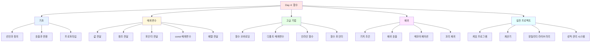

# Day 4-5교시: 함수 종합 실습

## 학습 목표
- 함수를 활용한 실전 프로그램 작성하기
- 다양한 함수 기법 통합하기
- 모듈화된 코드 작성하기
- 함수 포인터 기초 이해하기
- 함수 설계 원칙 적용하기

## 1. 숫자 맞추기 게임 프로그램

### 1.1 프로그램 구조

```
┌─────────────────────────────────────────────────────────────────┐
│                    숫자 맞추기 게임 구조                          │
├─────────────────────────────────────────────────────────────────┤
│                                                                  │
│   main()                                                         │
│     │                                                            │
│     ├── srand(time(0))  ← 난수 시드 초기화                       │
│     │                                                            │
│     └── do-while 루프                                            │
│           │                                                      │
│           ├── playGame()  ← 게임 한 판 실행                      │
│           │     │                                                │
│           │     ├── generateRandom()  ← 목표 숫자 생성           │
│           │     │                                                │
│           │     └── while 루프  ← 맞출 때까지 반복               │
│           │           │                                          │
│           │           ├── 입력 받기                              │
│           │           ├── 힌트 출력                              │
│           │           └── 정답 확인                              │
│           │                                                      │
│           └── 재시작 여부 확인                                   │
│                                                                  │
└─────────────────────────────────────────────────────────────────┘
```

### 1.2 기본 구현

```cpp
#include <iostream>
#include <cstdlib>
#include <ctime>
using namespace std;

// 랜덤 숫자 생성 (디폴트 매개변수 활용)
int generateRandom(int min = 1, int max = 100) {
    return rand() % (max - min + 1) + min;
}

// 난이도별 최대 시도 횟수
int getMaxAttempts(int difficulty) {
    switch (difficulty) {
        case 1: return 15;  // 쉬움
        case 2: return 10;  // 보통
        case 3: return 7;   // 어려움
        default: return 10;
    }
}

// 난이도별 숫자 범위
void getRange(int difficulty, int& min, int& max) {
    switch (difficulty) {
        case 1: min = 1; max = 50; break;   // 쉬움
        case 2: min = 1; max = 100; break;  // 보통
        case 3: min = 1; max = 200; break;  // 어려움
        default: min = 1; max = 100;
    }
}

// 힌트 출력
void printHint(int guess, int target, int attempts, int maxAttempts) {
    if (guess < target) {
        cout << "더 큰 숫자입니다! ";
    } else {
        cout << "더 작은 숫자입니다! ";
    }
    cout << "(남은 시도: " << maxAttempts - attempts << "회)" << endl;
}

// 게임 결과 출력
void printResult(bool won, int attempts, int target) {
    if (won) {
        cout << "\n🎉 정답입니다! " << attempts << "번 만에 맞췄습니다!" << endl;

        if (attempts <= 3) {
            cout << "천재입니다!" << endl;
        } else if (attempts <= 6) {
            cout << "훌륭합니다!" << endl;
        } else {
            cout << "잘했습니다!" << endl;
        }
    } else {
        cout << "\n😢 아쉽습니다! 정답은 " << target << "이었습니다." << endl;
    }
}

// 게임 실행
bool playGame(int difficulty = 2) {
    int minRange, maxRange;
    getRange(difficulty, minRange, maxRange);

    int target = generateRandom(minRange, maxRange);
    int maxAttempts = getMaxAttempts(difficulty);
    int guess;
    int attempts = 0;

    cout << "\n=== 숫자 맞추기 게임 ===" << endl;
    cout << minRange << "부터 " << maxRange << " 사이의 숫자를 맞춰보세요!" << endl;
    cout << "최대 시도 횟수: " << maxAttempts << "회" << endl;

    while (attempts < maxAttempts) {
        cout << "\n추측: ";
        cin >> guess;
        attempts++;

        // 범위 검사
        if (guess < minRange || guess > maxRange) {
            cout << "범위 내의 숫자를 입력하세요!" << endl;
            attempts--;  // 잘못된 입력은 시도 횟수에서 제외
            continue;
        }

        if (guess == target) {
            printResult(true, attempts, target);
            return true;
        }

        printHint(guess, target, attempts, maxAttempts);
    }

    printResult(false, attempts, target);
    return false;
}

// 난이도 선택
int selectDifficulty() {
    int choice;
    cout << "\n=== 난이도 선택 ===" << endl;
    cout << "1. 쉬움 (1-50, 15회)" << endl;
    cout << "2. 보통 (1-100, 10회)" << endl;
    cout << "3. 어려움 (1-200, 7회)" << endl;
    cout << "선택: ";
    cin >> choice;

    if (choice < 1 || choice > 3) choice = 2;
    return choice;
}

int main() {
    srand(time(0));

    int wins = 0, games = 0;
    char choice;

    cout << "╔════════════════════════════════╗" << endl;
    cout << "║      숫자 맞추기 게임 v2.0      ║" << endl;
    cout << "╚════════════════════════════════╝" << endl;

    do {
        int difficulty = selectDifficulty();
        games++;

        if (playGame(difficulty)) {
            wins++;
        }

        cout << "\n현재 전적: " << wins << "승 " << (games - wins) << "패" << endl;
        cout << "승률: " << (wins * 100 / games) << "%" << endl;

        cout << "\n다시 하시겠습니까? (y/n): ";
        cin >> choice;

    } while (choice == 'y' || choice == 'Y');

    cout << "\n=== 최종 전적 ===" << endl;
    cout << "총 게임: " << games << "회" << endl;
    cout << "승리: " << wins << "회" << endl;
    cout << "패배: " << (games - wins) << "회" << endl;
    cout << "최종 승률: " << (wins * 100 / games) << "%" << endl;
    cout << "\n게임을 종료합니다. 감사합니다!" << endl;

    return 0;
}
```

### 1.3 함수 분해 원칙

```
┌─────────────────────────────────────────────────────────────────┐
│                     함수 분해 원칙                               │
├─────────────────────────────────────────────────────────────────┤
│                                                                  │
│  1. 단일 책임 원칙 (Single Responsibility)                       │
│     - generateRandom(): 난수 생성만                              │
│     - printHint(): 힌트 출력만                                   │
│     - printResult(): 결과 출력만                                 │
│                                                                  │
│  2. 추상화 수준 일치                                             │
│     - main()은 전체 흐름만 담당                                   │
│     - 세부 구현은 하위 함수에 위임                                │
│                                                                  │
│  3. 재사용성                                                     │
│     - getRange()는 다른 게임에서도 사용 가능                      │
│     - generateRandom()은 범용 함수                               │
│                                                                  │
│  4. 테스트 용이성                                                │
│     - 각 함수를 독립적으로 테스트 가능                            │
│                                                                  │
└─────────────────────────────────────────────────────────────────┘
```

## 2. 고급 계산기 프로그램

### 2.1 함수 포인터 활용

```cpp
#include <iostream>
#include <cmath>
#include <string>
using namespace std;

// 함수 포인터 타입 정의
typedef double (*Operation)(double, double);

// 기본 사칙연산
double add(double a, double b) { return a + b; }
double subtract(double a, double b) { return a - b; }
double multiply(double a, double b) { return a * b; }
double divide(double a, double b) {
    if (b == 0) {
        cout << "오류: 0으로 나눌 수 없습니다." << endl;
        return 0;
    }
    return a / b;
}

// 추가 연산
double power(double base, double exp) {
    return pow(base, exp);
}

double modulo(double a, double b) {
    if (b == 0) {
        cout << "오류: 0으로 나눌 수 없습니다." << endl;
        return 0;
    }
    return (int)a % (int)b;
}

// 단항 연산 (함수 포인터 타입 다름)
typedef double (*UnaryOperation)(double);

double squareRoot(double a) {
    if (a < 0) {
        cout << "오류: 음수의 제곱근을 구할 수 없습니다." << endl;
        return 0;
    }
    return sqrt(a);
}

double absolute(double a) { return abs(a); }
double factorial(double n) {
    if (n < 0) return 0;
    if (n <= 1) return 1;
    double result = 1;
    for (int i = 2; i <= (int)n; i++) {
        result *= i;
    }
    return result;
}

// 연산 실행 함수 (함수 포인터 사용)
double calculate(Operation op, double a, double b) {
    return op(a, b);
}

double calculateUnary(UnaryOperation op, double a) {
    return op(a);
}

// 메뉴 출력
void printMenu() {
    cout << "\n╔═══════════════════════════════╗" << endl;
    cout << "║       고급 계산기 v2.0        ║" << endl;
    cout << "╠═══════════════════════════════╣" << endl;
    cout << "║  이항 연산:                   ║" << endl;
    cout << "║   1. 덧셈 (+)                 ║" << endl;
    cout << "║   2. 뺄셈 (-)                 ║" << endl;
    cout << "║   3. 곱셈 (×)                 ║" << endl;
    cout << "║   4. 나눗셈 (÷)               ║" << endl;
    cout << "║   5. 거듭제곱 (^)             ║" << endl;
    cout << "║   6. 나머지 (%)               ║" << endl;
    cout << "║                               ║" << endl;
    cout << "║  단항 연산:                   ║" << endl;
    cout << "║   7. 제곱근 (√)               ║" << endl;
    cout << "║   8. 절댓값 (|x|)             ║" << endl;
    cout << "║   9. 팩토리얼 (n!)            ║" << endl;
    cout << "║                               ║" << endl;
    cout << "║   0. 종료                     ║" << endl;
    cout << "╚═══════════════════════════════╝" << endl;
    cout << "선택: ";
}

// 두 숫자 입력 받기
void getNumbers(double& a, double& b) {
    cout << "첫 번째 숫자: ";
    cin >> a;
    cout << "두 번째 숫자: ";
    cin >> b;
}

// 한 숫자 입력 받기
double getNumber() {
    double num;
    cout << "숫자 입력: ";
    cin >> num;
    return num;
}

// 결과 출력 (오버로딩)
void printResult(double a, const string& op, double b, double result) {
    cout << "\n" << a << " " << op << " " << b << " = " << result << endl;
}

void printResult(const string& op, double a, double result) {
    cout << "\n" << op << "(" << a << ") = " << result << endl;
}

int main() {
    int choice;
    double num1, num2, result;

    // 연산 함수 배열
    Operation operations[] = {nullptr, add, subtract, multiply, divide, power, modulo};
    string opSymbols[] = {"", "+", "-", "×", "÷", "^", "%"};

    UnaryOperation unaryOps[] = {squareRoot, absolute, factorial};
    string unaryNames[] = {"√", "|x|", "!"};

    cout << "계산기를 시작합니다." << endl;

    while (true) {
        printMenu();
        cin >> choice;

        if (choice == 0) {
            cout << "계산기를 종료합니다." << endl;
            break;
        }

        if (choice >= 1 && choice <= 6) {
            // 이항 연산
            getNumbers(num1, num2);
            result = calculate(operations[choice], num1, num2);
            printResult(num1, opSymbols[choice], num2, result);
        }
        else if (choice >= 7 && choice <= 9) {
            // 단항 연산
            num1 = getNumber();
            int idx = choice - 7;
            result = calculateUnary(unaryOps[idx], num1);
            printResult(unaryNames[idx], num1, result);
        }
        else {
            cout << "잘못된 선택입니다." << endl;
        }
    }

    return 0;
}
```

### 2.2 함수 포인터 개념

```
┌─────────────────────────────────────────────────────────────────┐
│                      함수 포인터 기초                            │
├─────────────────────────────────────────────────────────────────┤
│                                                                  │
│   함수도 메모리에 저장됨 → 주소를 저장할 수 있음                   │
│                                                                  │
│   일반 변수:                                                     │
│   int x = 10;                                                    │
│   int* ptr = &x;  // x의 주소 저장                               │
│                                                                  │
│   함수 포인터:                                                   │
│   double add(double a, double b);                                │
│   double (*funcPtr)(double, double) = add;  // add의 주소 저장   │
│                                                                  │
│   사용 방법:                                                     │
│   double result = funcPtr(3.0, 4.0);  // add(3.0, 4.0) 호출     │
│                                                                  │
│   typedef로 간단하게:                                            │
│   typedef double (*Operation)(double, double);                   │
│   Operation op = add;                                            │
│   double result = op(3.0, 4.0);                                  │
│                                                                  │
└─────────────────────────────────────────────────────────────────┘

함수 포인터 사용 예:

┌──────────────┐    ┌──────────────┐
│ funcPtr      │───▶│ add 함수     │
│ 0x401234     │    │ 코드 영역    │
└──────────────┘    └──────────────┘
     │
     ▼
   funcPtr(3, 4)
     │
     ▼
   add(3, 4) 실행
     │
     ▼
   return 7
```

### 2.3 함수 포인터 활용 예제

```cpp
#include <iostream>
using namespace std;

// 정렬 비교 함수들
bool ascending(int a, int b) { return a > b; }   // 오름차순용 (swap 조건)
bool descending(int a, int b) { return a < b; }  // 내림차순용 (swap 조건)

// 비교 함수 타입
typedef bool (*CompareFunc)(int, int);

// 범용 정렬 함수 (함수 포인터 사용)
void sortArray(int arr[], int size, CompareFunc compare) {
    for (int i = 0; i < size - 1; i++) {
        for (int j = 0; j < size - i - 1; j++) {
            if (compare(arr[j], arr[j + 1])) {
                int temp = arr[j];
                arr[j] = arr[j + 1];
                arr[j + 1] = temp;
            }
        }
    }
}

void printArray(int arr[], int size) {
    for (int i = 0; i < size; i++) {
        cout << arr[i] << " ";
    }
    cout << endl;
}

int main() {
    int numbers[] = {64, 34, 25, 12, 22, 11, 90};
    int size = sizeof(numbers) / sizeof(numbers[0]);

    cout << "원본: ";
    printArray(numbers, size);

    // 오름차순 정렬
    sortArray(numbers, size, ascending);
    cout << "오름차순: ";
    printArray(numbers, size);

    // 내림차순 정렬
    sortArray(numbers, size, descending);
    cout << "내림차순: ";
    printArray(numbers, size);

    return 0;
}
```

## 3. 배열 유틸리티 라이브러리

### 3.1 완전한 구현

```cpp
#include <iostream>
#include <string>
#include <cstdlib>
#include <ctime>
using namespace std;

// ===== 배열 출력 함수들 =====

// 기본 출력
void printArray(const int arr[], int size, const string& label = "배열") {
    cout << label << ": [";
    for (int i = 0; i < size; i++) {
        cout << arr[i];
        if (i < size - 1) cout << ", ";
    }
    cout << "]" << endl;
}

// 포맷 지정 출력
void printArrayFormatted(const int arr[], int size, const string& separator = ", ") {
    for (int i = 0; i < size; i++) {
        cout << arr[i];
        if (i < size - 1) cout << separator;
    }
    cout << endl;
}

// ===== 배열 통계 함수들 =====

// 합계
int sum(const int arr[], int size) {
    int total = 0;
    for (int i = 0; i < size; i++) {
        total += arr[i];
    }
    return total;
}

// 평균
double average(const int arr[], int size) {
    if (size == 0) return 0;
    return (double)sum(arr, size) / size;
}

// 최댓값
int findMax(const int arr[], int size) {
    if (size == 0) return 0;
    int maxVal = arr[0];
    for (int i = 1; i < size; i++) {
        if (arr[i] > maxVal) {
            maxVal = arr[i];
        }
    }
    return maxVal;
}

// 최솟값
int findMin(const int arr[], int size) {
    if (size == 0) return 0;
    int minVal = arr[0];
    for (int i = 1; i < size; i++) {
        if (arr[i] < minVal) {
            minVal = arr[i];
        }
    }
    return minVal;
}

// 최댓값 인덱스
int findMaxIndex(const int arr[], int size) {
    if (size == 0) return -1;
    int maxIdx = 0;
    for (int i = 1; i < size; i++) {
        if (arr[i] > arr[maxIdx]) {
            maxIdx = i;
        }
    }
    return maxIdx;
}

// 최솟값 인덱스
int findMinIndex(const int arr[], int size) {
    if (size == 0) return -1;
    int minIdx = 0;
    for (int i = 1; i < size; i++) {
        if (arr[i] < arr[minIdx]) {
            minIdx = i;
        }
    }
    return minIdx;
}

// ===== 배열 검색 함수들 =====

// 선형 검색
int linearSearch(const int arr[], int size, int target) {
    for (int i = 0; i < size; i++) {
        if (arr[i] == target) {
            return i;
        }
    }
    return -1;  // 찾지 못함
}

// 이진 검색 (정렬된 배열 필요)
int binarySearch(const int arr[], int left, int right, int target) {
    while (left <= right) {
        int mid = left + (right - left) / 2;

        if (arr[mid] == target) {
            return mid;
        }
        if (arr[mid] < target) {
            left = mid + 1;
        } else {
            right = mid - 1;
        }
    }
    return -1;
}

// 값이 존재하는지 확인
bool contains(const int arr[], int size, int target) {
    return linearSearch(arr, size, target) != -1;
}

// 값의 개수 세기
int count(const int arr[], int size, int target) {
    int cnt = 0;
    for (int i = 0; i < size; i++) {
        if (arr[i] == target) cnt++;
    }
    return cnt;
}

// ===== 배열 수정 함수들 =====

// 버블 정렬
void bubbleSort(int arr[], int size, bool ascending = true) {
    for (int i = 0; i < size - 1; i++) {
        bool swapped = false;
        for (int j = 0; j < size - i - 1; j++) {
            bool shouldSwap = ascending ?
                (arr[j] > arr[j + 1]) : (arr[j] < arr[j + 1]);

            if (shouldSwap) {
                int temp = arr[j];
                arr[j] = arr[j + 1];
                arr[j + 1] = temp;
                swapped = true;
            }
        }
        // 최적화: 교환이 없으면 이미 정렬됨
        if (!swapped) break;
    }
}

// 선택 정렬
void selectionSort(int arr[], int size, bool ascending = true) {
    for (int i = 0; i < size - 1; i++) {
        int selectedIdx = i;
        for (int j = i + 1; j < size; j++) {
            bool shouldSelect = ascending ?
                (arr[j] < arr[selectedIdx]) : (arr[j] > arr[selectedIdx]);

            if (shouldSelect) {
                selectedIdx = j;
            }
        }
        if (selectedIdx != i) {
            int temp = arr[i];
            arr[i] = arr[selectedIdx];
            arr[selectedIdx] = temp;
        }
    }
}

// 배열 역순
void reverse(int arr[], int size) {
    for (int i = 0; i < size / 2; i++) {
        int temp = arr[i];
        arr[i] = arr[size - 1 - i];
        arr[size - 1 - i] = temp;
    }
}

// 배열 회전 (왼쪽으로)
void rotateLeft(int arr[], int size, int positions = 1) {
    positions = positions % size;  // 크기 초과 방지

    for (int p = 0; p < positions; p++) {
        int first = arr[0];
        for (int i = 0; i < size - 1; i++) {
            arr[i] = arr[i + 1];
        }
        arr[size - 1] = first;
    }
}

// 배열 회전 (오른쪽으로)
void rotateRight(int arr[], int size, int positions = 1) {
    positions = positions % size;

    for (int p = 0; p < positions; p++) {
        int last = arr[size - 1];
        for (int i = size - 1; i > 0; i--) {
            arr[i] = arr[i - 1];
        }
        arr[0] = last;
    }
}

// 특정 값 모두 제거 (새 크기 반환)
int removeAll(int arr[], int size, int target) {
    int newSize = 0;
    for (int i = 0; i < size; i++) {
        if (arr[i] != target) {
            arr[newSize++] = arr[i];
        }
    }
    return newSize;
}

// 중복 제거 (새 크기 반환, 정렬된 배열 가정)
int removeDuplicates(int arr[], int size) {
    if (size <= 1) return size;

    int newSize = 1;
    for (int i = 1; i < size; i++) {
        if (arr[i] != arr[i - 1]) {
            arr[newSize++] = arr[i];
        }
    }
    return newSize;
}

// ===== 배열 생성 함수들 =====

// 배열 채우기
void fill(int arr[], int size, int value) {
    for (int i = 0; i < size; i++) {
        arr[i] = value;
    }
}

// 범위로 채우기
void fillRange(int arr[], int size, int start = 0) {
    for (int i = 0; i < size; i++) {
        arr[i] = start + i;
    }
}

// 랜덤 값으로 채우기
void fillRandom(int arr[], int size, int min = 1, int max = 100) {
    for (int i = 0; i < size; i++) {
        arr[i] = rand() % (max - min + 1) + min;
    }
}

// 배열 복사
void copyArray(const int source[], int dest[], int size) {
    for (int i = 0; i < size; i++) {
        dest[i] = source[i];
    }
}

// ===== 배열 비교 함수들 =====

// 두 배열이 같은지 확인
bool equals(const int arr1[], const int arr2[], int size) {
    for (int i = 0; i < size; i++) {
        if (arr1[i] != arr2[i]) return false;
    }
    return true;
}

// ===== 데모 메인 함수 =====

int main() {
    srand(time(0));

    cout << "╔═══════════════════════════════════╗" << endl;
    cout << "║    배열 유틸리티 라이브러리 데모    ║" << endl;
    cout << "╚═══════════════════════════════════╝" << endl;

    // 테스트 배열 생성
    int numbers[10];
    fillRandom(numbers, 10, 1, 50);

    cout << "\n=== 배열 생성 및 출력 ===" << endl;
    printArray(numbers, 10, "랜덤 배열");

    cout << "\n=== 통계 ===" << endl;
    cout << "합계: " << sum(numbers, 10) << endl;
    cout << "평균: " << average(numbers, 10) << endl;
    cout << "최댓값: " << findMax(numbers, 10)
         << " (인덱스: " << findMaxIndex(numbers, 10) << ")" << endl;
    cout << "최솟값: " << findMin(numbers, 10)
         << " (인덱스: " << findMinIndex(numbers, 10) << ")" << endl;

    cout << "\n=== 정렬 ===" << endl;
    bubbleSort(numbers, 10);
    printArray(numbers, 10, "오름차순 정렬");

    bubbleSort(numbers, 10, false);
    printArray(numbers, 10, "내림차순 정렬");

    cout << "\n=== 검색 ===" << endl;
    bubbleSort(numbers, 10);  // 이진검색을 위해 정렬
    int target = numbers[5];  // 존재하는 값으로 테스트
    cout << target << " 선형검색: 인덱스 " << linearSearch(numbers, 10, target) << endl;
    cout << target << " 이진검색: 인덱스 " << binarySearch(numbers, 0, 9, target) << endl;

    cout << "\n=== 변환 ===" << endl;
    reverse(numbers, 10);
    printArray(numbers, 10, "역순");

    rotateLeft(numbers, 10, 2);
    printArray(numbers, 10, "왼쪽 2칸 회전");

    return 0;
}
```

### 3.2 배열 함수 요약표

```
┌─────────────────────────────────────────────────────────────────────┐
│                    배열 유틸리티 함수 정리표                          │
├─────────────────┬─────────────────────┬──────────┬─────────────────┤
│     함수명      │     매개변수        │  반환값  │   시간복잡도     │
├─────────────────┼─────────────────────┼──────────┼─────────────────┤
│ 출력 함수                                                           │
├─────────────────┼─────────────────────┼──────────┼─────────────────┤
│ printArray      │ const int[], int    │ void     │ O(n)            │
│ printFormatted  │ const int[], int    │ void     │ O(n)            │
├─────────────────┼─────────────────────┼──────────┼─────────────────┤
│ 통계 함수                                                           │
├─────────────────┼─────────────────────┼──────────┼─────────────────┤
│ sum             │ const int[], int    │ int      │ O(n)            │
│ average         │ const int[], int    │ double   │ O(n)            │
│ findMax         │ const int[], int    │ int      │ O(n)            │
│ findMin         │ const int[], int    │ int      │ O(n)            │
│ findMaxIndex    │ const int[], int    │ int      │ O(n)            │
│ findMinIndex    │ const int[], int    │ int      │ O(n)            │
├─────────────────┼─────────────────────┼──────────┼─────────────────┤
│ 검색 함수                                                           │
├─────────────────┼─────────────────────┼──────────┼─────────────────┤
│ linearSearch    │ const int[], int    │ int      │ O(n)            │
│ binarySearch    │ const int[], ...    │ int      │ O(log n)        │
│ contains        │ const int[], int    │ bool     │ O(n)            │
│ count           │ const int[], int    │ int      │ O(n)            │
├─────────────────┼─────────────────────┼──────────┼─────────────────┤
│ 정렬/변환 함수                                                       │
├─────────────────┼─────────────────────┼──────────┼─────────────────┤
│ bubbleSort      │ int[], int, bool    │ void     │ O(n²)           │
│ selectionSort   │ int[], int, bool    │ void     │ O(n²)           │
│ reverse         │ int[], int          │ void     │ O(n)            │
│ rotateLeft      │ int[], int, int     │ void     │ O(n×k)          │
│ rotateRight     │ int[], int, int     │ void     │ O(n×k)          │
├─────────────────┼─────────────────────┼──────────┼─────────────────┤
│ 생성/복사 함수                                                       │
├─────────────────┼─────────────────────┼──────────┼─────────────────┤
│ fill            │ int[], int, int     │ void     │ O(n)            │
│ fillRange       │ int[], int, int     │ void     │ O(n)            │
│ fillRandom      │ int[], int, int     │ void     │ O(n)            │
│ copyArray       │ const int[], int[]  │ void     │ O(n)            │
└─────────────────┴─────────────────────┴──────────┴─────────────────┘
```

## 4. 종합 프로젝트: 성적 관리 시스템 v2.0

### 4.1 향상된 구현

```cpp
#include <iostream>
#include <string>
#include <iomanip>
using namespace std;

// ===== 상수 정의 =====
const int MAX_STUDENTS = 100;
const int SUBJECTS = 3;  // 국어, 영어, 수학

// ===== 전역 데이터 =====
int studentCount = 0;
string names[MAX_STUDENTS];
int korean[MAX_STUDENTS];
int english[MAX_STUDENTS];
int math[MAX_STUDENTS];

// ===== 유틸리티 함수 =====

// 총점 계산
int getTotal(int idx) {
    return korean[idx] + english[idx] + math[idx];
}

// 평균 계산
double getAverage(int idx) {
    return getTotal(idx) / (double)SUBJECTS;
}

// 등급 계산
char getGrade(double avg) {
    if (avg >= 90) return 'A';
    if (avg >= 80) return 'B';
    if (avg >= 70) return 'C';
    if (avg >= 60) return 'D';
    return 'F';
}

// 점수 유효성 검사
bool isValidScore(int score) {
    return score >= 0 && score <= 100;
}

// ===== CRUD 함수 =====

// 학생 추가 (Create)
bool addStudent(const string& name, int kor, int eng, int mat) {
    if (studentCount >= MAX_STUDENTS) {
        cout << "더 이상 학생을 추가할 수 없습니다." << endl;
        return false;
    }

    if (!isValidScore(kor) || !isValidScore(eng) || !isValidScore(mat)) {
        cout << "점수는 0~100 사이여야 합니다." << endl;
        return false;
    }

    names[studentCount] = name;
    korean[studentCount] = kor;
    english[studentCount] = eng;
    math[studentCount] = mat;
    studentCount++;

    cout << "학생 '" << name << "'이(가) 추가되었습니다." << endl;
    return true;
}

// 이름으로 검색
int findStudentByName(const string& name) {
    for (int i = 0; i < studentCount; i++) {
        if (names[i] == name) {
            return i;
        }
    }
    return -1;
}

// 학생 조회 (Read)
void displayStudent(int idx) {
    if (idx < 0 || idx >= studentCount) {
        cout << "유효하지 않은 학생입니다." << endl;
        return;
    }

    cout << "\n┌────────────────────────────────┐" << endl;
    cout << "│       학생 정보 조회           │" << endl;
    cout << "├────────────────────────────────┤" << endl;
    cout << "│ 이름: " << setw(22) << left << names[idx] << " │" << endl;
    cout << "│ 국어: " << setw(22) << korean[idx] << " │" << endl;
    cout << "│ 영어: " << setw(22) << english[idx] << " │" << endl;
    cout << "│ 수학: " << setw(22) << math[idx] << " │" << endl;
    cout << "│ 총점: " << setw(22) << getTotal(idx) << " │" << endl;
    cout << "│ 평균: " << setw(22) << fixed << setprecision(1) << getAverage(idx) << " │" << endl;
    cout << "│ 등급: " << setw(22) << getGrade(getAverage(idx)) << " │" << endl;
    cout << "└────────────────────────────────┘" << endl;
}

// 전체 조회
void displayAll() {
    if (studentCount == 0) {
        cout << "등록된 학생이 없습니다." << endl;
        return;
    }

    cout << "\n╔═══════════════════════════════════════════════════════════════════════╗" << endl;
    cout << "║                          전체 학생 성적표                              ║" << endl;
    cout << "╠═════╦════════════╦══════╦══════╦══════╦══════╦═══════╦══════╣" << endl;
    cout << "║ No. ║    이름    ║ 국어 ║ 영어 ║ 수학 ║ 총점 ║  평균 ║ 등급 ║" << endl;
    cout << "╠═════╬════════════╬══════╬══════╬══════╬══════╬═══════╬══════╣" << endl;

    for (int i = 0; i < studentCount; i++) {
        cout << "║ " << setw(3) << right << (i + 1) << " ║ "
             << setw(10) << left << names[i] << " ║ "
             << setw(4) << right << korean[i] << " ║ "
             << setw(4) << english[i] << " ║ "
             << setw(4) << math[i] << " ║ "
             << setw(4) << getTotal(i) << " ║ "
             << setw(5) << fixed << setprecision(1) << getAverage(i) << " ║   "
             << getGrade(getAverage(i)) << "  ║" << endl;
    }

    cout << "╚═════╩════════════╩══════╩══════╩══════╩══════╩═══════╩══════╝" << endl;
}

// 학생 수정 (Update)
bool updateStudent(int idx, int kor, int eng, int mat) {
    if (idx < 0 || idx >= studentCount) {
        cout << "유효하지 않은 학생입니다." << endl;
        return false;
    }

    if (!isValidScore(kor) || !isValidScore(eng) || !isValidScore(mat)) {
        cout << "점수는 0~100 사이여야 합니다." << endl;
        return false;
    }

    korean[idx] = kor;
    english[idx] = eng;
    math[idx] = mat;

    cout << "'" << names[idx] << "' 학생의 성적이 수정되었습니다." << endl;
    return true;
}

// 학생 삭제 (Delete)
bool deleteStudent(int idx) {
    if (idx < 0 || idx >= studentCount) {
        cout << "유효하지 않은 학생입니다." << endl;
        return false;
    }

    string deletedName = names[idx];

    // 삭제된 자리를 뒤의 데이터로 채움
    for (int i = idx; i < studentCount - 1; i++) {
        names[i] = names[i + 1];
        korean[i] = korean[i + 1];
        english[i] = english[i + 1];
        math[i] = math[i + 1];
    }
    studentCount--;

    cout << "'" << deletedName << "' 학생이 삭제되었습니다." << endl;
    return true;
}

// ===== 통계 함수 =====

// 전체 평균
double calculateClassAverage() {
    if (studentCount == 0) return 0;

    double totalAvg = 0;
    for (int i = 0; i < studentCount; i++) {
        totalAvg += getAverage(i);
    }
    return totalAvg / studentCount;
}

// 과목별 평균
double getSubjectAverage(int subjectArray[]) {
    if (studentCount == 0) return 0;

    int sum = 0;
    for (int i = 0; i < studentCount; i++) {
        sum += subjectArray[i];
    }
    return (double)sum / studentCount;
}

// 최고/최저 학생
void displayTopBottom() {
    if (studentCount == 0) {
        cout << "등록된 학생이 없습니다." << endl;
        return;
    }

    int topIdx = 0, bottomIdx = 0;

    for (int i = 1; i < studentCount; i++) {
        if (getTotal(i) > getTotal(topIdx)) {
            topIdx = i;
        }
        if (getTotal(i) < getTotal(bottomIdx)) {
            bottomIdx = i;
        }
    }

    cout << "\n=== 성적 순위 ===" << endl;
    cout << "1등: " << names[topIdx] << " (평균: " << fixed << setprecision(1)
         << getAverage(topIdx) << ", 등급: " << getGrade(getAverage(topIdx)) << ")" << endl;
    cout << "꼴등: " << names[bottomIdx] << " (평균: " << getAverage(bottomIdx)
         << ", 등급: " << getGrade(getAverage(bottomIdx)) << ")" << endl;
}

// 등급별 인원 수
void displayGradeDistribution() {
    if (studentCount == 0) {
        cout << "등록된 학생이 없습니다." << endl;
        return;
    }

    int gradeCount[5] = {0};  // A, B, C, D, F

    for (int i = 0; i < studentCount; i++) {
        char grade = getGrade(getAverage(i));
        switch (grade) {
            case 'A': gradeCount[0]++; break;
            case 'B': gradeCount[1]++; break;
            case 'C': gradeCount[2]++; break;
            case 'D': gradeCount[3]++; break;
            case 'F': gradeCount[4]++; break;
        }
    }

    cout << "\n=== 등급별 분포 ===" << endl;
    char grades[] = {'A', 'B', 'C', 'D', 'F'};
    for (int i = 0; i < 5; i++) {
        cout << grades[i] << "등급: " << gradeCount[i] << "명 (";
        cout << fixed << setprecision(1) << (gradeCount[i] * 100.0 / studentCount) << "%)" << endl;
    }
}

// 전체 통계
void displayStatistics() {
    if (studentCount == 0) {
        cout << "등록된 학생이 없습니다." << endl;
        return;
    }

    cout << "\n╔═══════════════════════════════════╗" << endl;
    cout << "║           통계 분석               ║" << endl;
    cout << "╠═══════════════════════════════════╣" << endl;
    cout << "║ 총 학생 수: " << setw(18) << studentCount << "명 ║" << endl;
    cout << "║ 전체 평균: " << setw(18) << fixed << setprecision(1)
         << calculateClassAverage() << "점 ║" << endl;
    cout << "╠═══════════════════════════════════╣" << endl;
    cout << "║ 과목별 평균:                       ║" << endl;
    cout << "║   국어: " << setw(19) << getSubjectAverage(korean) << "점 ║" << endl;
    cout << "║   영어: " << setw(19) << getSubjectAverage(english) << "점 ║" << endl;
    cout << "║   수학: " << setw(19) << getSubjectAverage(math) << "점 ║" << endl;
    cout << "╚═══════════════════════════════════╝" << endl;

    displayTopBottom();
    displayGradeDistribution();
}

// ===== 정렬 함수 =====

// 성적순 정렬
void sortByScore(bool descending = true) {
    for (int i = 0; i < studentCount - 1; i++) {
        for (int j = 0; j < studentCount - i - 1; j++) {
            bool shouldSwap = descending ?
                (getTotal(j) < getTotal(j + 1)) : (getTotal(j) > getTotal(j + 1));

            if (shouldSwap) {
                swap(names[j], names[j + 1]);
                swap(korean[j], korean[j + 1]);
                swap(english[j], english[j + 1]);
                swap(math[j], math[j + 1]);
            }
        }
    }
    cout << "성적순으로 정렬되었습니다." << endl;
}

// 이름순 정렬
void sortByName() {
    for (int i = 0; i < studentCount - 1; i++) {
        for (int j = 0; j < studentCount - i - 1; j++) {
            if (names[j] > names[j + 1]) {
                swap(names[j], names[j + 1]);
                swap(korean[j], korean[j + 1]);
                swap(english[j], english[j + 1]);
                swap(math[j], math[j + 1]);
            }
        }
    }
    cout << "이름순으로 정렬되었습니다." << endl;
}

// ===== 메뉴 함수 =====

void printMainMenu() {
    cout << "\n╔═══════════════════════════════════╗" << endl;
    cout << "║     성적 관리 시스템 v2.0         ║" << endl;
    cout << "╠═══════════════════════════════════╣" << endl;
    cout << "║  1. 학생 추가                     ║" << endl;
    cout << "║  2. 전체 조회                     ║" << endl;
    cout << "║  3. 학생 검색                     ║" << endl;
    cout << "║  4. 성적 수정                     ║" << endl;
    cout << "║  5. 학생 삭제                     ║" << endl;
    cout << "║  6. 통계 보기                     ║" << endl;
    cout << "║  7. 정렬 (성적순)                 ║" << endl;
    cout << "║  8. 정렬 (이름순)                 ║" << endl;
    cout << "║  0. 종료                          ║" << endl;
    cout << "╚═══════════════════════════════════╝" << endl;
    cout << "선택: ";
}

// ===== 메인 함수 =====

int main() {
    int choice;
    string name;
    int kor, eng, mat;

    // 샘플 데이터 추가
    addStudent("김철수", 85, 90, 78);
    addStudent("이영희", 92, 88, 95);
    addStudent("박민수", 78, 82, 70);
    addStudent("정수진", 95, 98, 92);
    addStudent("홍길동", 65, 72, 68);

    while (true) {
        printMainMenu();
        cin >> choice;

        switch (choice) {
            case 1:  // 추가
                cout << "이름: ";
                cin >> name;
                cout << "국어 점수: ";
                cin >> kor;
                cout << "영어 점수: ";
                cin >> eng;
                cout << "수학 점수: ";
                cin >> mat;
                addStudent(name, kor, eng, mat);
                break;

            case 2:  // 전체 조회
                displayAll();
                break;

            case 3:  // 검색
                cout << "검색할 이름: ";
                cin >> name;
                {
                    int idx = findStudentByName(name);
                    if (idx != -1) {
                        displayStudent(idx);
                    } else {
                        cout << "학생을 찾을 수 없습니다." << endl;
                    }
                }
                break;

            case 4:  // 수정
                cout << "수정할 학생 이름: ";
                cin >> name;
                {
                    int idx = findStudentByName(name);
                    if (idx != -1) {
                        cout << "새 국어 점수: ";
                        cin >> kor;
                        cout << "새 영어 점수: ";
                        cin >> eng;
                        cout << "새 수학 점수: ";
                        cin >> mat;
                        updateStudent(idx, kor, eng, mat);
                    } else {
                        cout << "학생을 찾을 수 없습니다." << endl;
                    }
                }
                break;

            case 5:  // 삭제
                cout << "삭제할 학생 이름: ";
                cin >> name;
                {
                    int idx = findStudentByName(name);
                    if (idx != -1) {
                        deleteStudent(idx);
                    } else {
                        cout << "학생을 찾을 수 없습니다." << endl;
                    }
                }
                break;

            case 6:  // 통계
                displayStatistics();
                break;

            case 7:  // 성적순 정렬
                sortByScore();
                displayAll();
                break;

            case 8:  // 이름순 정렬
                sortByName();
                displayAll();
                break;

            case 0:  // 종료
                cout << "프로그램을 종료합니다." << endl;
                return 0;

            default:
                cout << "잘못된 선택입니다." << endl;
        }
    }

    return 0;
}
```

## 5. 함수 설계 원칙

### 5.1 좋은 함수의 특징

```
┌─────────────────────────────────────────────────────────────────┐
│                    좋은 함수의 특징                              │
├─────────────────────────────────────────────────────────────────┤
│                                                                  │
│  1. 단일 책임 (Single Responsibility)                           │
│     ─────────────────────────────────                           │
│     - 하나의 함수는 하나의 작업만 수행                             │
│     - 함수 이름으로 기능을 정확히 표현                             │
│                                                                  │
│     ❌ 나쁜 예:                                                  │
│     void processStudentAndPrintReport(...)  // 두 가지 작업      │
│                                                                  │
│     ✅ 좋은 예:                                                  │
│     void processStudent(...)                                     │
│     void printReport(...)                                        │
│                                                                  │
│  2. 적절한 크기                                                  │
│     ─────────────                                               │
│     - 한 화면에 들어오는 크기 (약 20-30줄)                        │
│     - 너무 길면 분리, 너무 짧으면 인라인 고려                      │
│                                                                  │
│  3. 명확한 인터페이스                                            │
│     ────────────────                                            │
│     - 매개변수는 3-4개 이하                                       │
│     - 반환값의 의미가 명확                                        │
│     - const 적절히 사용                                          │
│                                                                  │
│  4. 부작용 최소화                                                │
│     ────────────                                                │
│     - 전역 변수 수정 최소화                                       │
│     - 입력만으로 결과 예측 가능                                    │
│                                                                  │
└─────────────────────────────────────────────────────────────────┘
```

### 5.2 함수 명명 규칙

| 종류 | 접두사/패턴 | 예시 |
|------|------------|------|
| 조회/읽기 | get, find, is, has | `getName()`, `findMax()`, `isEmpty()` |
| 설정/쓰기 | set, update | `setName()`, `updateScore()` |
| 계산 | calculate, compute | `calculateAverage()`, `computeTotal()` |
| 생성 | create, make, generate | `createStudent()`, `generateRandom()` |
| 삭제 | delete, remove, clear | `deleteStudent()`, `clearArray()` |
| 변환 | convert, to | `convertToString()`, `toUpperCase()` |
| 출력 | print, display, show | `printArray()`, `displayMenu()` |
| 검증 | validate, check, is | `validateInput()`, `checkRange()` |

### 5.3 함수 설계 체크리스트

```cpp
/*
 * 함수 설계 체크리스트
 *
 * □ 함수명이 기능을 명확히 설명하는가?
 * □ 매개변수 개수가 적절한가? (3-4개 이하)
 * □ const가 적절히 사용되었는가?
 * □ 반환값의 의미가 명확한가?
 * □ 하나의 작업만 수행하는가?
 * □ 함수 길이가 적절한가? (20-30줄 이하)
 * □ 전역 변수 의존성이 최소화되었는가?
 * □ 에러 처리가 되어 있는가?
 * □ 재사용 가능한가?
 * □ 테스트하기 쉬운가?
 */
```

## 6. 과제

### 과제 1: 도서 관리 시스템
성적 관리 시스템을 참고하여 도서 관리 시스템을 작성하세요.

**요구 기능:**
- 도서 추가 (제목, 저자, ISBN, 출판년도)
- 도서 검색 (제목/저자로)
- 도서 대출/반납
- 전체 목록 출력
- 대출 중인 도서 목록

### 과제 2: 은행 계좌 관리
간단한 은행 계좌 관리 프로그램을 작성하세요.

**요구 기능:**
- 계좌 생성 (이름, 초기 잔액)
- 입금/출금
- 잔액 조회
- 거래 내역 (최근 10건)
- 계좌 이체

### 과제 3: 미니 게임 모음
여러 미니 게임을 모아둔 프로그램을 작성하세요.

**요구 게임:**
1. 숫자 맞추기 (구현됨)
2. 가위바위보
3. 주사위 게임
4. 더 높은 카드 맞추기

## Day 4 총정리

### 오늘 배운 내용



### 핵심 개념 요약

| 교시 | 주제 | 핵심 내용 |
|------|------|----------|
| 1교시 | 함수 기초 | 선언, 정의, 호출, 반환값 |
| 2교시 | 매개변수 전달 | 값/참조/포인터 전달, const |
| 3교시 | 함수 오버로딩 | 다형성, 디폴트 매개변수, 인라인 |
| 4교시 | 재귀 함수 | 기저 조건, 호출 스택, 메모이제이션 |
| 5교시 | 종합 실습 | 실전 프로젝트, 함수 설계 원칙 |

### 함수 사용 가이드

```
┌─────────────────────────────────────────────────────────────────┐
│                    함수 사용 의사결정 트리                        │
├─────────────────────────────────────────────────────────────────┤
│                                                                  │
│   문제 상황 발생                                                 │
│        │                                                        │
│        ▼                                                        │
│   ┌─────────────┐     아니오     ┌────────────────────┐         │
│   │ 반복되는가? │───────────────▶│ 그냥 코드 작성      │         │
│   └─────────────┘                └────────────────────┘         │
│        │ 예                                                     │
│        ▼                                                        │
│   ┌─────────────┐     아니오     ┌────────────────────┐         │
│   │ 재귀적 구조? │───────────────▶│ 일반 함수 사용      │         │
│   └─────────────┘                └────────────────────┘         │
│        │ 예                                                     │
│        ▼                                                        │
│   ┌─────────────┐     예        ┌────────────────────┐         │
│   │ 깊이 > 1000? │───────────────▶│ 반복문으로 변환     │         │
│   └─────────────┘                └────────────────────┘         │
│        │ 아니오                                                 │
│        ▼                                                        │
│   ┌─────────────────┐                                           │
│   │ 재귀 함수 사용   │                                           │
│   └─────────────────┘                                           │
│                                                                  │
└─────────────────────────────────────────────────────────────────┘
```

### 함수 학습 로드맵

| 단계 | 주제 | 핵심 스킬 | 난이도 |
|------|------|----------|-------|
| 1 | 함수 기초 | 선언, 정의, 호출 | ⭐ |
| 2 | 매개변수 | 값/참조/포인터 전달 | ⭐⭐ |
| 3 | 오버로딩 | 다형성 활용 | ⭐⭐ |
| 4 | 디폴트/인라인 | 편의 기능 | ⭐⭐ |
| 5 | 재귀 함수 | 분할 정복 | ⭐⭐⭐ |
| 6 | 함수 포인터 | 콜백 패턴 | ⭐⭐⭐ |
| 7 | 종합 실습 | 프로젝트 적용 | ⭐⭐⭐ |

### 내일 배울 내용

```
Day 5: 포인터와 동적 메모리
├── 포인터 기초
│   ├── 주소와 포인터
│   ├── 포인터 연산
│   └── 포인터와 배열
├── 동적 메모리 할당
│   ├── new와 delete
│   ├── 동적 배열
│   └── 메모리 누수 방지
└── 실전 활용
    ├── 동적 자료구조
    └── 메모리 관리 패턴
```
